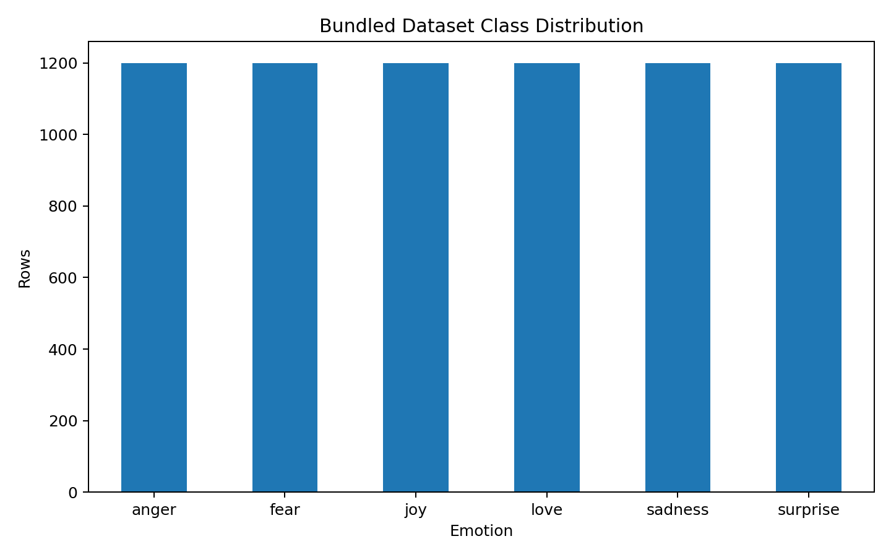
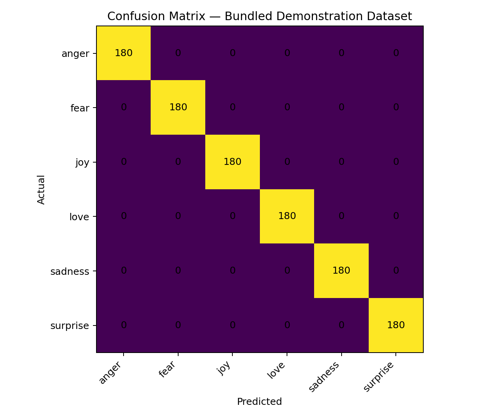
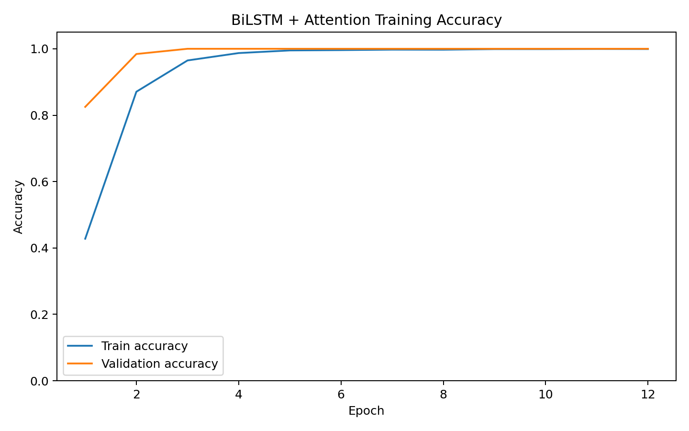
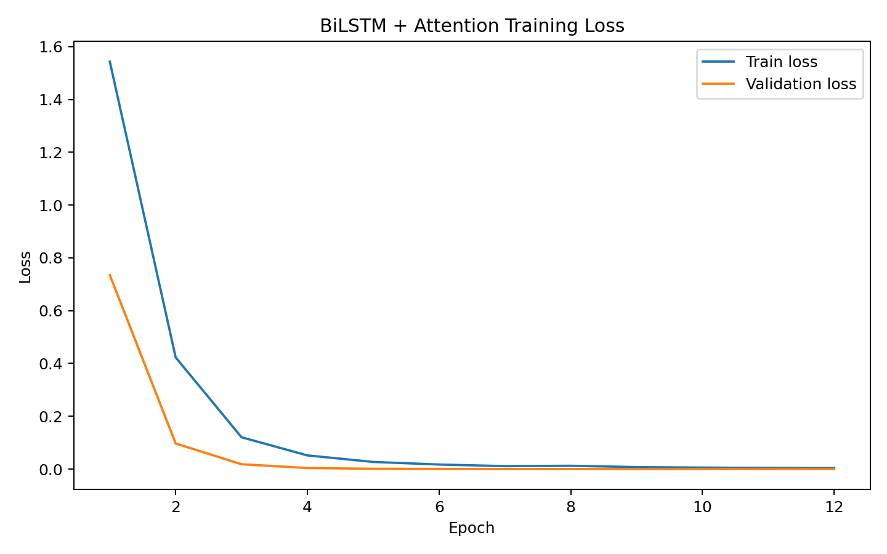
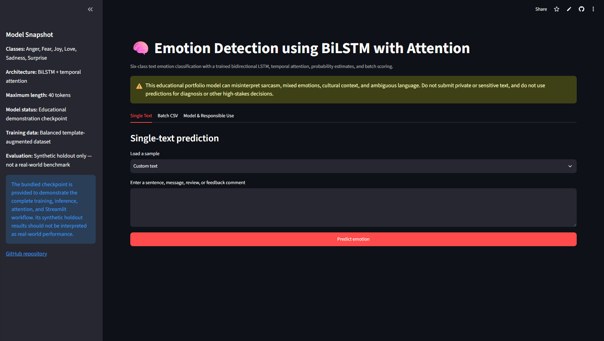
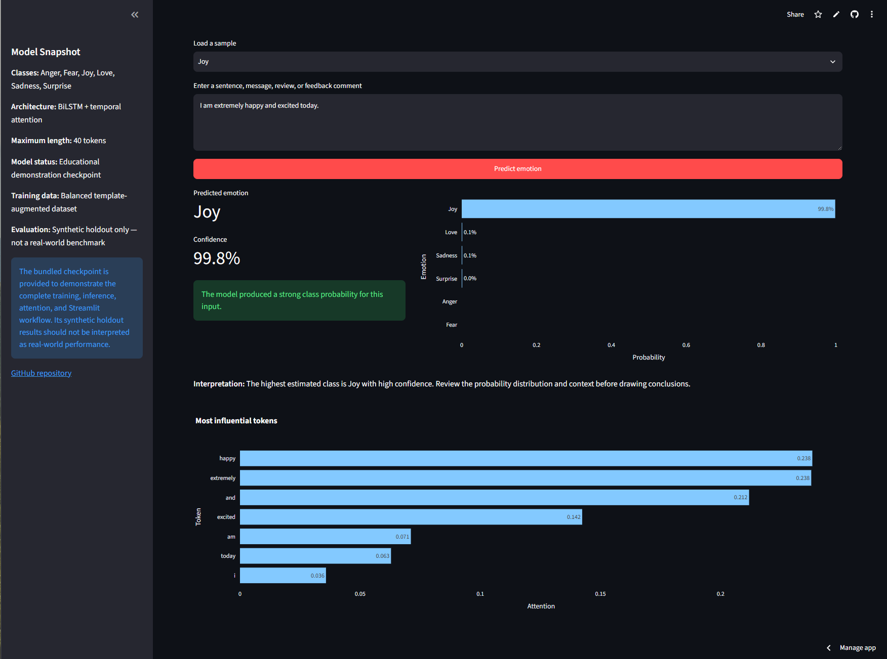
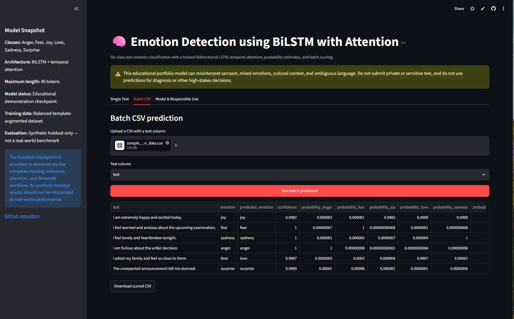

# Emotion Detection using Bidirectional LSTM with Temporal Attention

[](https://www.python.org/)
[](https://pytorch.org/)
[](https://bi-directional-lstm-projects-hyy32ssueogmqtisqjxzbg.streamlit.app/)
[](LICENSE)
[](https://github.com/unit-mole/bi-directional-lstm-projects/actions/workflows/01-emotion-detection-bilstm-attention.yml)

An end-to-end natural-language emotion-classification project that uses a
**Bidirectional Long Short-Term Memory network with temporal attention** to
classify English text into six emotion categories. The repository includes
reproducible text preprocessing, deterministic training, saved inference
artifacts, class-probability scoring, token-level attention visualization,
batch CSV prediction, automated tests, GitHub Actions, Docker support, and a
deployed Streamlit application.

**Status:** Portfolio-ready educational demonstration  
**Live demo:** [Open the Streamlit application](https://bi-directional-lstm-projects-hyy32ssueogmqtisqjxzbg.streamlit.app/)  
[](https://bi-directional-lstm-projects-hyy32ssueogmqtisqjxzbg.streamlit.app/)  
**Primary stack:** Python · PyTorch · pandas · scikit-learn · Plotly · Streamlit

---

## Problem Statement

Organizations receive large amounts of unstructured text through product
reviews, surveys, support messages, social posts, and employee or customer
feedback. Reading every message manually is slow and makes it difficult to
identify the dominant emotional signal consistently.

This project answers:

> Given a sentence, message, review, or feedback comment, which emotion class
> receives the highest probability from a BiLSTM-attention model?

The deployed pipeline returns:

- **Predicted emotion**
- **Confidence score**
- **Probability for all six classes**
- **Most influential tokens based on temporal attention**
- **Downloadable batch-scoring results**

## Project Objective

Build a portfolio-ready BiLSTM solution that can:

1. Load and validate labelled emotion text.
2. Normalize and tokenize English-language input.
3. Remove duplicate text-label records before splitting.
4. Create a train-only vocabulary and fixed-length sequences.
5. Learn forward and backward contextual patterns using a Bidirectional LSTM.
6. Apply temporal attention across sequence states.
7. Produce six-class softmax probabilities rather than a label alone.
8. Expose uncertainty through confidence and competing-class probabilities.
9. Support single-text and batch CSV prediction.
10. Save and reload every artifact required for reproducible inference.
11. Validate the project through tests, artifact checks, and GitHub Actions.

## Portfolio Scope

This repository is an educational and portfolio demonstration. The bundled
checkpoint was trained on a deterministic, balanced, template-augmented dataset
so that the full workflow can be reproduced and deployed without sharing
private text.

The packaged synthetic holdout results validate the application pipeline, but
they are **not a real-world benchmark**. The application must not be used for
mental-health diagnosis, employee screening, surveillance, insurance, legal
decisions, or other high-stakes purposes.

## Emotion Classes

The model predicts one of the following classes:

| Class | Example signal |
|---|---|
| Anger | frustration, outrage, irritation |
| Fear | anxiety, nervousness, worry |
| Joy | happiness, excitement, delight |
| Love | affection, warmth, closeness |
| Sadness | loneliness, disappointment, grief |
| Surprise | shock, astonishment, unexpected reaction |

## Dataset

The bundled dataset contains **7,200 balanced educational examples** with
**1,200 records per emotion class**.

| Emotion | Records | Share |
|---|---:|---:|
| Anger | 1,200 | 16.67% |
| Fear | 1,200 | 16.67% |
| Joy | 1,200 | 16.67% |
| Love | 1,200 | 16.67% |
| Sadness | 1,200 | 16.67% |
| Surprise | 1,200 | 16.67% |
| **Total** | **7,200** | **100.00%** |

The deterministic stratified split is:

| Split | Rows | Share |
|---|---:|---:|
| Training | 5,040 | 70% |
| Validation | 1,080 | 15% |
| Test | 1,080 | 15% |

The data loader accepts the following column aliases:

- Text: `text`, `sentence`, `message`, `content`, or `comment`
- Label: `emotion`, `label`, `target`, or `class`

No private customer, employee, patient, or social-media data is included in the
repository.

## Tools and Technologies

| Area | Technology |
|---|---|
| Language | Python 3.11 |
| Deep-learning framework | PyTorch |
| Data processing | pandas, NumPy |
| Dataset splitting and evaluation | scikit-learn |
| Visualization | Matplotlib, Plotly |
| Interactive application | Streamlit |
| Model persistence | PyTorch `.pt`, JSON |
| Testing and quality | pytest, compile checks, artifact validation |
| Continuous integration | GitHub Actions |
| Containerization | Docker |
| Hosting | Streamlit Community Cloud |

## Project Workflow

```text
Labelled emotion text
        │
        ▼
Schema validation and missing-value removal
        │
        ▼
Text normalization and duplicate removal
        │
        ▼
Stratified 70% / 15% / 15% split
        │
        ▼
Train-only vocabulary construction
        │
        ▼
Token encoding, padding, and truncation
        │
        ▼
Embedding layer
        │
        ▼
Bidirectional LSTM sequence encoder
        │
        ▼
Temporal attention over hidden states
        │
        ▼
Dense classification head
        │
        ▼
Six-class softmax probabilities
        │
        ▼
Saved model, vocabulary, labels, and metadata
        │
        ▼
Streamlit single-text and batch inference
```

## Text Preprocessing

| Step | Implementation |
|---|---|
| HTML handling | Decode HTML entities |
| Unicode handling | Normalize using NFKC |
| URLs | Replace with a URL placeholder |
| User mentions | Replace with a user placeholder |
| Hashtags | Remove the `#` symbol while retaining text |
| Whitespace | Collapse repeated whitespace |
| Case | Convert text to lowercase |
| Tokenization | Extract words, contractions, and `!` / `?` signals |
| Duplicate control | Remove duplicate cleaned-text and label pairs |
| Vocabulary | Build from the training split only |
| Maximum length | 40 tokens |

Building the vocabulary only from the training split helps prevent validation
and test vocabulary leakage.

## BiLSTM with Temporal Attention Architecture

```text
Token IDs
    ↓
Embedding: vocabulary size 193 × 96 dimensions
    ↓
Embedding dropout: 0.30
    ↓
Bidirectional LSTM: 64 units per direction
    ↓
128-dimensional contextual sequence states
    ↓
Temporal attention
    ↓
Weighted 128-dimensional context vector
    ↓
Dense 96 + ReLU + Dropout(0.30)
    ↓
Dense 6
    ↓
Softmax emotion probabilities
```

| Model property | Value |
|---|---:|
| Vocabulary size | 193 |
| Maximum sequence length | 40 |
| Embedding dimension | 96 |
| LSTM units | 64 per direction |
| Dense units | 96 |
| Output classes | 6 |
| Trainable parameters | 114,567 |

The attention layer calculates a normalized weight for each encoded token. The
weighted sequence representation is used for classification, while the highest
attention weights are displayed in the Streamlit application as
model-specific explanatory signals.

## Prediction and Confidence Logic

The model outputs a softmax probability for every emotion class. The class with
the highest probability becomes the predicted emotion.

The application uses the maximum probability to describe confidence:

| Maximum probability | Displayed interpretation |
|---|---|
| `< 0.55` | Low confidence |
| `0.55–<0.75` | Moderate confidence |
| `>= 0.75` | High confidence |

A high probability is not proof that the prediction is correct. Users should
review competing classes, the original context, and the model limitations.

## Synthetic Package-Validation Results

The bundled checkpoint was evaluated on a balanced **1,080-row synthetic
holdout set**.

| Metric | Synthetic holdout result |
|---|---:|
| Accuracy | 1.000 |
| Macro F1 | 1.000 |
| Weighted F1 | 1.000 |

Each class contains 180 test examples and received a synthetic holdout F1 score
of 1.000.

> **Important:** These results reflect a deterministic template-augmented
> educational dataset with highly learnable lexical patterns. They demonstrate
> that the packaged pipeline, model loading, class mapping, and inference
> workflow function correctly. They must not be presented as evidence of
> real-world emotion-classification performance.

## Training Behaviour

The bundled training run used:

| Parameter | Value |
|---|---:|
| Random seed | 42 |
| Epochs | 12 |
| Batch size | 64 |
| Learning rate | 0.001 |
| Validation share | 15% |
| Test share | 15% |
| Minimum class support | 50 |

Validation macro F1 reached 1.000 during training on the synthetic dataset.
Because this result is driven by the educational data design, stronger
evaluation requires a licensed natural-language corpus and an untouched,
independently distributed test set.

## Visual Model Results

| Class distribution | Confusion matrix |
|---|---|
|  |  |

| Training accuracy | Training loss |
|---|---|
|  |  |

## Streamlit Application

The deployed application supports:

- Custom text entry
- Safe preloaded examples for every emotion
- Predicted class and confidence
- Six-class probability chart
- Token-level temporal-attention chart
- CSV upload for batch inference
- Downloadable scored CSV
- Model and artifact information
- Responsible-use guidance

### Application Overview

The main application view presents the model scope, supported emotion classes,
responsible-use warning, single-text workflow, batch workflow, and model
information.



### Single-Text Prediction with Attention

The single-text workflow shows the predicted emotion, confidence, complete
probability distribution, interpretation, and the tokens receiving the highest
attention weights.



### Batch CSV Prediction

The batch workflow accepts a CSV, identifies the selected text column, scores
all non-empty rows, displays class probabilities, and provides a downloadable
result file.



## Model Artifacts

| Artifact | Purpose |
|---|---|
| `models/emotion_bilstm_attention.pt` | Trained PyTorch BiLSTM-attention checkpoint |
| `models/vocabulary.json` | Token-to-index mapping used during inference |
| `models/label_mapping.json` | Output-index to emotion-label mapping |
| `models/model_metadata.json` | Architecture, dataset audit, split sizes, configuration, and evaluation metadata |

The application requires all four artifacts. The artifact-validation script
checks their presence and verifies that the saved model can support inference.

## Expected Smoke-Test Examples

| Input | Expected bundled-demo class |
|---|---|
| `I am extremely happy and excited today.` | Joy |
| `I feel worried and anxious about the upcoming examination.` | Fear |
| `I feel lonely and heartbroken tonight.` | Sadness |
| `I am furious about the unfair decision.` | Anger |
| `I adore my family and feel so close to them.` | Love |
| `The unexpected announcement left me stunned.` | Surprise |

These examples are smoke tests for the packaged educational checkpoint, not
evidence of general language understanding.

## Run Locally

### 1. Open the project directory

```bash
cd bi-directional-lstm-projects/01-emotion-detection-bilstm-attention
```

### 2. Create and activate a virtual environment

Windows Command Prompt:

```bat
py -3.11 -m venv .venv
.venv\Scripts\activate
```

macOS or Linux:

```bash
python3.11 -m venv .venv
source .venv/bin/activate
```

### 3. Install dependencies

```bash
python -m pip install --upgrade pip
python -m pip install -r requirements.txt
```

Install development tools when needed:

```bash
python -m pip install -r requirements-dev.txt
```

### 4. Validate the project

```bash
python scripts/validate_project.py
python -m pytest -q
python -m compileall app src scripts tests
```

### 5. Run packaged smoke predictions

```bash
python scripts/evaluate_model.py
```

### 6. Launch the Streamlit application

```bash
python -m streamlit run app/streamlit_app.py
```

Open the local address displayed in the terminal, normally:

```text
http://localhost:8501
```

Windows users can also run:

```bat
run_local.bat
```

## Retrain the Model

### Recreate the bundled educational dataset

```bash
python scripts/generate_demo_dataset.py \
  --output data/emotion_dataset_full.csv \
  --rows-per-class 1200 \
  --seed 42
```

Windows Command Prompt equivalent:

```bat
python scripts\generate_demo_dataset.py --output data\emotion_dataset_full.csv --rows-per-class 1200 --seed 42
```

### Train the BiLSTM-attention model

```bash
python scripts/train_model.py \
  --data data/emotion_dataset_full.csv \
  --epochs 12 \
  --batch-size 64
```

Windows Command Prompt equivalent:

```bat
python scripts\train_model.py --data data\emotion_dataset_full.csv --epochs 12 --batch-size 64
```

### Train on a stronger dataset

Prepare a compatible CSV:

```csv
text,emotion
"I am delighted with the result",joy
"I feel anxious about tomorrow",fear
```

Then run:

```bash
python scripts/train_model.py \
  --data path/to/licensed_emotion_dataset.csv \
  --epochs 15 \
  --batch-size 64
```

Use a documented dataset license, preserve an untouched test split, and report
macro F1, weighted F1, per-class precision and recall, confusion matrix, and
out-of-domain examples.

## Deployment

The application is deployed through Streamlit Community Cloud directly from
the public BiLSTM portfolio repository.

- **Repository:** `unit-mole/bi-directional-lstm-projects`
- **Branch:** `main`
- **Entrypoint:** `01-emotion-detection-bilstm-attention/app/streamlit_app.py`
- **Python:** `3.11`
- **Secrets:** None
- **Live application:**  
  https://bi-directional-lstm-projects-hyy32ssueogmqtisqjxzbg.streamlit.app/

The deployment-specific dependency file is located beside the Streamlit
entrypoint:

```text
01-emotion-detection-bilstm-attention/app/requirements.txt
```

See [`README_HOSTING.md`](README_HOSTING.md) for deployment and maintenance
instructions.

## Project Structure

```text
bi-directional-lstm-projects/
├── .github/
│   └── workflows/
│       └── 01-emotion-detection-bilstm-attention.yml
├── 01-emotion-detection-bilstm-attention/
│   ├── .streamlit/
│   │   └── config.toml
│   ├── app/
│   │   ├── __init__.py
│   │   ├── requirements.txt
│   │   └── streamlit_app.py
│   ├── archive/
│   │   └── legacy_checkpoint/
│   ├── data/
│   │   ├── README_data.md
│   │   ├── emotion_dataset_full.csv
│   │   └── sample_emotion_data.csv
│   ├── images/
│   │   ├── batch_prediction_demo.png
│   │   ├── single_text_prediction_demo.png
│   │   └── streamlit_app_overview.png
│   ├── models/
│   │   ├── emotion_bilstm_attention.pt
│   │   ├── label_mapping.json
│   │   ├── model_metadata.json
│   │   └── vocabulary.json
│   ├── notebooks/
│   │   └── emotion_detection_bilstm_attention.ipynb
│   ├── outputs/
│   │   ├── figures/
│   │   │   ├── class_distribution.png
│   │   │   ├── confusion_matrix.png
│   │   │   ├── training_accuracy.png
│   │   │   └── training_loss.png
│   │   ├── classification_report.csv
│   │   ├── confusion_matrix.csv
│   │   ├── model_summary.txt
│   │   ├── test_predictions.csv
│   │   └── training_history.csv
│   ├── scripts/
│   │   ├── evaluate_model.py
│   │   ├── generate_demo_dataset.py
│   │   ├── run_streamlit.py
│   │   ├── train_baseline.py
│   │   ├── train_model.py
│   │   └── validate_project.py
│   ├── src/
│   │   ├── attention_layer.py
│   │   ├── baseline_model.py
│   │   ├── config.py
│   │   ├── data_preprocessing.py
│   │   ├── emotion_prediction.py
│   │   ├── inference_pipeline.py
│   │   ├── model_evaluation.py
│   │   ├── model_training.py
│   │   ├── sequence_generation.py
│   │   ├── text_preprocessing.py
│   │   ├── tokenizer_utils.py
│   │   └── visualization.py
│   ├── tests/
│   │   ├── test_attention_layer.py
│   │   ├── test_data_preprocessing.py
│   │   ├── test_inference_pipeline.py
│   │   ├── test_sequence_generation.py
│   │   └── test_text_preprocessing.py
│   ├── Dockerfile
│   ├── FILE_MANIFEST.csv
│   ├── IMPROVEMENTS.md
│   ├── LICENSE
│   ├── MONOREPO_INTEGRATION.md
│   ├── PROJECT_AUDIT.md
│   ├── README.md
│   ├── README_HOSTING.md
│   ├── requirements-dev.txt
│   ├── requirements.txt
│   ├── run_local.bat
│   ├── run_local.sh
│   └── train_model.py
├── 02-medical-text-classification-bilstm-attention/
├── 03-named-entity-recognition-bilstm-crf/
├── 04-question-answer-matching-siamese-bilstm/
├── 05-resume-job-description-matching-siamese-bilstm/
├── 06-code-comment-generation-bilstm-attention/
├── .gitignore
├── LICENSE
└── README.md
```

## Testing and Continuous Integration

Run the complete local test suite:

```bash
python -m pytest -q
```

Compile project source:

```bash
python -m compileall -q app src scripts tests
```

Validate the packaged model and metadata:

```bash
python scripts/validate_project.py
```

The project-specific workflow is:

```text
.github/workflows/01-emotion-detection-bilstm-attention.yml
```

It runs when Project 01 or its workflow file changes and performs:

- Python 3.11 environment setup
- Dependency installation
- Python compilation
- Artifact validation
- Unit tests
- Streamlit syntax validation

The CI workflow does not retrain the neural network.

## Docker

Build the image from the Project 01 directory:

```bash
docker build -t bilstm-emotion-attention .
```

Run the container:

```bash
docker run --rm -p 8501:8501 bilstm-emotion-attention
```

Then open:

```text
http://localhost:8501
```

## Limitations

- The bundled checkpoint is trained on template-augmented educational text.
- Synthetic holdout performance does not estimate real-world generalization.
- Emotion categories are simplified and cannot fully represent mixed feelings.
- Sarcasm, irony, negation, slang, code-switching, and cultural context can
  reduce reliability.
- The vocabulary is intentionally small because it reflects the bundled
  demonstration dataset.
- Attention weights indicate model emphasis, not human-like reasoning or causal
  explanation.
- Probability values may be overconfident on text outside the training
  distribution.
- English is the supported demonstration language.

## Future Improvements

- Retrain on a licensed real-world six-class emotion dataset.
- Preserve and evaluate against an untouched official test split.
- Add out-of-domain and adversarial evaluation.
- Compare BiLSTM-attention performance with CNN, GRU, Transformer, and
  fine-tuned language-model baselines.
- Add class-probability calibration and reliability diagrams.
- Add embedding coverage and unknown-token monitoring.
- Evaluate robustness to negation, sarcasm, slang, spelling errors, and mixed
  emotions.
- Add experiment tracking and model-version metadata.
- Add automated Streamlit deployment smoke tests.
- Add a lightweight API endpoint for reusable inference.
- Add multilingual emotion classification as a separate project extension.

## Skills Demonstrated

- Natural-language preprocessing
- Multi-class text classification
- Bidirectional LSTM modeling
- Temporal attention implementation
- PyTorch training and inference
- Train-only vocabulary construction
- Stratified data splitting
- Model-artifact persistence
- Probability interpretation
- Token-level attention visualization
- Single-record and batch inference
- Streamlit application development
- Unit testing and project validation
- GitHub Actions
- Docker packaging
- Responsible AI communication
- Deployment-ready ML engineering

## Portfolio Positioning

**One-line description:** Six-class emotion-classification application using a
PyTorch Bidirectional LSTM with temporal attention, probability scoring,
token-level model emphasis, and deployable batch inference.

**Pinned repository description:** End-to-end NLP deep-learning project with
reproducible preprocessing, BiLSTM-attention training, six-class probabilities,
attention visualization, saved inference artifacts, tests, CI, Docker, and a
live Streamlit application.

The project demonstrates the ability to move beyond notebook-only modeling by
building a complete and reviewable machine-learning product: dataset checks,
modular source code, saved artifacts, inference logic, interactive deployment,
testing, documentation, and responsible-use controls.

## Responsible Use

This repository is an educational portfolio demonstration. It is not validated
for clinical, psychological, employment, legal, insurance, surveillance,
security, or other consequential use.

Do not submit private, confidential, personally identifiable, medical, legal,
or proprietary text to the public application.

## License

Project code is distributed under the MIT License. Any third-party dataset used
for future retraining remains governed by its own license, terms, and citation
requirements.

## Author

**Anmol Tripathi**  
Quality Data Scientist transitioning toward Data Science, Machine Learning,
Applied AI, Analytics Engineering, and Quality Analytics roles.
