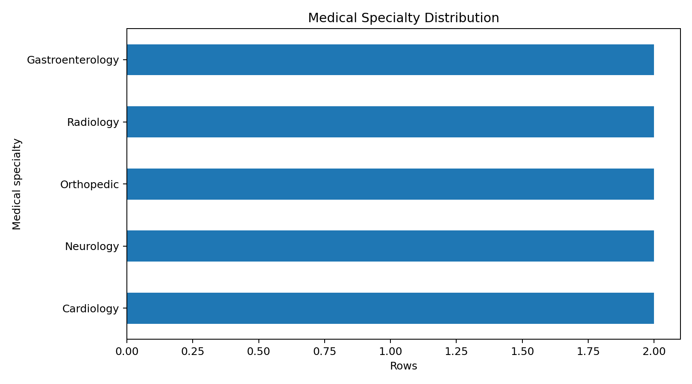
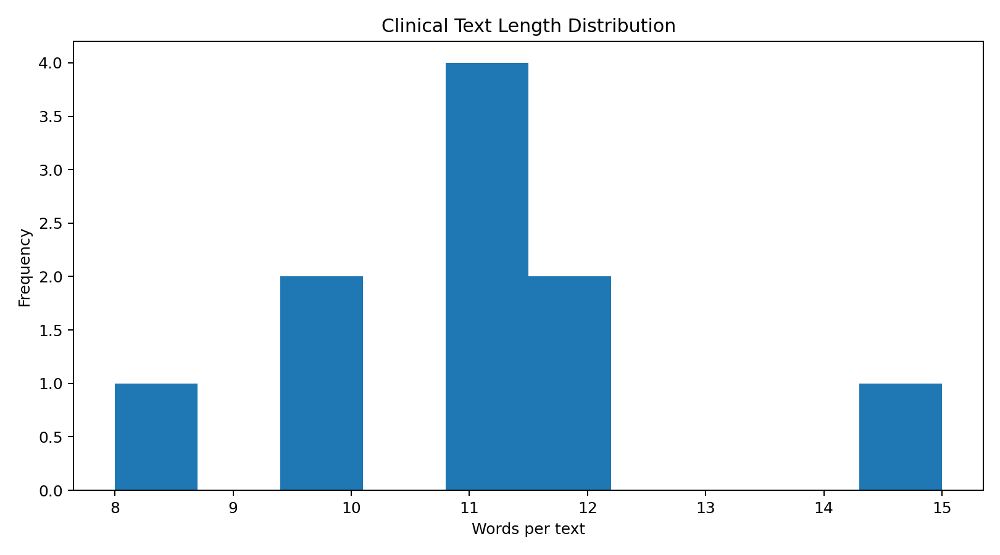
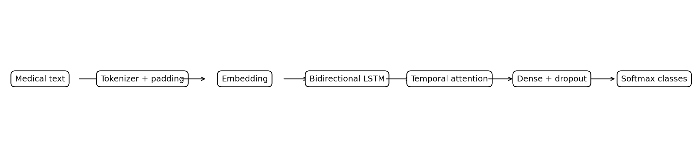
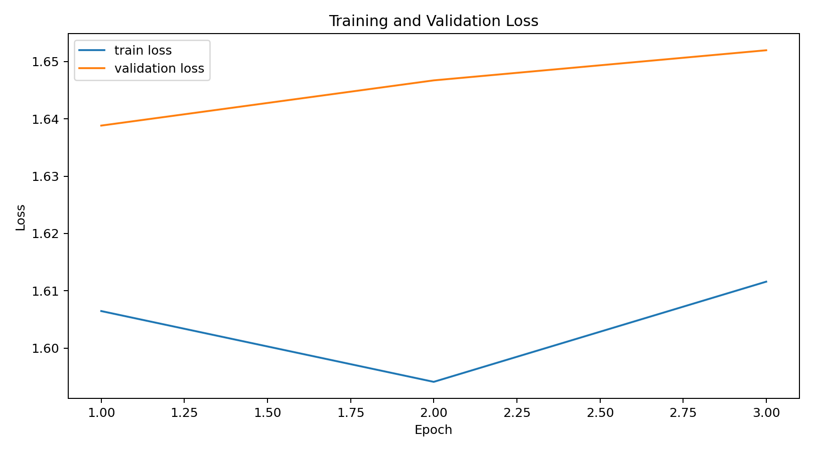
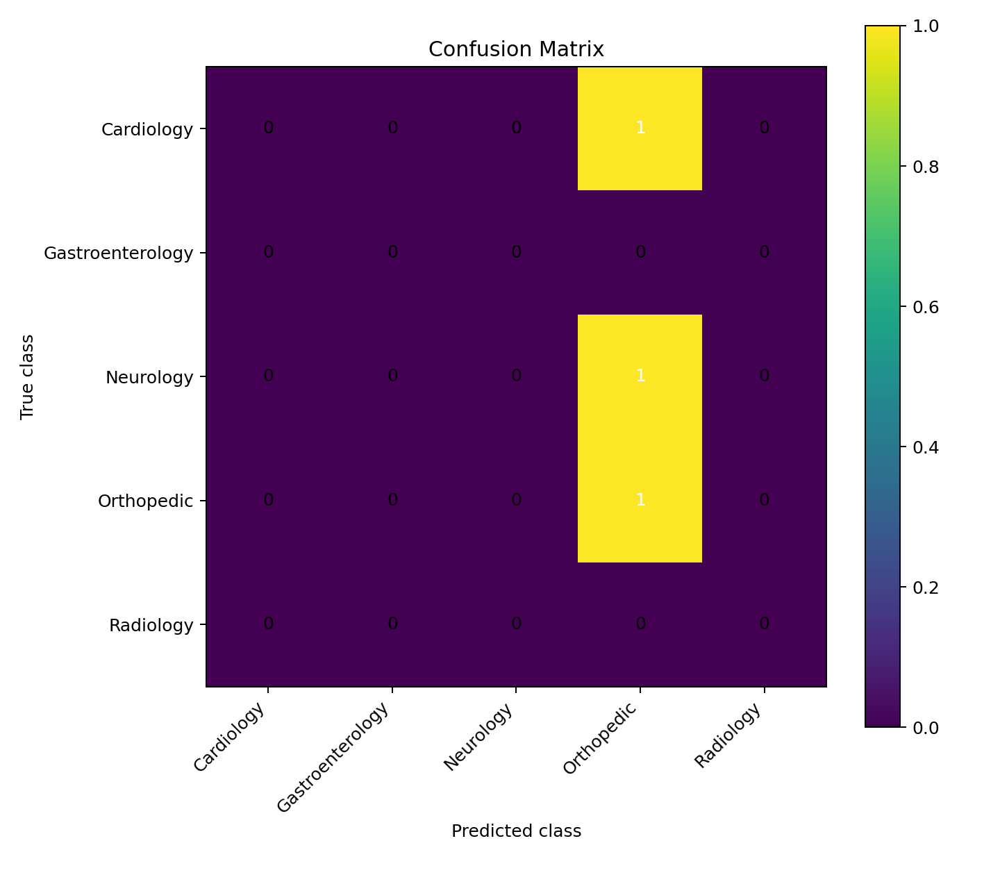
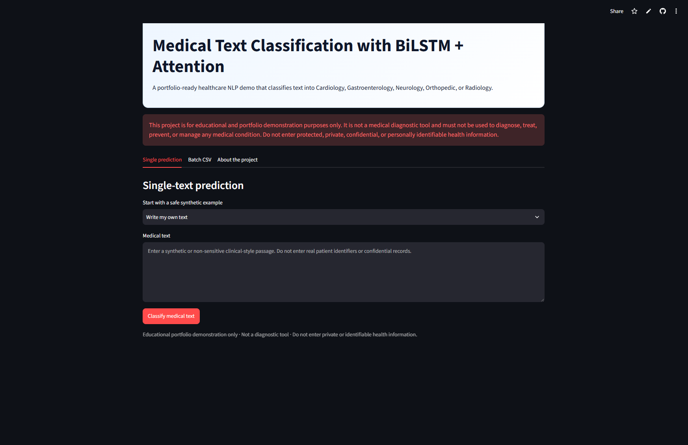
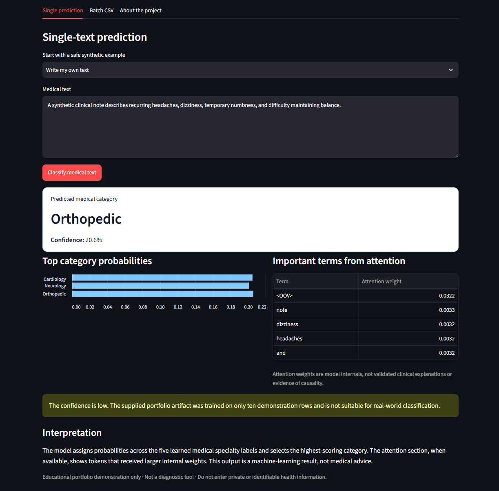
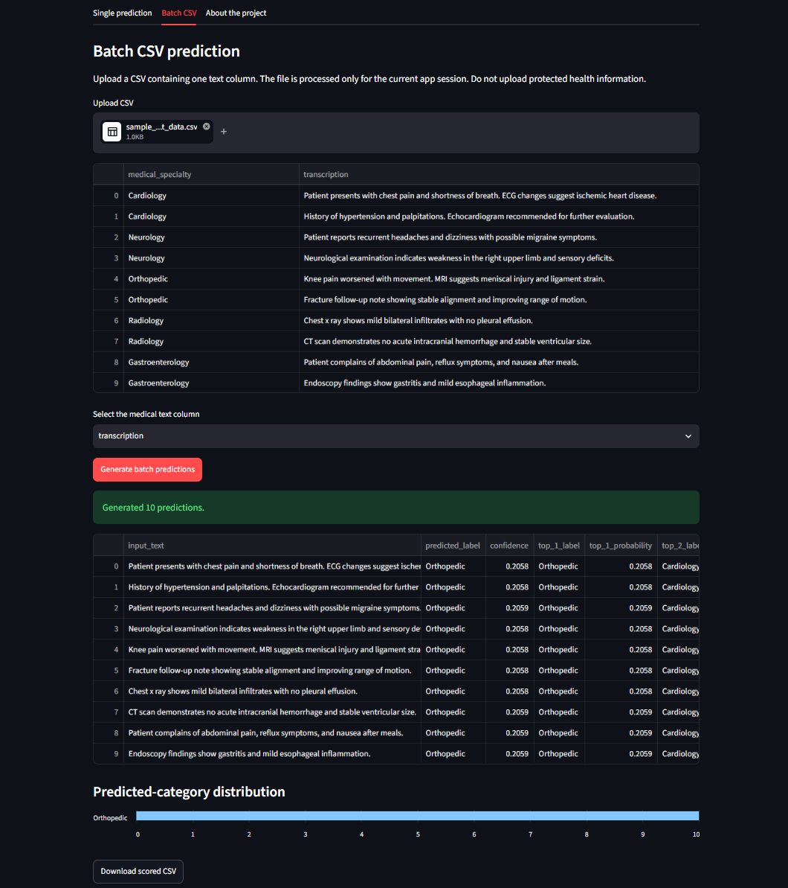

# Medical Text Classification using Bidirectional LSTM with Temporal Attention

[](https://www.python.org/)
[](https://www.tensorflow.org/)
[](https://keras.io/)
[](https://bi-directional-lstm-projects-fvks4ksrhymci7vudgqq62.streamlit.app/)
[](LICENSE)
[](https://github.com/unit-mole/bi-directional-lstm-projects/actions/workflows/02-medical-text-classification-bilstm-attention.yml)

An end-to-end healthcare natural-language-processing project that uses a
**Bidirectional Long Short-Term Memory network with temporal attention** to
classify clinical-style text into five medical specialty categories. The
repository includes reusable preprocessing and training modules, saved Keras
artifacts, class-probability scoring, optional attention-term inspection, a
TF-IDF baseline, error-analysis outputs, batch CSV inference, automated tests,
GitHub Actions, Docker support, and a deployed Streamlit application.

**Status:** Portfolio-ready engineering demonstration; bundled model is not a credible clinical benchmark  
**Live demo:** [Open the Streamlit application](https://bi-directional-lstm-projects-fvks4ksrhymci7vudgqq62.streamlit.app/)  
[](https://bi-directional-lstm-projects-fvks4ksrhymci7vudgqq62.streamlit.app/)  
**Primary stack:** Python · TensorFlow · Keras · pandas · scikit-learn · Streamlit

---

## Medical and Privacy Disclaimer

> **Educational use only:** This project is not a medical diagnostic, clinical
> decision-support, treatment, triage, or patient-routing system. The bundled
> model was trained on ten synthetic demonstration rows and has not undergone
> clinical validation, external validation, privacy review, fairness testing,
> security assessment, or regulatory evaluation.
>
> Do not enter protected health information, patient identifiers, confidential
> records, or other private medical data into the public Streamlit application.
> Predictions are machine-learning outputs and must not be interpreted as
> medical advice.

## Problem Statement

Healthcare, quality, service, and support systems generate large amounts of
unstructured text, including:

- clinical-style notes,
- complaint narratives,
- service records,
- issue descriptions,
- customer feedback,
- diagnostic summaries,
- imaging descriptions, and
- quality-event narratives.

Manual routing and categorization can be slow, inconsistent, and difficult to
scale.

This project asks:

> Given a medical-style text passage, can a sequence model assign the most
> likely specialty label from a predefined five-class taxonomy?

The deployed pipeline returns:

- **Predicted medical category**
- **Confidence score**
- **Top-three class probabilities**
- **Optional attention-weighted terms**
- **Downloadable batch predictions**
- **A visible uncertainty and medical-use warning**

## Project Objective

Build a portfolio-ready healthcare NLP workflow that can:

1. Validate medical-style text and label columns.
2. Remove unusable rows and identify duplicate text.
3. Preserve medically meaningful punctuation when retraining.
4. Encode labels and tokenize text reproducibly.
5. Learn context from both directions using a Bidirectional LSTM.
6. Apply temporal attention across sequence states.
7. Produce five-class probability distributions.
8. Support confidence-aware interpretation.
9. Compare the neural model with a TF-IDF baseline.
10. Generate class-level metrics, confusion matrices, and error tables.
11. Save and reload every artifact required for inference.
12. Support safe single-text and batch CSV scoring in Streamlit.
13. Validate the codebase using tests, artifact checks, and CI.

## Portfolio Scope

This repository demonstrates the complete engineering pattern around a medical
text classifier:

```text
data validation
    → preprocessing
    → sequence generation
    → model training
    → evaluation
    → artifact persistence
    → reusable inference
    → Streamlit deployment
    → testing and CI
```

The bundled ten-row dataset is intentionally small and synthetic. It allows the
application, model-loading path, class mapping, attention interface, and batch
workflow to be demonstrated without distributing private medical data.

The current numerical results are **pipeline diagnostics**, not evidence of
useful real-world generalization.

## Medical Specialty Classes

The supplied artifact predicts one of five categories:

| Class | Example text signals |
|---|---|
| Cardiology | chest pain, palpitations, ECG, hypertension, ischemia |
| Gastroenterology | abdominal pain, reflux, gastritis, nausea, endoscopy |
| Neurology | headache, dizziness, weakness, sensory deficits, migraine |
| Orthopedic | fracture, knee pain, ligament injury, joint movement, MRI |
| Radiology | X-ray, CT findings, infiltrates, hemorrhage, imaging description |

The label space is deliberately limited. Real clinical documentation frequently
contains overlapping specialties, multiple diagnoses, referral context, and
institution-specific terminology.

## Dataset Audit

The bundled dataset is:

```text
data/sample_medical_text_data.csv
```

### Actual dataset characteristics

| Attribute | Value |
|---|---:|
| Total rows | 10 |
| Medical classes | 5 |
| Rows per class | 2 |
| Missing text rows | 0 |
| Missing label rows | 0 |
| Empty text rows | 0 |
| Duplicate text rows | 0 |
| Average text length | 11.1 words |
| Maximum text length | 15 words |

### Class distribution

| Medical category | Rows | Share |
|---|---:|---:|
| Cardiology | 2 | 20% |
| Gastroenterology | 2 | 20% |
| Neurology | 2 | 20% |
| Orthopedic | 2 | 20% |
| Radiology | 2 | 20% |
| **Total** | **10** | **100%** |

### Original columns

| Role | Column |
|---|---|
| Text | `transcription` |
| Target | `medical_specialty` |

The ten rows are short synthetic examples. They are appropriate for testing
code paths but far too small for reliable training, model selection, or
performance claims.

See [`data/README_data.md`](data/README_data.md) for dataset replacement,
licensing, privacy, and de-identification guidance.

## Tools and Technologies

| Area | Technology |
|---|---|
| Language | Python 3.11 |
| Deep-learning framework | TensorFlow 2.21 / Keras |
| Data processing | pandas, NumPy |
| Preprocessing and evaluation | scikit-learn |
| Baseline | TF-IDF + Logistic Regression |
| Static visualizations | Matplotlib |
| Interactive application | Streamlit |
| Model persistence | Keras `.keras`, Pickle, JSON |
| Testing and validation | pytest, compile checks, artifact validation |
| Continuous integration | GitHub Actions |
| Containerization | Docker |
| Hosting | Streamlit Community Cloud |

## Project Workflow

```text
Medical-style text and labels
        │
        ▼
Schema validation and data-quality checks
        │
        ▼
Medical-text preprocessing
        │
        ▼
Label encoding
        │
        ▼
Tokenizer fitting and integer sequences
        │
        ▼
Post-padding and post-truncation
        │
        ▼
Train / validation / test split
        │
        ▼
Embedding layer
        │
        ▼
Bidirectional LSTM
        │
        ▼
Temporal attention
        │
        ▼
Dense classification head
        │
        ▼
Five-class softmax probabilities
        │
        ▼
Evaluation, error analysis, and baseline comparison
        │
        ▼
Saved model, tokenizer, labels, and metadata
        │
        ▼
Streamlit single-text and batch inference
```

## Medical-Text Preprocessing

The project contains two preprocessing modes.

### Legacy mode

The deployed bundled checkpoint uses `legacy` mode because inference
preprocessing must match the preprocessing used during training.

Legacy mode:

- converts text to lowercase,
- normalizes whitespace,
- removes punctuation,
- retains letters and numbers.

### Clinical-safe mode

The reusable training pipeline also provides `clinical_safe` mode for future
retraining on a stronger dataset.

Clinical-safe mode:

- applies Unicode normalization,
- removes HTML safely,
- normalizes whitespace,
- lowercases by default,
- preserves numbers,
- preserves decimals and percentages,
- preserves slashes and colons,
- preserves plus/minus signs,
- preserves medically meaningful hyphens,
- retains negations such as `no`, `not`, and `denies`,
- supports conservative abbreviation mapping.

Examples such as the following retain more clinically meaningful structure:

```text
BP 140/90
O2 98%
2.5-mg
no acute hemorrhage
```

## Dataset Splitting

The original small-sample workflow produced:

| Split | Rows |
|---|---:|
| Training | 5 |
| Validation | 2 |
| Test | 3 |

This split is useful only for confirming that the training and evaluation code
runs. A three-row test set cannot provide a stable estimate of accuracy,
precision, recall, or F1.

For a replacement dataset, patient-level or document-source-level grouped
splitting should be considered to reduce leakage between related records.

## BiLSTM with Temporal Attention Architecture

```text
Integer-encoded medical text
        ↓
Input sequence length: 300
        ↓
Embedding: effective vocabulary 91 × 128 dimensions
        ↓
Bidirectional LSTM: 64 units per direction
        ↓
128-dimensional contextual sequence states
        ↓
Trainable temporal attention
        ↓
Dropout: 0.30
        ↓
Dense: 128 + ReLU
        ↓
Dropout: 0.20
        ↓
Dense: 5 + Softmax
        ↓
Medical specialty probabilities
```

### Model configuration

| Property | Value |
|---|---:|
| Effective vocabulary size | 91 |
| Maximum configured vocabulary | 30,000 |
| Maximum sequence length | 300 |
| Embedding dimension | 128 |
| BiLSTM units | 64 per direction |
| Dense units | 128 |
| Dropout rate | 0.30 |
| Output classes | 5 |
| Trainable parameters | 128,049 |

### Training configuration recorded for the supplied artifact

| Parameter | Value |
|---|---|
| Random seed | 42 |
| Batch size | 32 |
| Requested epochs | 5 |
| Completed epochs | 3 |
| Optimizer | Adam |
| Learning rate | 0.001 |
| Loss | Categorical cross-entropy |
| Class weighting | Balanced; all weights were 1.0 on the sample |
| Learning-rate control | Reduce on validation-loss plateau |
| Checkpointing | Best validation-loss checkpoint |

## Temporal Attention

The custom attention layer learns a score for every BiLSTM sequence state,
normalizes those scores across the sequence, and creates a weighted context
vector for classification.

The Streamlit application can display the highest-weighted terms when the
runtime can recover attention values from the saved artifact.

Attention values should be interpreted carefully:

- they show where this model placed larger internal weights,
- they are not clinical evidence,
- they do not prove causality,
- they are not a substitute for validated explanation methods, and
- they do not justify medical decisions.

## Probability and Confidence Logic

The model outputs a probability across all five categories.

The application displays:

- the highest-probability medical category,
- the maximum probability as confidence,
- the top three category probabilities, and
- a low-confidence warning when confidence is below 50%.

Because the bundled artifact produces near-uniform probabilities for many
inputs, the probability distribution is more informative than the winning label
alone.

## Honest Model Audit

The original supplied artifact is functional but not reliable as a classifier.

### Three-row holdout results

| Metric | Diagnostic result |
|---|---:|
| Test loss | 1.5904 |
| Accuracy | 0.3333 |
| Macro precision | 0.0667 |
| Macro recall | 0.2000 |
| Macro F1 | 0.1000 |
| Weighted precision | 0.1111 |
| Weighted recall | 0.3333 |
| Weighted F1 | 0.1667 |

### Observed prediction behaviour

The supplied model predicted **Orthopedic for all three holdout rows**, with
probabilities close to 20% per class.

This means:

- the saved artifact proves that the inference pipeline can run,
- it does not demonstrate useful medical-text generalization,
- the current metrics must not be promoted as a benchmark,
- screenshots should emphasize the application workflow rather than model
  quality, and
- replacing the training dataset is the highest-priority improvement.

See [`PROJECT_AUDIT.md`](PROJECT_AUDIT.md) for the complete audit.

## Per-Class Diagnostic Results

| Class | Precision | Recall | F1 | Test support |
|---|---:|---:|---:|---:|
| Cardiology | 0.000 | 0.000 | 0.000 | 1 |
| Gastroenterology | 0.000 | 0.000 | 0.000 | 0 |
| Neurology | 0.000 | 0.000 | 0.000 | 1 |
| Orthopedic | 0.333 | 1.000 | 0.500 | 1 |
| Radiology | 0.000 | 0.000 | 0.000 | 0 |

Two classes have no test support because the complete test split contains only
three rows. This further demonstrates why the metrics are unstable.

## Baseline Comparison

A TF-IDF + Logistic Regression baseline is implemented in:

```text
src/baseline.py
```

| Model | Evaluation protocol | Accuracy | Macro F1 | Weighted F1 |
|---|---|---:|---:|---:|
| TF-IDF + Logistic Regression | 2-fold stratified cross-validation | 0.1000 | 0.1000 | 0.1000 |
| BiLSTM + Attention | 3-row holdout | 0.3333 | 0.1000 | 0.1667 |

The rows use different evaluation protocols and are not directly comparable.
Both results are highly unstable because the dataset contains only ten rows.

The baseline exists to demonstrate disciplined model comparison rather than to
claim that deep learning performs better.

## Class Imbalance Handling

The bundled dataset is exactly balanced, so the calculated class weights are all
1.0.

The reusable training pipeline still computes balanced class weights for
replacement datasets. Future evaluation should prioritize:

- macro precision,
- macro recall,
- macro F1,
- weighted F1,
- per-class recall,
- confusion costs,
- top-k accuracy,
- calibrated confidence, and
- error analysis.

Accuracy alone can hide poor minority-class performance.

## Visual Model Diagnostics

| Class distribution | Text-length distribution |
|---|---|
|  |  |

| Model architecture | Training curve |
|---|---|
|  |  |

### Confusion Matrix



The figures are included as reproducible pipeline diagnostics. They should not
be interpreted as clinical validation.

## Streamlit Application

The deployed application supports:

- manual medical-text entry,
- five safe synthetic examples,
- predicted medical category,
- confidence score,
- top-three class probabilities,
- optional attention-weighted terms,
- CSV batch upload,
- selectable text column,
- batch prediction table,
- predicted-category distribution,
- downloadable scored CSV,
- visible model limitations,
- medical and privacy disclaimers.

### Application Overview

The main page presents the project purpose, supported specialty classes,
medical-use warning, safe text-entry workflow, batch workflow, and project
information.



### Single-Text Medical Specialty Prediction

The single-text workflow shows a safe synthetic passage, predicted category,
confidence, top-three probability distribution, interpretation, and attention
terms when available.



### Batch CSV Classification

The batch workflow previews uploaded data, lets the user choose the medical-text
column, scores all valid rows, displays the predicted-category distribution, and
provides a downloadable CSV.



## Safe Streamlit Examples

The application provides synthetic examples representing:

- Cardiology
- Gastroenterology
- Neurology
- Orthopedic
- Radiology

Example:

```text
Recurrent headache with dizziness, sensory changes, and weakness in the right
upper limb on neurological examination.
```

Only synthetic or non-sensitive text should be used in the public application.

## Batch CSV Format

A compatible CSV can contain a text column such as:

```csv
transcription
"Recurrent headache with dizziness and sensory changes."
"CT imaging demonstrates no acute intracranial hemorrhage."
"Knee pain increases with movement and MRI suggests a meniscal injury."
```

Recognized text-column patterns include:

- `transcription`
- `clinical_text`
- `medical_text`
- `note`
- `text`
- `description`
- `abstract`

For the public demo, batch prediction is limited to the first 2,000 non-empty
rows.

## Model Artifacts

| Artifact | Purpose |
|---|---|
| `models/medical_text_bilstm_attention_model.keras` | Saved Keras BiLSTM-attention model |
| `models/tokenizer_config.json` | Serialized tokenizer vocabulary and configuration |
| `models/label_mapping.json` | Numeric output to medical-category mapping |
| `models/label_encoder.pkl` | Serialized label encoder |
| `models/model_metadata.json` | Architecture, split, metric, limitation, and configuration metadata |

### Artifact validation

Metadata-only validation does not import TensorFlow:

```bash
python scripts/validate_artifacts.py --metadata-only
```

Full validation loads the Keras model and tokenizer:

```bash
python scripts/validate_artifacts.py
```

## Output Files

| Output | Purpose |
|---|---|
| `outputs/model_metrics.json` | Diagnostic holdout metrics and warning |
| `outputs/classification_report.csv` | Class-level and aggregate metrics |
| `outputs/per_class_performance.csv` | Compact per-class performance table |
| `outputs/confusion_matrix.csv` | Numeric confusion matrix |
| `outputs/confusion_matrix.png` | Visual confusion matrix |
| `outputs/error_analysis.csv` | Misclassified-row analysis |
| `outputs/baseline_metrics.csv` | TF-IDF baseline metrics |
| `outputs/baseline_comparison.csv` | Baseline and BiLSTM diagnostic comparison |
| `outputs/medical_text_training_history.csv` | Epoch-level training history |
| `outputs/medical_text_prediction_analysis.csv` | Original prediction analysis |
| `outputs/data_quality_summary.json` | Input data-quality audit |
| `outputs/project_validation_report.json` | Project validation status |

## Run Locally

### 1. Open the project directory

```bash
cd bi-directional-lstm-projects/02-medical-text-classification-bilstm-attention
```

### 2. Create and activate a virtual environment

Windows Command Prompt:

```bat
py -3.11 -m venv .venv
.venv\Scripts\activate
```

Windows PowerShell:

```powershell
py -3.11 -m venv .venv
.venv\Scripts\Activate.ps1
```

macOS or Linux:

```bash
python3.11 -m venv .venv
source .venv/bin/activate
```

### 3. Install runtime dependencies

```bash
python -m pip install --upgrade pip
python -m pip install -r requirements.txt
```

Install development dependencies when needed:

```bash
python -m pip install -r requirements-dev.txt
```

### 4. Validate artifacts and source

```bash
python scripts/validate_artifacts.py --metadata-only
python -m compileall app src scripts tests
```

For full model validation:

```bash
python scripts/validate_artifacts.py
```

### 5. Run tests

```bash
python -m pytest -q
```

Skip model-loading tests:

```bash
python -m pytest -q -m "not model"
```

### 6. Launch Streamlit

```bash
python -m streamlit run app/streamlit_app.py
```

Open the local address displayed in the terminal, normally:

```text
http://localhost:8501
```

Windows users can also run:

```bat
run_local.bat
```

macOS and Linux users can run:

```bash
chmod +x run_local.sh
./run_local.sh
```

## Train a Replacement Model

The current ten-row dataset should not be used to train a model for performance
claims.

Prepare an appropriately licensed, de-identified dataset with meaningful class
support:

```csv
transcription,medical_specialty
"Synthetic or de-identified clinical-style text",Cardiology
"Another safely governed text record",Neurology
```

Train using the recommended medical-text preprocessing mode:

```bash
python scripts/train_model.py \
  --data path/to/deidentified_medical_text.csv \
  --text-column transcription \
  --label-column medical_specialty \
  --epochs 20 \
  --batch-size 32 \
  --preprocessing-mode clinical_safe
```

Windows Command Prompt equivalent:

```bat
python scripts\train_model.py --data path\to\deidentified_medical_text.csv --text-column transcription --label-column medical_specialty --epochs 20 --batch-size 32 --preprocessing-mode clinical_safe
```

Training saves artifacts under `models/` and evaluation outputs under
`outputs/`.

## Run the Baseline

```bash
python scripts/train_baseline.py
```

For a meaningful comparison, train and evaluate all candidate models using the
same split or cross-validation design.

## Evaluate a Saved Model

```bash
python scripts/evaluate_model.py \
  --data path/to/independent_evaluation_data.csv \
  --text-column transcription \
  --label-column medical_specialty
```

The evaluation dataset should be independent of the training set.

## Deployment

The application is deployed through Streamlit Community Cloud from the public
BiLSTM portfolio repository.

- **Repository:** `unit-mole/bi-directional-lstm-projects`
- **Branch:** `main`
- **Entrypoint:** `02-medical-text-classification-bilstm-attention/app/streamlit_app.py`
- **Python:** `3.11`
- **Secrets:** None
- **Live application:**  
  https://bi-directional-lstm-projects-fvks4ksrhymci7vudgqq62.streamlit.app/

The deployment dependency file is kept beside the nested Streamlit entrypoint:

```text
02-medical-text-classification-bilstm-attention/app/requirements.txt
```

See [`README_HOSTING.md`](README_HOSTING.md) for detailed deployment and
maintenance instructions.

## Project Structure

```text
bi-directional-lstm-projects/
├── .github/
│   └── workflows/
│       └── 02-medical-text-classification-bilstm-attention.yml
├── 01-emotion-detection-bilstm-attention/
├── 02-medical-text-classification-bilstm-attention/
│   ├── .streamlit/
│   │   └── README.md
│   ├── app/
│   │   ├── __init__.py
│   │   ├── requirements.txt
│   │   └── streamlit_app.py
│   ├── archive/
│   │   ├── Medical_Text_Classification_using_Bi_Directional_LSTM_COMPLETE_corrected.ipynb
│   │   └── README.md
│   ├── data/
│   │   ├── README_data.md
│   │   └── sample_medical_text_data.csv
│   ├── images/
│   │   ├── batch_prediction_demo.png
│   │   ├── single_text_prediction_demo.png
│   │   └── streamlit_app_overview.png
│   ├── models/
│   │   ├── label_encoder.pkl
│   │   ├── label_mapping.json
│   │   ├── medical_text_bilstm_attention_model.keras
│   │   ├── model_metadata.json
│   │   └── tokenizer_config.json
│   ├── notebooks/
│   │   └── medical_text_classification_bilstm_attention.ipynb
│   ├── outputs/
│   │   ├── baseline_comparison.csv
│   │   ├── baseline_metrics.csv
│   │   ├── baseline_prediction_analysis.csv
│   │   ├── class_distribution.png
│   │   ├── classification_report.csv
│   │   ├── confusion_matrix.csv
│   │   ├── confusion_matrix.png
│   │   ├── data_quality_summary.json
│   │   ├── error_analysis.csv
│   │   ├── medical_text_prediction_analysis.csv
│   │   ├── medical_text_training_history.csv
│   │   ├── model_architecture.png
│   │   ├── model_metrics.json
│   │   ├── per_class_performance.csv
│   │   ├── project_validation_report.json
│   │   ├── sample_predictions.csv
│   │   ├── text_length_distribution.png
│   │   └── training_curve.png
│   ├── scripts/
│   │   ├── __init__.py
│   │   ├── evaluate_model.py
│   │   ├── run_streamlit.py
│   │   ├── train_baseline.py
│   │   ├── train_model.py
│   │   └── validate_artifacts.py
│   ├── src/
│   │   ├── __init__.py
│   │   ├── artifacts.py
│   │   ├── attention_layer.py
│   │   ├── baseline.py
│   │   ├── config.py
│   │   ├── data_preprocessing.py
│   │   ├── inference_pipeline.py
│   │   ├── medical_text_prediction.py
│   │   ├── medical_text_preprocessing.py
│   │   ├── model_evaluation.py
│   │   ├── model_training.py
│   │   ├── sequence_generation.py
│   │   ├── tokenizer_utils.py
│   │   └── visualization.py
│   ├── tests/
│   │   ├── __init__.py
│   │   ├── conftest.py
│   │   ├── test_artifact_contract.py
│   │   ├── test_data_preprocessing.py
│   │   ├── test_inference_pipeline.py
│   │   ├── test_medical_text_preprocessing.py
│   │   └── test_sequence_generation.py
│   ├── .dockerignore
│   ├── .gitignore
│   ├── Dockerfile
│   ├── FILE_MANIFEST.csv
│   ├── IMPROVEMENTS.md
│   ├── LICENSE
│   ├── MONOREPO_INTEGRATION.md
│   ├── PROJECT_AUDIT.md
│   ├── README.md
│   ├── README_HOSTING.md
│   ├── requirements-dev.txt
│   ├── requirements.txt
│   ├── run_local.bat
│   ├── run_local.sh
│   └── train_model.py
├── 03-named-entity-recognition-bilstm-crf/
├── 04-question-answer-matching-siamese-bilstm/
├── 05-resume-job-description-matching-siamese-bilstm/
├── 06-code-comment-generation-bilstm-attention/
├── .gitignore
├── LICENSE
└── README.md
```

## Testing and Continuous Integration

Run the lightweight test suite:

```bash
python -m pytest -q -m "not model"
```

Run all tests when TensorFlow and the complete artifacts are available:

```bash
python -m pytest -q
```

Compile Python source:

```bash
python -m compileall app src scripts tests
```

Validate artifact metadata:

```bash
python scripts/validate_artifacts.py --metadata-only
```

The project-specific GitHub Actions workflow is:

```text
.github/workflows/02-medical-text-classification-bilstm-attention.yml
```

The workflow performs:

- Python 3.11 setup,
- dependency installation,
- Python compilation,
- saved-artifact contract validation,
- lightweight tests, and
- Streamlit import validation.

The workflow does not retrain the neural network.

## Docker

Build the image from the Project 02 directory:

```bash
docker build -t medical-text-bilstm-attention .
```

Run the container:

```bash
docker run --rm -p 8501:8501 medical-text-bilstm-attention
```

Then open:

```text
http://localhost:8501
```

## Limitations

- The bundled dataset contains only ten synthetic rows.
- The training split contains only five rows.
- The test set contains only three rows.
- Two classes have no support in the test split.
- The model frequently returns near-uniform probabilities.
- The original artifact predicted Orthopedic for every test row.
- The model is not calibrated.
- The model has not been externally validated.
- Attention terms are not clinically validated explanations.
- The taxonomy includes only five specialties.
- Medical language varies across institutions and populations.
- The app is not designed to process protected health information.
- Bias, robustness, privacy, drift, and security testing have not been
  completed.
- Real deployment would require clinical governance, domain review, monitoring,
  access controls, audit trails, and regulatory analysis.

## Future Improvements

1. Replace the ten-row sample with an appropriately licensed, de-identified,
   representative dataset.
2. Require meaningful minimum support for every class.
3. Use patient-level or document-source-level grouped splitting.
4. Preserve an untouched external test set.
5. Add repeated stratified validation where grouping permits.
6. Compare TF-IDF, linear SVM, BiLSTM without attention, CNN, and transformer
   baselines under the same protocol.
7. Add probability calibration and confidence-based abstention.
8. Evaluate class-specific recall and confusion costs with domain experts.
9. Add explicit out-of-distribution detection.
10. Add de-identification and sensitive-data checks before batch scoring.
11. Add a formal model card and data card.
12. Add fairness, subgroup, robustness, and drift analysis.
13. Add monitoring for vocabulary coverage and unknown-token rates.
14. Retrain the model and replace screenshots only after credible validation.
15. Add deployment smoke tests for model loading and sample inference.

## Skills Demonstrated

- Healthcare NLP
- Medical-text preprocessing
- Multi-class text classification
- Bidirectional LSTM modeling
- Custom temporal attention
- TensorFlow and Keras
- Saved-model artifact management
- Label and tokenizer serialization
- Class-weighted training
- Macro and weighted F1 evaluation
- Confusion-matrix interpretation
- Error analysis
- TF-IDF baseline comparison
- Single-record and batch inference
- Streamlit application development
- Privacy-aware interface design
- Unit testing and artifact validation
- GitHub Actions
- Docker packaging
- Responsible AI documentation

## Connection to Quality Data Science

The technical pattern extends naturally to quality and operational text:

- complaint classification,
- GCS case categorization,
- issue-description routing,
- failure-mode text prediction,
- customer feedback analysis,
- service-note classification,
- root-cause narrative triage,
- quality-event prioritization, and
- automated insight generation.

The project demonstrates how structured data-science practices can be applied
to high-context text workflows while preserving transparent limitations and
human review.

## Portfolio Positioning

**One-line description:** Privacy-aware medical-text classification pipeline
using a TensorFlow Bidirectional LSTM with temporal attention, probability
outputs, batch inference, tests, Docker, and a deployed Streamlit application.

**Pinned repository description:** End-to-end healthcare NLP engineering
demonstration with medical-text preprocessing, BiLSTM-attention modeling,
five-class probabilities, saved Keras artifacts, TF-IDF baseline comparison,
error analysis, CI, Docker, and a live Streamlit app.

The strongest portfolio value of the current project is the complete and
auditable engineering workflow—not the diagnostic performance of the bundled
ten-row artifact.

## Responsible Use

This repository is an educational portfolio demonstration. It is not validated
for diagnosis, treatment, clinical triage, patient routing, insurance,
employment, surveillance, legal decisions, or any other consequential use.

Do not submit private, confidential, personally identifiable, protected health,
medical, legal, or proprietary text to the public application.

## License

Project code is distributed under the MIT License. Any replacement dataset or
third-party model remains governed by its own license, privacy obligations,
terms, and citation requirements.

## Author

**Anmol Tripathi**  
Quality Data Scientist transitioning toward Data Science, Machine Learning,
Applied AI, Analytics Engineering, and Quality Analytics roles.
