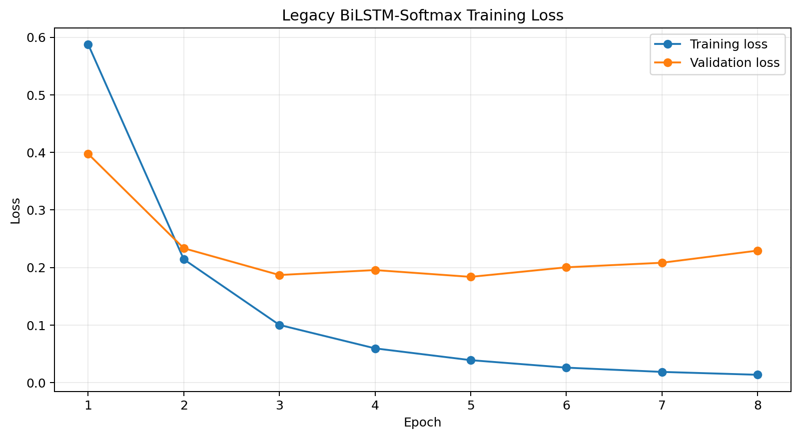
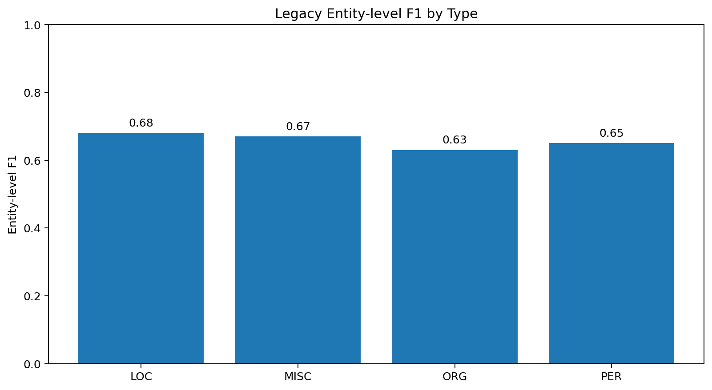
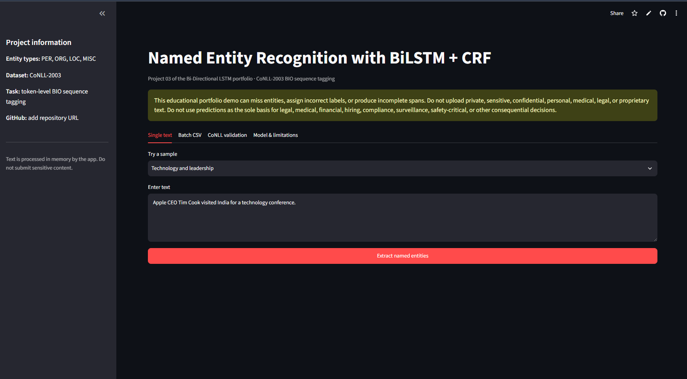
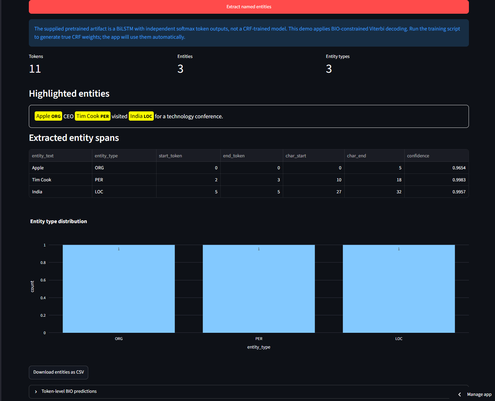
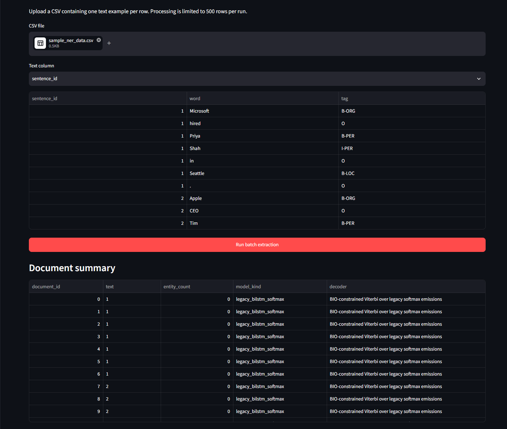

# Named Entity Recognition using Bidirectional LSTM with CRF-Aware Decoding

[](https://www.python.org/)
[](https://www.tensorflow.org/)
[](https://keras.io/)
[](https://bi-directional-lstm-projects-qs6nxmeqrdur2reyifbxnh.streamlit.app/)
[](LICENSE)
[](https://github.com/unit-mole/bi-directional-lstm-projects/actions/workflows/03-named-entity-recognition-bilstm-crf.yml)

An end-to-end **Named Entity Recognition** project that converts unstructured
English text into structured person, organization, location, and miscellaneous
entity spans. The repository combines Bidirectional LSTM sequence encoding,
BIO-aware decoding, entity-span reconstruction, token- and entity-level
evaluation, error analysis, reusable inference, batch CSV extraction, CoNLL
validation, automated tests, Docker support, GitHub Actions, and a deployed
Streamlit application.

The supplied pretrained checkpoint is transparently preserved as a
**BiLSTM-softmax baseline**. The application applies BIO-constrained Viterbi
post-processing to that checkpoint, while the repository also contains a true
linear-chain CRF training implementation that can generate a replacement CRF
artifact.

**Status:** Portfolio-ready engineering demonstration  
**Deployed artifact:** Legacy BiLSTM-softmax checkpoint with BIO-constrained Viterbi decoding  
**Live demo:** [Open the Streamlit application](https://bi-directional-lstm-projects-qs6nxmeqrdur2reyifbxnh.streamlit.app/)  
[](https://bi-directional-lstm-projects-qs6nxmeqrdur2reyifbxnh.streamlit.app/)  
**Primary stack:** Python · TensorFlow · Keras · seqeval · pandas · Plotly · Streamlit

---

## Responsible Use and Privacy

> This project is for education and portfolio demonstration only. Named Entity
> Recognition models can miss entities, assign incorrect types, merge unrelated
> words, split valid spans, or produce incomplete boundaries.
>
> Do not upload private, sensitive, confidential, personal, medical, legal,
> customer, employee, resume, case-management, or proprietary text to the public
> application.
>
> Predictions must not be treated as guaranteed facts or used as the sole basis
> for legal, medical, financial, hiring, compliance, surveillance,
> safety-critical, or other consequential decisions.

## Problem Statement

Unstructured text often contains valuable entities that organizations need to
identify and organize, including:

- people,
- organizations,
- locations,
- products,
- technical systems,
- departments,
- customer names,
- service locations, and
- domain-specific terminology.

Manual extraction is slow and inconsistent at scale.

This project asks:

> Given a sentence or document, can a sequence model assign a valid BIO tag to
> every token and reconstruct meaningful entity spans?

The deployed pipeline returns:

- **Highlighted entities in the original text**
- **Entity text and entity type**
- **Token and character boundaries**
- **Token-level BIO predictions**
- **Selected emission confidence**
- **Entity-type distribution**
- **Downloadable single-text and batch results**

## Project Objective

Build a portfolio-ready NER workflow that can:

1. Load CoNLL, token-per-row CSV, or compatible Hugging Face data.
2. Validate token/tag alignment and BIO tag structure.
3. Build vocabulary mappings from the training split.
4. Handle padding and unknown tokens consistently.
5. Learn left and right token context using a Bidirectional LSTM.
6. Produce per-token BIO emission scores.
7. Decode coherent tag sequences using Viterbi decoding.
8. Convert BIO sequences into human-readable entity spans.
9. Preserve token indices and character offsets.
10. Evaluate token and entity-level performance.
11. Generate per-type metrics and error-analysis outputs.
12. Support single-text and batch CSV inference.
13. Validate uploaded CoNLL files.
14. Save and reload all mappings and model metadata.
15. Validate the project through tests and GitHub Actions.

## Portfolio Scope

The project demonstrates the complete engineering workflow around a
token-classification model:

```text
dataset loading
    → BIO validation
    → vocabulary construction
    → sequence generation
    → BiLSTM emission modeling
    → sequence decoding
    → entity-span extraction
    → evaluation and error analysis
    → artifact persistence
    → Streamlit deployment
    → testing and CI
```

The repository contains two clearly separated modeling paths:

1. **Supplied legacy artifact**  
   A pretrained BiLSTM with independent softmax token outputs. The deployed app
   can use this immediately and applies BIO-constrained Viterbi decoding as a
   transparent post-processing layer.

2. **True CRF training path**  
   A pure TensorFlow linear-chain CRF implementation with trainable transition
   scores, sequence log-likelihood, masking, and Viterbi decoding. Running the
   training script creates CRF weights that the app automatically prefers.

This distinction prevents the original softmax artifact from being
misrepresented as a CRF-trained model.

## Dataset

The original notebook uses **CoNLL-2003** through the Hugging Face dataset
identifier:

```text
eriktks/conll2003
```

It uses the predefined training, validation, and test splits.

The complete benchmark is not redistributed in this repository. The training
script downloads it from its upstream source at runtime. Dataset terms and
newswire-source licensing should be reviewed before redistribution or
commercial use.

### Included safe samples

The repository includes small synthetic examples for demonstrations and tests:

```text
data/sample_ner_data.conll
data/sample_ner_data.csv
```

These examples are not large enough for meaningful model training or benchmark
claims.

### Included sample entities

The safe sample contains examples such as:

| Text | Tag |
|---|---|
| Microsoft | `B-ORG` |
| Priya Shah | `B-PER I-PER` |
| Seattle | `B-LOC` |
| Apple | `B-ORG` |
| Tim Cook | `B-PER I-PER` |
| India | `B-LOC` |
| United Nations | `B-ORG I-ORG` |
| European Championship | `B-MISC I-MISC` |

## BIO Tagging Scheme

The model supports nine token labels:

```text
O
B-PER  I-PER
B-ORG  I-ORG
B-LOC  I-LOC
B-MISC I-MISC
```

| Prefix | Meaning |
|---|---|
| `B-` | Beginning of an entity span |
| `I-` | Continuation of an entity span |
| `O` | Token outside a named entity |

### Entity types

| Entity type | Meaning |
|---|---|
| `PER` | Person |
| `ORG` | Organization |
| `LOC` | Location |
| `MISC` | Miscellaneous named entity |

BIO-aware decoding matters because a tag such as `I-PER` should normally follow
`B-PER` or `I-PER`, rather than appearing arbitrarily after `O` or another
entity type.

## Tools and Technologies

| Area | Technology |
|---|---|
| Language | Python 3.11 |
| Deep-learning framework | TensorFlow 2.21 / Keras |
| Data processing | pandas, NumPy |
| NER evaluation | seqeval |
| Supporting evaluation | scikit-learn |
| Static visualization | Matplotlib |
| Interactive visualization | Plotly |
| Application | Streamlit |
| Model persistence | Keras HDF5, TensorFlow weights, Pickle, JSON |
| Testing and validation | pytest, compile checks, project validation |
| Continuous integration | GitHub Actions |
| Containerization | Docker |
| Hosting | Streamlit Community Cloud |

## Project Workflow

```text
CoNLL-2003 token and BIO-tag sequences
        │
        ▼
Sentence grouping and alignment validation
        │
        ▼
BIO transition validation and deterministic repair
        │
        ▼
Training-only vocabulary construction
        │
        ▼
Token IDs with <PAD> and <UNK>
        │
        ▼
Post-padding to the configured maximum length
        │
        ▼
Embedding layer
        │
        ▼
Bidirectional LSTM contextual encoder
        │
        ▼
Per-token emission scores
        │
        ├─────────────────────────────────────┐
        ▼                                     ▼
Legacy softmax checkpoint              True CRF training path
        │                                     │
BIO-constrained Viterbi                Trainable transition matrix
        │                                     │
        └──────────────────┬──────────────────┘
                           ▼
                  Decoded BIO sequence
                           │
                           ▼
          Entity spans and character offsets
                           │
                           ▼
          Entity-level evaluation and errors
                           │
                           ▼
        Streamlit single and batch extraction
```

## Data Preprocessing

The NER pipeline preserves sequence structure rather than applying aggressive
document cleaning.

### Core preprocessing behaviour

- preserves token order,
- preserves punctuation,
- preserves sentence boundaries,
- validates token/tag length alignment,
- lowercases tokens for compatibility with the supplied artifact,
- maps unseen tokens to `<UNK>`,
- maps padding to `<PAD>`,
- post-pads token and tag sequences,
- stores forward and reverse vocabulary mappings,
- validates the supported BIO label set, and
- repairs invalid BIO boundaries deterministically when required.

### Supplied mapping configuration

| Property | Value |
|---|---:|
| Vocabulary size | 21,011 |
| Number of BIO tags | 9 |
| Maximum sequence length | 124 |
| Padding token | `<PAD>` |
| Padding token ID | 0 |
| Unknown token | `<UNK>` |
| Unknown token ID | 1 |
| Lowercase tokens | Yes |

Lowercasing maintains compatibility with the original checkpoint, but it also
removes capitalization signals that are useful for recognizing names and
organizations. Preserving case or adding case-pattern features is a recommended
future improvement.

## Honest Architecture Audit

The original notebook and saved model were inspected before the repository was
structured.

### Supplied deployed checkpoint

```text
Token IDs
    ↓
Embedding(21,011 vocabulary, 64 dimensions, mask_zero=True)
    ↓
Bidirectional LSTM(64 units per direction)
    ↓
Dropout(0.30)
    ↓
TimeDistributed Dense(32, ReLU)
    ↓
TimeDistributed Dense(9, Softmax)
    ↓
Independent token probabilities
```

| Property | Value |
|---|---:|
| Input length | 124 |
| Vocabulary size | 21,011 |
| Embedding dimension | 64 |
| LSTM units | 64 per direction |
| Dense units | 32 |
| Output tags | 9 |
| Trainable parameters | 1,415,177 |
| Loss | Categorical cross-entropy |
| Native decoder | Independent token softmax / argmax |

### Critical finding

The supplied checkpoint is **not a CRF-trained model**:

- it has no trainable tag-transition matrix,
- it does not use CRF log-likelihood,
- it was compiled with categorical cross-entropy,
- each token is scored independently, and
- the original decoding used token-level argmax.

The artifact is therefore stored as:

```text
models/legacy_bilstm_softmax_model.h5
```

### Deployed decoding strategy

The application loads the legacy model and applies **BIO-constrained Viterbi
decoding** over its token emissions. This improves sequence validity, but it
does not convert the checkpoint into a model trained with CRF likelihood.

The Streamlit app displays this distinction to the user.

## True Linear-Chain CRF Implementation

The repository adds a true CRF training path implemented directly in
TensorFlow. TensorFlow Addons is not required.

The CRF code includes:

- unary sequence scores,
- trainable transition scores,
- masked sequence scoring,
- forward-algorithm log normalization,
- CRF log-likelihood,
- negative log-likelihood training,
- BIO-aware transition constraints, and
- Viterbi decoding.

### Default CRF training configuration

| Parameter | Default |
|---|---:|
| Random seed | 42 |
| Maximum vocabulary size | 30,000 |
| Maximum sequence length | 124 |
| Embedding dimension | 100 |
| LSTM units | 128 per direction |
| Dense units | 64 |
| Dropout | 0.30 |
| Learning rate | 0.001 |
| Batch size | 32 |
| Epochs | 15 |
| Early-stopping patience | 3 |
| Lowercase tokens | Yes |

After true CRF training, the app prefers:

```text
models/ner_bilstm_crf.weights.h5
```

If those weights are unavailable, it falls back to the legacy softmax model.

## Evaluation Strategy

Raw token accuracy can be misleading in NER because `O` is commonly the
majority label.

The primary evaluation measures are:

- entity-level micro precision,
- entity-level micro recall,
- entity-level micro F1,
- per-entity precision, recall, and F1,
- token-level classification metrics,
- invalid BIO sequence patterns,
- boundary errors,
- missed entities, and
- type-confusion patterns.

### Metric definitions

- **Precision:** proportion of predicted entity spans that are correct.
- **Recall:** proportion of true entity spans that are recovered.
- **F1:** harmonic balance of entity precision and recall.
- **Per-type F1:** performance for `PER`, `ORG`, `LOC`, and `MISC`.

A predicted entity is generally counted as correct only when both the entity
type and the complete span boundary match the reference.

## Supplied Baseline Results

The original notebook recorded the following results for the legacy
BiLSTM-softmax artifact:

| Metric | Recorded result |
|---|---:|
| Seqeval token accuracy | 0.9305 |
| Entity-level micro precision | 0.6900 |
| Entity-level micro recall | 0.6300 |
| Entity-level micro F1 | 0.6572 |
| Reference entity support | 5,648 |

### Per-entity diagnostic performance

| Entity type | Precision | Recall | F1 | Support |
|---|---:|---:|---:|---:|
| `LOC` | 0.66 | 0.70 | 0.68 | 1,668 |
| `MISC` | 0.67 | 0.67 | 0.67 | 702 |
| `ORG` | 0.69 | 0.59 | 0.63 | 1,661 |
| `PER` | 0.74 | 0.58 | 0.65 | 1,617 |

The token accuracy is substantially higher than entity F1 because non-entity
tokens and partially correct token sequences can make token-level scores appear
stronger than exact entity-span performance.

The repository does not claim true CRF metrics until the CRF training and
evaluation scripts have been executed.

## Recorded Legacy Training Behaviour

| Epoch | Training loss | Validation loss | Training accuracy | Validation accuracy |
|---:|---:|---:|---:|---:|
| 1 | 0.5877 | 0.3974 | 0.8528 | 0.8949 |
| 2 | 0.2142 | 0.2334 | 0.9370 | 0.9352 |
| 3 | 0.1002 | 0.1869 | 0.9721 | 0.9478 |
| 4 | 0.0595 | 0.1955 | 0.9830 | 0.9491 |
| 5 | 0.0390 | 0.1837 | 0.9886 | 0.9528 |
| 6 | 0.0260 | 0.2003 | 0.9925 | 0.9535 |
| 7 | 0.0186 | 0.2082 | 0.9945 | 0.9541 |
| 8 | 0.0136 | 0.2293 | 0.9960 | 0.9529 |

Validation loss begins increasing after the earlier epochs while training loss
continues decreasing. This suggests overfitting and reinforces the importance of
entity-level validation and early stopping.

## Known Error Examples

The original artifact correctly extracted entities in examples such as:

```text
Apple       → ORG
Tim Cook    → PER
India       → LOC
```

A harder custom example exposed generalization and boundary problems:

```text
Barack Obama spoke at the United Nations
```

The supplied prediction output:

- missed `Barack Obama`,
- labelled `United` as `B-LOC`, and
- labelled `Nations` as `I-ORG`.

This invalid cross-type boundary demonstrates why BIO validation and
sequence-aware decoding are important.

## Error Analysis Focus

Reviewing only aggregate F1 can hide operationally important failure patterns.
The project focuses on:

- missed entities,
- false-positive entities,
- partial spans,
- overextended spans,
- invalid `I-` boundaries,
- `ORG` versus `LOC` confusion,
- `PER` versus `ORG` confusion,
- rare `MISC` entities,
- unseen proper names,
- vocabulary coverage,
- capitalization loss,
- domain shift, and
- chunk-boundary errors in long text.

## Visual Model Diagnostics

### Legacy Training Curve



### Entity F1 by Type



These plots document the supplied baseline. They are not true CRF evaluation
results.

## Streamlit Application

The deployed application supports:

- safe curated text samples,
- manual text input,
- highlighted entity spans,
- entity counts and type counts,
- extracted entity tables,
- token and character boundaries,
- entity-type distribution charts,
- token-level BIO prediction tables,
- selected emission confidence,
- CSV batch inference,
- downloadable entity tables,
- CoNLL file validation,
- loaded-artifact information,
- supported-label documentation, and
- visible responsible-use limitations.

### Application Overview

The main application screen presents the project task, supported entity types,
CoNLL-2003 scope, privacy warning, sample selector, text input, batch workflow,
CoNLL validation, and model documentation.



### Single-Text Entity Extraction

The single-text workflow highlights predicted entities in context and displays
entity text, type, token boundaries, character offsets, confidence, and
entity-type distribution.



### Batch CSV Entity Extraction

The batch workflow accepts a CSV, lets the user select the text column,
processes up to 500 non-empty records, displays document summaries and extracted
entities, and provides a downloadable entity CSV.



## Safe Application Examples

The Streamlit app includes synthetic examples such as:

```text
Apple CEO Tim Cook visited India for a technology conference.
```

```text
Microsoft hired Priya Shah to lead its Seattle research team.
```

```text
Barack Obama spoke at the United Nations in New York.
```

```text
AquaSense engineer Maya Chen reviewed sensor failures reported in Colorado.
```

The fourth example shows how a general NER workflow can be connected to quality
analytics without exposing real customer or company records.

## Single-Text Output Schema

The extracted entity table can include:

| Field | Meaning |
|---|---|
| `entity_text` | Complete reconstructed entity span |
| `entity_type` | `PER`, `ORG`, `LOC`, or `MISC` |
| `start_token` | First token index |
| `end_token` | Ending token index |
| `char_start` | First character offset |
| `char_end` | Ending character offset |
| `confidence` | Aggregated selected-emission confidence |

Confidence is not a calibrated probability that the complete entity span is
correct.

## Batch CSV Format

A compatible batch file can use:

```csv
text
"Apple CEO Tim Cook visited Paris for a technology conference."
"Microsoft opened a new research center in London."
"Sundar Pichai represented Google at an event in New Delhi."
"Tesla announced a partnership with Panasonic in Japan."
```

The deployed batch workflow processes up to 500 text rows per run.

## CoNLL Validation

The application can validate a blank-line-separated CoNLL file where:

- the first column contains the token,
- the final column contains the BIO tag, and
- blank lines separate sentences.

Example:

```text
Microsoft B-ORG
hired O
Priya B-PER
Shah I-PER
in O
Seattle B-LOC
. O
```

The validator reports the number of sentences and tokens and previews parsed
sequences.

## Model Artifacts

| Artifact | Purpose |
|---|---|
| `models/legacy_bilstm_softmax_model.h5` | Supplied pretrained BiLSTM-softmax checkpoint |
| `models/ner_bilstm_crf.weights.h5` | True CRF weights created after retraining |
| `models/word_to_index.pkl` | Token-to-index vocabulary |
| `models/index_to_word.pkl` | Reverse vocabulary |
| `models/tag_to_index.pkl` | BIO tag-to-index mapping |
| `models/index_to_tag.pkl` | Reverse BIO tag mapping |
| `models/model_metadata.json` | Architecture, labels, preprocessing, metrics, and artifact status |

Training and inference must use matching vocabulary and tag mappings. These
files should not be edited independently of the model weights.

## Output Files

The supplied baseline package includes:

| Output | Purpose |
|---|---|
| `outputs/legacy_model_metrics.json` | Recorded aggregate baseline results |
| `outputs/legacy_entity_level_classification_report.csv` | Per-entity metrics |
| `outputs/legacy_training_history.csv` | Epoch-level training history |
| `outputs/legacy_training_curve.png` | Training and validation curves |
| `outputs/legacy_entity_f1_by_type.png` | F1 comparison across entity types |
| `outputs/legacy_sample_entity_predictions.csv` | Token-level custom-example predictions |
| `outputs/legacy_extracted_entities_examples.json` | Extracted-entity examples |

After true CRF training and evaluation, the modular pipeline can generate:

```text
outputs/training_history.csv
outputs/training_curve.png
outputs/entity_level_classification_report.csv
outputs/token_level_classification_report.csv
outputs/confusion_matrix.png
outputs/error_analysis.csv
outputs/model_metrics.json
```

## Run Locally

### 1. Open the project directory

```bash
cd bi-directional-lstm-projects/03-named-entity-recognition-bilstm-crf
```

### 2. Create and activate a virtual environment

Windows Command Prompt:

```bat
py -3.11 -m venv .venv
.venv\Scripts\activate
```

Windows PowerShell:

```powershell
py -3.11 -m venv .venv
.venv\Scripts\Activate.ps1
```

macOS or Linux:

```bash
python3.11 -m venv .venv
source .venv/bin/activate
```

### 3. Install runtime dependencies

```bash
python -m pip install --upgrade pip
python -m pip install -r requirements.txt
```

Install development tools when needed:

```bash
python -m pip install -r requirements-dev.txt
```

### 4. Validate the project

```bash
python scripts/validate_project.py --skip-model-load
python -m compileall app src scripts tests
```

To validate the complete deployed model package:

```bash
python scripts/validate_project.py
```

### 5. Run tests

```bash
python -m pytest -q
```

### 6. Launch Streamlit

```bash
python -m streamlit run app/streamlit_app.py
```

Open the local address displayed in the terminal, normally:

```text
http://localhost:8501
```

Windows users can also run:

```bat
run_local.bat
```

macOS and Linux users can run:

```bash
chmod +x run_local.sh
./run_local.sh
```

## Train the True CRF Model

From the Project 03 directory:

```bash
python scripts/train_model.py
```

The default training process:

1. downloads CoNLL-2003,
2. uses its predefined splits,
3. builds the training vocabulary,
4. validates BIO sequences,
5. trains BiLSTM emission scores with CRF likelihood,
6. saves trainable CRF weights,
7. stores updated mappings and metadata, and
8. writes training outputs.

### Custom training options

```bash
python scripts/train_model.py \
  --epochs 15 \
  --batch-size 32 \
  --max-length 124 \
  --embedding-dim 100 \
  --lstm-units 128
```

Windows Command Prompt equivalent:

```bat
python scripts\train_model.py --epochs 15 --batch-size 32 --max-length 124 --embedding-dim 100 --lstm-units 128
```

### Generated CRF artifacts

```text
models/ner_bilstm_crf.weights.h5
models/word_to_index.pkl
models/index_to_word.pkl
models/tag_to_index.pkl
models/index_to_tag.pkl
models/model_metadata.json
outputs/training_history.csv
outputs/training_curve.png
```

The application automatically prefers the true CRF weights when they are
present.

## Evaluate the Model

```bash
python scripts/evaluate_model.py
```

The evaluation process:

- uses the official test split,
- ignores padded positions,
- performs Viterbi decoding,
- calculates entity-level seqeval metrics,
- creates token-level reports,
- saves error-analysis records, and
- writes evaluation figures and metadata.

## Deployment

The application is deployed through Streamlit Community Cloud from the public
BiLSTM portfolio repository.

- **Repository:** `unit-mole/bi-directional-lstm-projects`
- **Branch:** `main`
- **Entrypoint:** `03-named-entity-recognition-bilstm-crf/app/streamlit_app.py`
- **Python:** `3.11`
- **Secrets:** None
- **Live application:**  
  https://bi-directional-lstm-projects-qs6nxmeqrdur2reyifbxnh.streamlit.app/

The deployment dependency file should remain beside the nested Streamlit
entrypoint:

```text
03-named-entity-recognition-bilstm-crf/app/requirements.txt
```

See [`README_HOSTING.md`](README_HOSTING.md) for detailed deployment and
maintenance instructions.

## Project Structure

```text
bi-directional-lstm-projects/
├── .github/
│   └── workflows/
│       └── 03-named-entity-recognition-bilstm-crf.yml
├── 01-emotion-detection-bilstm-attention/
├── 02-medical-text-classification-bilstm-attention/
├── 03-named-entity-recognition-bilstm-crf/
│   ├── .streamlit/
│   │   └── config.toml
│   ├── app/
│   │   ├── __init__.py
│   │   ├── requirements.txt
│   │   └── streamlit_app.py
│   ├── archive/
│   │   ├── ORIGINAL_ARTIFACT_AUDIT.md
│   │   └── original_named_entity_recognition_bilstm_crf.ipynb
│   ├── data/
│   │   ├── README_data.md
│   │   ├── sample_ner_data.conll
│   │   └── sample_ner_data.csv
│   ├── images/
│   │   ├── batch_entity_extraction_demo.png
│   │   ├── single_text_entity_extraction_demo.png
│   │   └── streamlit_app_overview.png
│   ├── models/
│   │   ├── README_models.md
│   │   ├── index_to_tag.pkl
│   │   ├── index_to_word.pkl
│   │   ├── legacy_bilstm_softmax_model.h5
│   │   ├── model_metadata.json
│   │   ├── tag_to_index.pkl
│   │   └── word_to_index.pkl
│   ├── notebooks/
│   │   └── named_entity_recognition_bilstm_crf.ipynb
│   ├── outputs/
│   │   ├── README_outputs.md
│   │   ├── legacy_entity_f1_by_type.png
│   │   ├── legacy_entity_level_classification_report.csv
│   │   ├── legacy_extracted_entities_examples.json
│   │   ├── legacy_model_metrics.json
│   │   ├── legacy_sample_entity_predictions.csv
│   │   ├── legacy_training_curve.png
│   │   └── legacy_training_history.csv
│   ├── scripts/
│   │   ├── convert_legacy_artifacts.py
│   │   ├── evaluate_model.py
│   │   ├── run_streamlit.py
│   │   ├── train_model.py
│   │   └── validate_project.py
│   ├── src/
│   │   ├── __init__.py
│   │   ├── config.py
│   │   ├── crf_layer.py
│   │   ├── data_preprocessing.py
│   │   ├── entity_extraction.py
│   │   ├── inference_pipeline.py
│   │   ├── model_evaluation.py
│   │   ├── model_training.py
│   │   ├── ner_preprocessing.py
│   │   ├── sequence_generation.py
│   │   ├── tokenizer_utils.py
│   │   └── visualization.py
│   ├── tests/
│   │   ├── conftest.py
│   │   ├── test_entity_extraction.py
│   │   ├── test_inference_pipeline.py
│   │   ├── test_ner_preprocessing.py
│   │   └── test_sequence_generation.py
│   ├── .dockerignore
│   ├── .gitignore
│   ├── Dockerfile
│   ├── FILE_MANIFEST.csv
│   ├── IMPROVEMENTS.md
│   ├── LICENSE
│   ├── MONOREPO_INTEGRATION.md
│   ├── PROJECT_AUDIT.md
│   ├── README.md
│   ├── README_HOSTING.md
│   ├── requirements-dev.txt
│   ├── requirements.txt
│   ├── run_local.bat
│   ├── run_local.sh
│   └── train_model.py
├── 04-question-answer-matching-siamese-bilstm/
├── 05-resume-job-description-matching-siamese-bilstm/
├── 06-code-comment-generation-bilstm-attention/
├── .gitignore
├── LICENSE
└── README.md
```

## Testing and Continuous Integration

Run all unit tests:

```bash
python -m pytest -q
```

Compile project source:

```bash
python -m compileall app src scripts tests
```

Run lightweight project validation:

```bash
python scripts/validate_project.py --skip-model-load
```

The project-specific GitHub Actions workflow is:

```text
.github/workflows/03-named-entity-recognition-bilstm-crf.yml
```

The workflow performs:

- repository checkout,
- Git LFS artifact handling,
- Python environment setup,
- dependency installation,
- Python compilation,
- project and artifact checks,
- lightweight unit tests,
- inference-pipeline validation, and
- Streamlit application validation.

The workflow does not retrain the NER model.

## Docker

Build the image from the Project 03 directory:

```bash
docker build -t bilstm-crf-ner .
```

Run the container:

```bash
docker run --rm -p 8501:8501 bilstm-crf-ner
```

Then open:

```text
http://localhost:8501
```

## Limitations

- The deployed checkpoint was trained with independent token softmax, not CRF
  likelihood.
- BIO-constrained Viterbi post-processing does not replace true CRF training.
- CoNLL-2003 is newswire-oriented and supports only `PER`, `ORG`, `LOC`, and
  `MISC`.
- The model is not a medical, legal, resume, financial, or quality-domain NER
  system.
- Word-level vocabulary handling can struggle with unseen names.
- The original preprocessing lowercases text and loses capitalization signals.
- Long documents are chunked, so an entity can cross a chunk boundary.
- Exact entity-span F1 is substantially lower than raw token accuracy.
- Emission confidence is not a calibrated probability of entity correctness.
- `MISC` is a broad and ambiguous category.
- Domain shift can substantially reduce performance.
- The application does not perform privacy redaction before inference.
- The public demo must not receive confidential text.

## Future Improvements

1. Train and publish verified true CRF evaluation results.
2. Compare BiLSTM-softmax and BiLSTM-CRF using identical preprocessing and
   splits.
3. Preserve case or add case-pattern embeddings.
4. Add character-level CNN or LSTM features for unseen names.
5. Add pretrained word embeddings.
6. Compare with transformer-based token-classification baselines.
7. Add confidence calibration and entity-level abstention.
8. Add out-of-domain evaluation and vocabulary-coverage monitoring.
9. Improve long-document handling with overlapping chunks.
10. Add boundary-specific error metrics.
11. Add experiment tracking and model-version records.
12. Add deployment smoke tests with safe synthetic examples.
13. Add domain-specific taxonomies using governed data.

### Quality-domain extension

A separate governed quality-analytics model could introduce labels such as:

```text
PRODUCT
DEFECT
FAILURE_MODE
ROOT_CAUSE
COMPONENT
SERIAL_NUMBER
CUSTOMER_LOCATION
```

This would require domain annotation guidelines, privacy controls, data
governance, inter-annotator agreement checks, and independent evaluation.

## Skills Demonstrated

- Named Entity Recognition
- Token-level sequence classification
- BIO tagging
- Sequence alignment validation
- Bidirectional LSTM modeling
- Linear-chain CRF concepts
- Sequence log-likelihood
- Viterbi decoding
- Entity-span reconstruction
- Character-offset generation
- Entity-level seqeval metrics
- Per-type performance analysis
- Error analysis
- Model-artifact auditing
- Vocabulary and label serialization
- Single-text and batch inference
- CoNLL file validation
- Streamlit application development
- TensorFlow and Keras
- Unit testing
- GitHub Actions
- Git LFS model handling
- Docker packaging
- Responsible AI communication
- Deployment-ready NLP engineering

## Connection to Quality Data Science

The information-extraction pattern demonstrated here can support quality and
operational analytics by extracting structured fields from unstructured text,
including:

- product names,
- defect symptoms,
- components,
- failure modes,
- root-cause terms,
- supplier names,
- customer locations,
- service organizations,
- instrument identifiers, and
- quality-event metadata.

A production quality-domain solution would require a custom entity schema,
governed internal annotations, privacy controls, and evaluation against
real-world quality text.

## Portfolio Positioning

**One-line description:** End-to-end Named Entity Recognition system using
Bidirectional LSTM contextual encoding, BIO-aware Viterbi sequence decoding,
entity-span extraction, entity-level evaluation, and Streamlit deployment.

**Pinned repository description:** Modular CoNLL-2003 NER project with a
BiLSTM-softmax baseline, true TensorFlow CRF training path, Viterbi decoding,
entity-level F1 analysis, error inspection, saved artifacts, tests, Docker,
GitHub Actions, and a live Streamlit app.

The project demonstrates the ability to audit an existing model honestly,
identify a mismatch between its stated and actual architecture, preserve the
working baseline, implement the missing sequence-modeling component, and package
the complete workflow for reproducible inference and deployment.

## Responsible Use

This repository is an educational portfolio demonstration. It is not validated
for clinical, legal, employment, financial, surveillance, identity
verification, compliance, or other consequential use.

Do not submit private, confidential, personally identifiable, medical, legal,
customer, employee, resume, quality-case, or proprietary text to the public
application.

## License

Project code is distributed under the MIT License. CoNLL-2003, upstream
newswire text, pretrained artifacts, and other third-party resources remain
subject to their respective licenses and terms.

## Author

**Anmol Tripathi**  
Quality Data Scientist transitioning toward Data Science, Machine Learning,
Applied AI, Analytics Engineering, and Quality Analytics roles.
