# Question–Answer Semantic Matching using a Siamese Bidirectional LSTM

[](https://www.python.org/)
[](https://www.tensorflow.org/)
[](https://keras.io/)
[](https://bi-directional-lstm-projects-jvvrbxy7ukywyxzoqd4vnw.streamlit.app/)
[](LICENSE)
[](https://github.com/unit-mole/bi-directional-lstm-projects/actions/workflows/04-question-answer-matching-siamese-bilstm.yml)

An end-to-end semantic text-pair matching project that uses a **shared-encoder
Siamese Bidirectional Long Short-Term Memory network** to estimate whether two
texts express the same intent. The repository includes pair-aware preprocessing,
shared tokenization, sequence generation, a reusable Keras model, class
probability scoring, lexical-overlap diagnostics, candidate ranking, batch CSV
inference, evaluation outputs, automated tests, Docker support, GitHub Actions,
and a deployed Streamlit application.

The supplied artifact was trained on a very small synthetic
**duplicate-question dataset**. The deployed interface demonstrates how the
same architecture can be used for question–candidate matching, but it does not
establish factual answer relevance.

**Status:** Portfolio-ready engineering demonstration; bundled checkpoint is undertrained  
**Live demo:** [Open the Streamlit application](https://bi-directional-lstm-projects-jvvrbxy7ukywyxzoqd4vnw.streamlit.app/)  
[](https://bi-directional-lstm-projects-jvvrbxy7ukywyxzoqd4vnw.streamlit.app/)  
**Primary stack:** Python · TensorFlow · Keras · pandas · scikit-learn · Plotly · Streamlit

---

## Responsible Use and Privacy

> This project is an educational and portfolio demonstration. It estimates
> semantic similarity but does not verify that an answer is factually correct,
> complete, current, safe, or appropriate.
>
> Do not upload private, confidential, sensitive, personally identifiable,
> medical, legal, customer, employee, security, or proprietary text to the
> public application.
>
> The output must not be used as the sole basis for legal, medical, financial,
> safety-critical, customer-support, compliance, hiring, or other consequential
> decisions.

## Problem Statement

Search, support, knowledge-management, and question-answer systems frequently
need to compare two pieces of text and determine whether they are semantically
aligned.

Examples include:

- detecting duplicate questions,
- matching a user question to an FAQ,
- identifying related support tickets,
- ranking candidate answers,
- retrieving similar issue descriptions,
- matching a new case to an existing resolution,
- identifying paraphrases, and
- supporting semantic search.

This project asks:

> Given Text A and Text B, how strongly does a Siamese BiLSTM model estimate
> that they express the same intent?

The deployed pipeline returns:

- **Match / No Match prediction**
- **Match probability**
- **Decision confidence**
- **Decision threshold**
- **Human-readable interpretation**
- **Shared lexical tokens**
- **Jaccard token overlap**
- **Ranked candidate texts**
- **Downloadable batch predictions**

## Honest Task Audit

The original project files were inspected before this repository structure was
created.

The supplied dataset contains:

```text
question1
question2
is_duplicate
```

Therefore, the artifact was trained for:

```text
duplicate-question detection
```

and not directly for:

```text
factual question-answer relevance
```

These tasks are related but not identical.

### What the model can demonstrate

- semantic pair classification,
- paraphrase detection,
- duplicate-question detection,
- shared-encoder representation learning,
- probability-based pair scoring,
- candidate ranking mechanics,
- FAQ-style retrieval workflow, and
- deployment of a reusable text-pair model.

### What the current artifact cannot establish

- whether an answer is factually correct,
- whether an answer fully addresses a question,
- whether information is current,
- whether a response is safe or compliant,
- whether the highest-ranked answer is truly relevant, or
- whether the model generalizes beyond the tiny demonstration sample.

A genuine question-answer relevance system should be retrained using rows that
contain a question, a candidate answer, and a relevance label.

## Project Objective

Build a portfolio-ready Siamese BiLSTM workflow that can:

1. Resolve common question-pair and question-answer column names.
2. Validate and clean both text inputs consistently.
3. Normalize binary labels into Match and No Match.
4. Remove rows with missing or empty text.
5. Deduplicate unordered text pairs.
6. Fit one tokenizer across both branches.
7. Prevent vocabulary leakage in the improved training pipeline.
8. Apply identical padding and truncation to both sequences.
9. Encode both texts using the same embedding and BiLSTM weights.
10. Construct explicit pair-interaction features.
11. Produce a sigmoid match probability.
12. Support threshold-aware interpretation.
13. Expose lexical overlap as a transparent supporting signal.
14. Support single-pair and batch inference.
15. Rank multiple candidate texts for one query.
16. Save and reload the model, tokenizer, and metadata.
17. Generate evaluation, threshold, and error-analysis outputs.
18. Validate the project using tests and GitHub Actions.

## Portfolio Scope

The strongest value of the current repository is the complete engineering
workflow:

```text
pair-data validation
    → text preprocessing
    → shared tokenization
    → sequence generation
    → Siamese BiLSTM encoding
    → pair-interaction features
    → probability scoring
    → evaluation and error analysis
    → reusable inference
    → candidate ranking
    → Streamlit deployment
    → testing and CI
```

The bundled model is retained as a working deployment artifact. Its metrics are
reported transparently as tiny-sample diagnostics rather than benchmark
evidence.

## Dataset

The included dataset is:

```text
data/quora_question_pairs_sample.csv
```

It is a synthetic Quora-style demonstration file, not the full official Quora
Question Pairs dataset.

### Dataset columns

| Column | Meaning |
|---|---|
| `question1` | First question or text |
| `question2` | Second question or candidate text |
| `is_duplicate` | `1 = Match`, `0 = No Match` |

### Dataset audit

| Attribute | Value |
|---|---:|
| Total rows | 15 |
| Match rows | 10 |
| No Match rows | 5 |
| Missing values | 0 |
| Duplicate rows | 0 |
| Average Question 1 length | 6.0 words |
| Average Question 2 length | 6.8 words |

### Label distribution

| Label | Rows | Share |
|---|---:|---:|
| Match | 10 | 66.67% |
| No Match | 5 | 33.33% |
| **Total** | **15** | **100.00%** |

### Bundled artifact split

| Split | Rows |
|---|---:|
| Training | 10 |
| Validation | 2 |
| Test | 3 |

The split is far too small for credible model selection, threshold tuning, or
performance claims.

## Supported Dataset Schemas

The reusable data loader recognizes common pair-column patterns, including:

```text
question1 / question2 / is_duplicate
question / answer / is_match
text_a / text_b / label
sentence1 / sentence2 / target
query / response / relevance
```

Recognized binary labels include:

```text
1, true, yes, match, duplicate, relevant, similar
0, false, no, no match, not duplicate, irrelevant, dissimilar
```

## Tools and Technologies

| Area | Technology |
|---|---|
| Language | Python 3.11 |
| Deep-learning framework | TensorFlow 2.20 / Keras |
| Data processing | pandas, NumPy |
| Preprocessing and evaluation | scikit-learn |
| Baseline implementation | TF-IDF cosine similarity |
| Static visualization | Matplotlib |
| Interactive visualization | Plotly |
| Application | Streamlit |
| Model persistence | Keras `.keras`, JSON |
| Testing and validation | pytest, compile checks, artifact validation |
| Continuous integration | GitHub Actions |
| Large-model handling | Git LFS |
| Containerization | Docker |
| Hosting | Streamlit Community Cloud |

## Project Workflow

```text
Text A and Text B
        │
        ▼
Schema resolution and missing-value checks
        │
        ▼
Conservative normalization of both texts
        │
        ▼
Unordered pair-key construction
        │
        ▼
Pair deduplication
        │
        ▼
Train / validation / test split
        │
        ▼
Training-only shared tokenizer
        │
        ▼
Integer sequence conversion
        │
        ▼
Post-padding and post-truncation
        │
        ├───────────────────────────────┐
        ▼                               ▼
Shared encoder for Text A       Shared encoder for Text B
        │                               │
        └───────────────┬───────────────┘
                        ▼
[A, B, |A-B|, A×B] interaction features
                        │
                        ▼
Dense classification head
                        │
                        ▼
Sigmoid match probability
                        │
                        ▼
Threshold-aware prediction
                        │
                        ├───────────────┐
                        ▼               ▼
Single/batch scoring        Candidate ranking
```

## Text Preprocessing

The preprocessing is intentionally conservative so that important question
words, negations, entities, and numbers are retained.

### Processing steps

- normalize Unicode using NFKC,
- decode HTML entities,
- remove HTML tags,
- replace URLs with a `<URL>` token,
- convert text to lowercase,
- normalize punctuation into spaces,
- retain letters, numbers, underscores, angle brackets, and apostrophes,
- collapse repeated whitespace,
- remove empty text rows,
- create a normalized unordered pair key, and
- remove repeated semantic pairs in either order.

### Transparent lexical diagnostics

The application also calculates:

- shared unique tokens, and
- Jaccard token overlap.

For token sets \(A\) and \(B\), Jaccard overlap is:

```text
|A ∩ B| / |A ∪ B|
```

This lexical score is displayed only as an interpretable supporting signal. It
is not used as proof that the neural prediction is correct.

## Shared Tokenizer and Sequence Generation

The same tokenizer is used for Text A and Text B.

| Property | Bundled artifact value |
|---|---:|
| Maximum configured vocabulary | 40,000 |
| Effective bundled vocabulary | 81 |
| Maximum sequence length | 40 |
| Text A maximum length | 40 |
| Text B maximum length | 40 |
| Out-of-vocabulary handling | Supported by tokenizer |
| Padding | Post-padding |
| Truncation | Post-truncation |

The improved training pipeline fits the tokenizer only on the training split,
reducing validation and test vocabulary leakage.

## Siamese BiLSTM Architecture

A Siamese model applies the **same encoder weights** to both texts. This places
the inputs in one shared representation space and prevents the two branches from
learning unrelated feature systems.

```text
Text A token IDs                         Text B token IDs
        │                                      │
        ▼                                      ▼
Shared Embedding                         Shared Embedding
81 × 128 dimensions                      same weights
        │                                      │
        ▼                                      ▼
Shared Bidirectional LSTM                Shared Bidirectional LSTM
64 units per direction                   same weights
        │                                      │
        ▼                                      ▼
Global Max Pooling                       Global Max Pooling
        │                                      │
        ▼                                      ▼
Encoder Dropout 0.30                     Encoder Dropout 0.30
        │                                      │
        ▼                                      ▼
Dense 128 semantic vector                Dense 128 semantic vector
        │                                      │
        └──────────────────┬───────────────────┘
                           ▼
             Concatenate interaction features
                 A, B, |A-B|, A×B
                           │
                           ▼
                 Dense 128 + ReLU
                           │
                           ▼
                     Dropout 0.30
                           │
                           ▼
                  Dense 64 + ReLU
                           │
                           ▼
                     Dropout 0.20
                           │
                           ▼
                  Dense 1 + Sigmoid
                           │
                           ▼
                  Match probability
```

### Architecture configuration

| Property | Value |
|---|---:|
| Effective vocabulary size | 81 |
| Embedding dimension | 128 |
| BiLSTM units | 64 per direction |
| BiLSTM contextual width | 128 |
| Semantic-vector dimension | 128 |
| Pair-feature dimension | 512 |
| First classifier layer | 128 |
| Second classifier layer | 64 |
| Output | One sigmoid probability |
| Trainable parameters | 199,681 |

### Optimization configuration

| Component | Setting |
|---|---|
| Optimizer | Adam |
| Learning rate | 0.001 |
| Loss | Binary cross-entropy |
| Training metrics | Accuracy, Precision, Recall, ROC-AUC, PR-AUC |
| Early stopping | Validation-loss monitoring |
| Learning-rate reduction | Reduce on validation-loss plateau |
| Class weighting | Balanced in the improved training pipeline |

## Pair-Interaction Features

The classifier receives four representations:

```text
A
B
|A - B|
A × B
```

| Feature | Purpose |
|---|---|
| `A` | Semantic representation of Text A |
| `B` | Semantic representation of Text B |
| `|A-B|` | Dimension-wise distance between the representations |
| `A×B` | Dimension-wise agreement or interaction |

The four 128-dimensional vectors are concatenated into a 512-dimensional
pair representation before classification.

## Prediction and Decision Logic

The model outputs one probability between 0 and 1.

The bundled decision threshold is:

```text
0.50
```

| Probability condition | Predicted label |
|---|---|
| `< 0.50` | No Match |
| `>= 0.50` | Match |

The displayed decision confidence is:

```text
probability, when predicted Match
1 - probability, when predicted No Match
```

### Application interpretation bands

| Probability | Interpretation |
|---|---|
| `>= 0.75` | Comparatively strong semantic alignment |
| `0.50–<0.75` | Limited-to-moderate evidence of a match |
| `0.35–<0.50` | Borderline; manual review recommended |
| `< 0.35` | Little evidence of matching intent |

These bands are interface guidance only. They are not calibrated business or
risk thresholds.

## Honest Model Audit

The bundled model is functional but undertrained.

Its saved probabilities are tightly clustered near approximately:

```text
0.51
```

This means that the model often behaves close to the decision boundary and may
assign very similar scores to relevant and irrelevant pairs.

### Tiny three-row test results

| Metric | Diagnostic result |
|---|---:|
| Accuracy | 0.6667 |
| Precision | 0.6667 |
| Recall | 1.0000 |
| F1 | 0.8000 |
| Macro F1 | 0.4000 |
| Weighted F1 | 0.5333 |
| ROC-AUC | 0.5000 |
| PR-AUC | 0.8333 |

### Confusion matrix

```text
                       Predicted No Match   Predicted Match
Actual No Match                 0                  1
Actual Match                    0                  2
```

The model predicted every test row as a Match. The apparent recall of 1.0 and F1
of 0.8 therefore do not represent useful generalization.

> **Important:** These metrics come from only three test rows. They document the
> behaviour of the supplied artifact but must not be presented as benchmark
> performance.

## Threshold Analysis

Thresholds from 0.45 through 0.51 produced the same three-row result:

```text
Accuracy = 0.6667
Precision = 0.6667
Recall = 1.0000
F1 = 0.8000
```

At thresholds of 0.52 and above, the model predicted no positive rows:

```text
Accuracy = 0.3333
Precision = 0
Recall = 0
F1 = 0
```

This sharp change confirms that the probabilities are compressed around the
decision boundary. Threshold tuning on three rows is not statistically valid.

## Recorded Training Behaviour

The bundled artifact records four training epochs:

| Epoch | Training accuracy | Training loss | Validation accuracy | Validation loss |
|---:|---:|---:|---:|---:|
| 1 | 0.400 | 0.6936 | 0.500 | 0.6920 |
| 2 | 0.800 | 0.6859 | 0.500 | 0.6920 |
| 3 | 0.700 | 0.6854 | 0.500 | 0.6922 |
| 4 | 0.700 | 0.6800 | 0.500 | 0.6926 |

Validation accuracy remains at 0.50 while validation loss stays close to random
binary cross-entropy. This supports the conclusion that the tiny checkpoint did
not learn a reliable semantic boundary.

## TF-IDF Baseline

A TF-IDF cosine-similarity baseline is implemented in:

```text
src/baseline_model.py
```

The committed comparison file intentionally does not provide benchmark values
for this baseline. It should be run on a meaningfully sized held-out dataset and
compared with the neural model under the same split and threshold protocol.

A strong future comparison should include:

- TF-IDF cosine similarity,
- Logistic Regression on pair features,
- linear SVM,
- Siamese BiLSTM,
- sentence-transformer embeddings, and
- a cross-encoder reranker.

## Candidate Ranking

The `rank_candidates` workflow repeats one query across multiple candidates,
scores every pair, and sorts by match probability.

```text
One question
    ↓
Candidate 1 ─┐
Candidate 2 ─┼─→ shared pair scorer → probability → rank
Candidate 3 ─┘
```

The ranking workflow is useful for demonstrating:

- FAQ candidate retrieval,
- answer recommendation,
- similar-ticket retrieval,
- knowledge-base search,
- troubleshooting recommendation, and
- semantic candidate ordering.

Because the bundled probabilities are undertrained and poorly separated, the
ranking should be interpreted as a workflow demonstration rather than reliable
retrieval quality.

Meaningful ranking evaluation should report:

- Mean Reciprocal Rank,
- Recall@K,
- Precision@K,
- Mean Average Precision, and
- NDCG.

## Visual Model Diagnostics

| Label distribution | Text A length distribution |
|---|---|
| 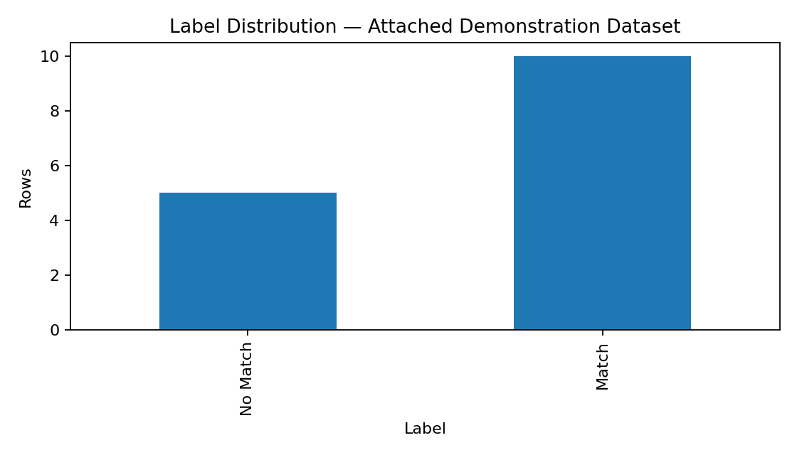 | 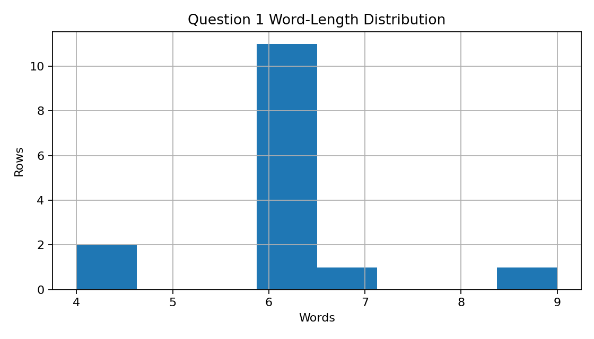 |

| Text B length distribution | Prediction probability distribution |
|---|---|
| 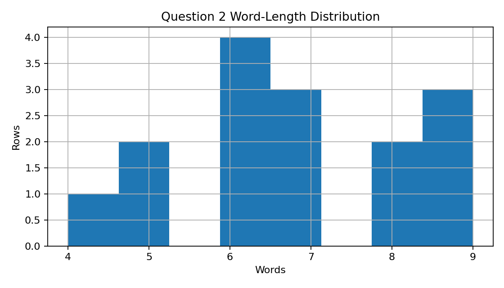 | 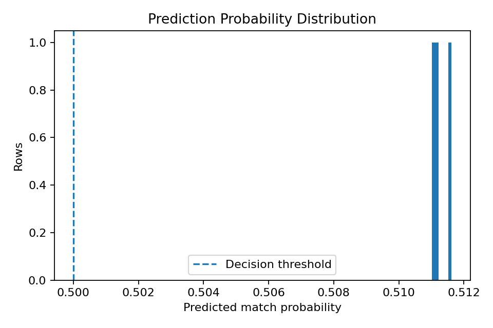 |

| Training accuracy | Training loss |
|---|---|
| 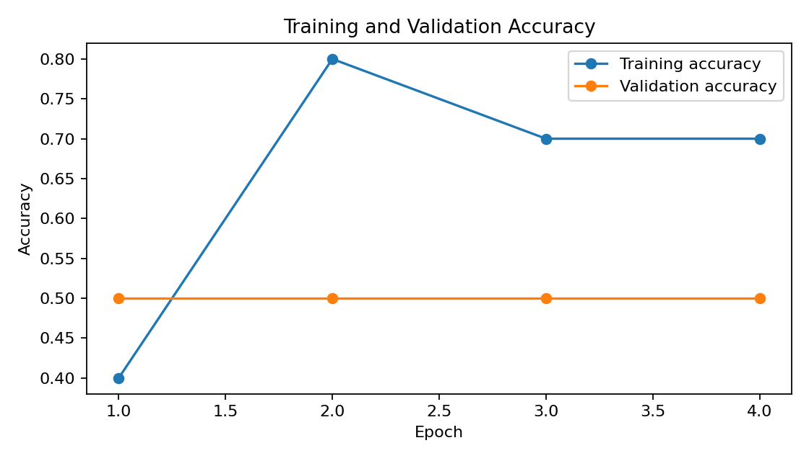 | 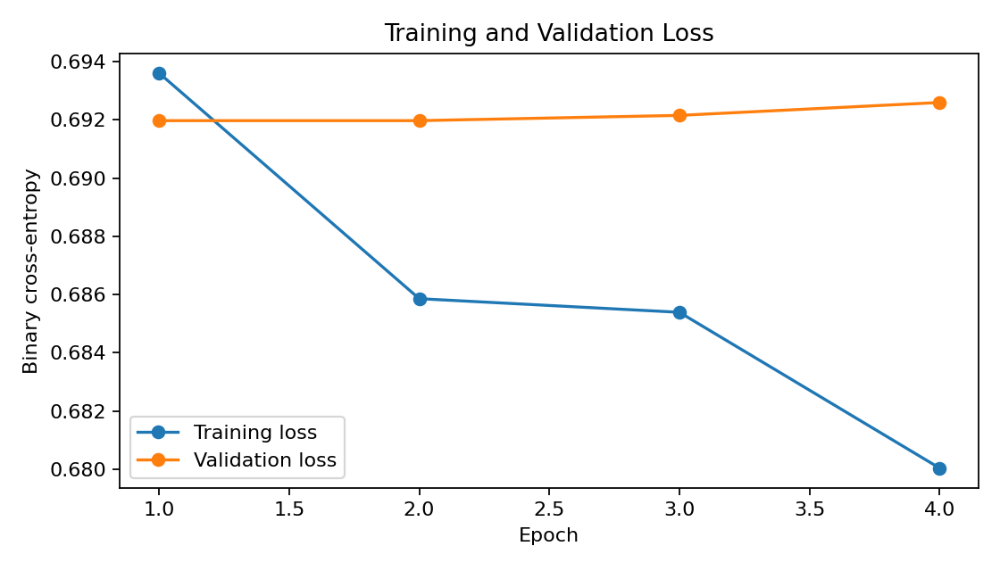 |

| ROC curve | Precision-recall curve |
|---|---|
| 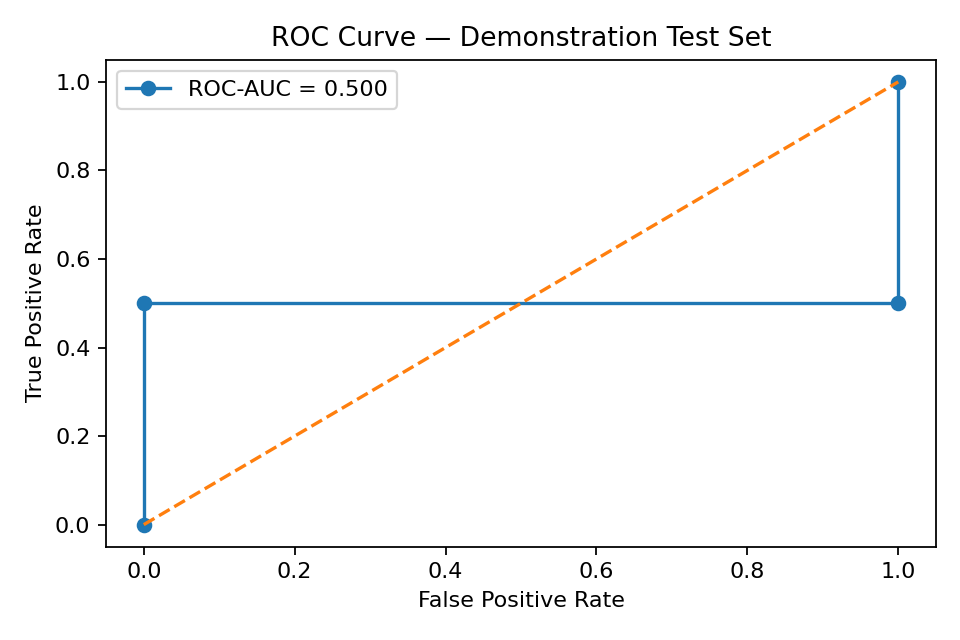 | 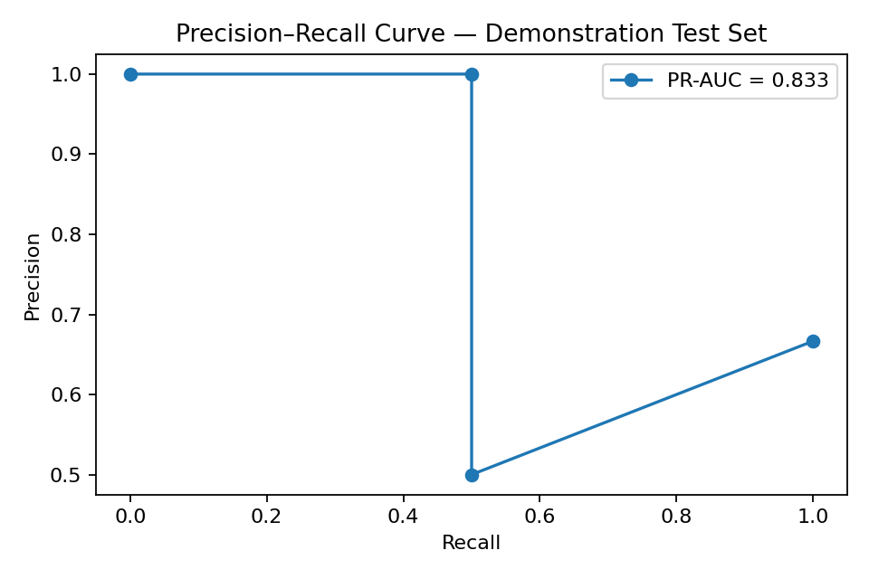 |

### Confusion Matrix

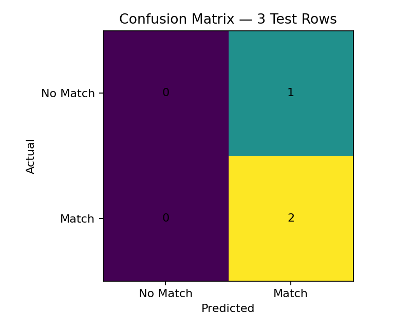

These figures are tiny-sample diagnostics and should not be interpreted as
credible benchmark evaluation.

## Streamlit Application

The deployed application supports four workflows:

1. **Single Pair**
2. **Batch CSV**
3. **Rank Candidates**
4. **Model Details**

### Application features

- safe sample pairs,
- manual Text A and Text B entry,
- Match / No Match prediction,
- match probability,
- decision confidence,
- threshold display,
- interpretation bands,
- shared-token display,
- Jaccard lexical overlap,
- CSV batch prediction,
- prediction distribution chart,
- downloadable scored CSV,
- multiple-candidate ranking,
- architecture visualization,
- model metadata, and
- responsible-use limitations.

### Application Overview

The main application view presents the model objective, transfer-learning scope,
privacy warning, input fields, prediction workflow, candidate-ranking workflow,
and model documentation.

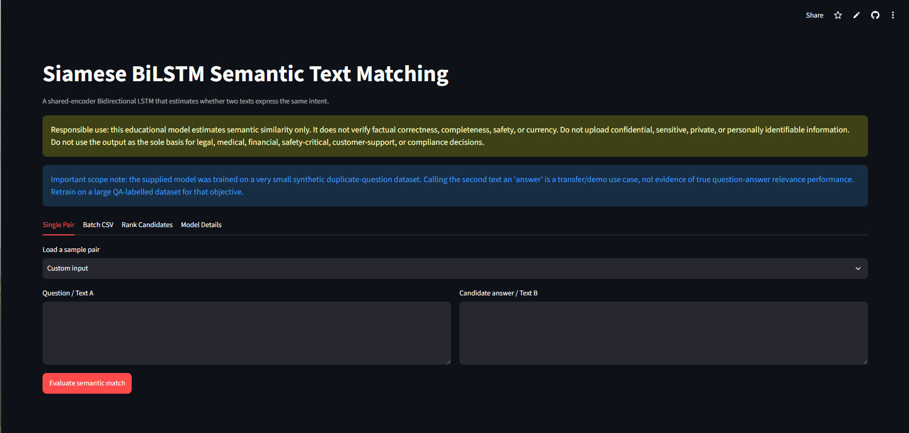

### Question–Candidate Match Prediction

The single-pair workflow displays the entered question and candidate text,
predicted label, match probability, decision confidence, threshold,
interpretation, shared tokens, and lexical overlap.

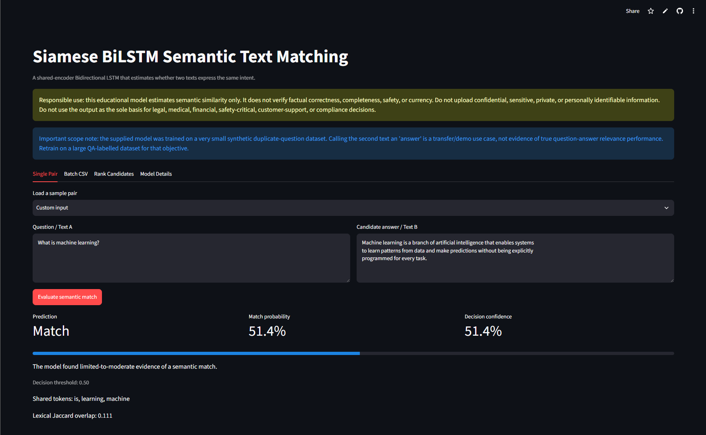

### Candidate Answer Ranking

The ranking workflow scores multiple candidate texts against one question and
sorts them by the neural match probability.

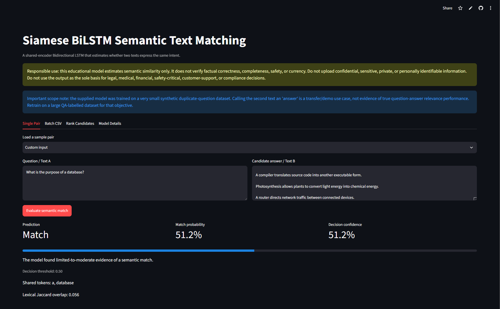

No batch screenshot is included in this README. The batch workflow remains
available in the application and source code.

## Safe Sample Pairs

The app includes safe examples such as:

### Likely match

```text
Text A:
How can I learn Python quickly?

Text B:
What is the fastest way to learn Python?
```

### Likely no match

```text
Text A:
How can I learn Python quickly?

Text B:
What is the capital of France?
```

### Machine-learning paraphrase

```text
Text A:
What is machine learning?

Text B:
Can you explain the meaning of machine learning?
```

These examples demonstrate interface behaviour. The current checkpoint may
still produce similar probabilities because of its tiny training set.

## Batch CSV Format

The application supports common schemas such as:

```csv
question1,question2
"How can I learn Python?","What is the fastest way to learn Python?"
"What is machine learning?","The Pacific Ocean is the largest ocean on Earth."
```

or:

```csv
question,answer
"What does a database do?","A database stores and retrieves organized information."
"What does a database do?","A thermometer measures temperature."
```

The batch output includes:

- normalized pair columns,
- match probability,
- predicted class,
- predicted label, and
- decision confidence.

## Model Artifacts

| Artifact | Purpose |
|---|---|
| `models/qa_siamese_bilstm_model.keras` | Saved Keras Siamese BiLSTM model |
| `models/tokenizer.json` | Shared tokenizer used for both text branches |
| `models/model_metadata.json` | Architecture, task scope, label mapping, threshold, split sizes, metrics, and responsible-use metadata |

The three artifacts must remain synchronized. Replacing the model without its
matching tokenizer and metadata can invalidate inference.

### Artifact validation

Validate metadata without loading TensorFlow:

```bash
python scripts/validate_artifacts.py --metadata-only
```

Run full validation when TensorFlow and the real Keras artifact are available:

```bash
python scripts/validate_artifacts.py
```

## Output Files

| Output | Purpose |
|---|---|
| `outputs/eda_summary.json` | Dataset audit and length summary |
| `outputs/model_metrics.json` | Bundled three-row test diagnostics |
| `outputs/baseline_comparison.csv` | Neural and baseline-comparison framework |
| `outputs/threshold_analysis.csv` | Exploratory threshold table |
| `outputs/error_analysis.csv` | Misclassification inspection |
| `outputs/sample_predictions.csv` | Pair-level prediction examples |
| `outputs/retrieval_examples.csv` | Candidate-ranking examples |
| `outputs/training_history.csv` | Epoch-level training history |
| `outputs/model_layers.txt` | Saved model-layer inventory |
| `outputs/label_distribution.png` | Label balance |
| `outputs/question1_length_distribution.png` | Text A length distribution |
| `outputs/question2_length_distribution.png` | Text B length distribution |
| `outputs/prediction_probability_distribution.png` | Score distribution |
| `outputs/training_accuracy_curve.png` | Training and validation accuracy |
| `outputs/training_loss_curve.png` | Training and validation loss |
| `outputs/confusion_matrix.png` | Tiny-sample confusion matrix |
| `outputs/roc_curve.png` | Tiny-sample ROC curve |
| `outputs/precision_recall_curve.png` | Tiny-sample precision-recall curve |

## Run Locally

### 1. Open the project directory

```bash
cd bi-directional-lstm-projects/04-question-answer-matching-siamese-bilstm
```

### 2. Create and activate a virtual environment

Windows Command Prompt:

```bat
py -3.11 -m venv .venv
.venv\Scripts\activate
```

Windows PowerShell:

```powershell
py -3.11 -m venv .venv
.venv\Scripts\Activate.ps1
```

macOS or Linux:

```bash
python3.11 -m venv .venv
source .venv/bin/activate
```

### 3. Install runtime dependencies

```bash
python -m pip install --upgrade pip
python -m pip install -r requirements.txt
```

Install development dependencies when needed:

```bash
python -m pip install -r requirements-dev.txt
```

### 4. Validate the project

```bash
python scripts/validate_artifacts.py --metadata-only
python -m compileall -q app src scripts tests
```

For complete model loading:

```bash
python scripts/validate_artifacts.py
```

### 5. Run tests

```bash
python -m pytest -q
```

### 6. Launch Streamlit

```bash
python -m streamlit run app/streamlit_app.py
```

Open the local address displayed in the terminal, normally:

```text
http://localhost:8501
```

Windows users can also run:

```bat
run_local.bat
```

macOS and Linux users can run:

```bash
chmod +x run_local.sh
./run_local.sh
```

## Retrain on a Credible Dataset

The improved training pipeline refuses to train on fewer than 100 labelled
pairs. Several thousand diverse pairs are recommended.

### Duplicate-question training

Use a dataset such as:

```csv
question1,question2,is_duplicate
"How can I learn Python?","What is the fastest way to learn Python?",1
"How can I learn Python?","What is the capital of France?",0
```

Run:

```bash
python scripts/train_model.py \
  --data path/to/question_pairs.csv \
  --epochs 20 \
  --batch-size 64
```

Windows Command Prompt equivalent:

```bat
python scripts\train_model.py --data path\to\question_pairs.csv --epochs 20 --batch-size 64
```

### True question-answer relevance training

Prepare data such as:

```csv
question,answer,is_match
"What is overfitting?","Overfitting occurs when a model memorizes training patterns and performs poorly on unseen data.",1
"What is overfitting?","SQL is used to query relational databases.",0
```

Then train with the same command.

For factual answer selection, labels should represent relevance and
correctness—not duplicate-question similarity.

## Improved Training Protocol

The modular training pipeline performs:

1. schema resolution,
2. text cleaning,
3. unordered pair deduplication,
4. stratified 70% / 15% / 15% splitting,
5. training-only tokenizer fitting,
6. balanced class-weight calculation,
7. Siamese BiLSTM training,
8. early stopping,
9. validation-based threshold tuning,
10. held-out test evaluation,
11. model and tokenizer persistence, and
12. prediction-analysis export.

The vocabulary is fitted only after splitting, reducing leakage.

## Evaluate a Saved Model

Run:

```bash
python scripts/evaluate_model.py
```

A credible evaluation should use an independent held-out set and report:

- Accuracy
- Precision
- Recall
- F1
- Macro F1
- Weighted F1
- ROC-AUC
- PR-AUC
- Confusion matrix
- Threshold sensitivity
- Probability calibration
- Hard-negative performance

For candidate ranking, also report:

- MRR
- Recall@K
- Precision@K
- MAP
- NDCG

## Deployment

The application is deployed through Streamlit Community Cloud from the public
BiLSTM portfolio repository.

- **Repository:** `unit-mole/bi-directional-lstm-projects`
- **Branch:** `main`
- **Entrypoint:** `04-question-answer-matching-siamese-bilstm/app/streamlit_app.py`
- **Python:** `3.11`
- **Secrets:** None
- **Live application:**  
  https://bi-directional-lstm-projects-jvvrbxy7ukywyxzoqd4vnw.streamlit.app/

The deployment dependency file should remain beside the nested Streamlit
entrypoint:

```text
04-question-answer-matching-siamese-bilstm/app/requirements.txt
```

See [`README_HOSTING.md`](README_HOSTING.md) for detailed deployment and
maintenance guidance.

## Project Structure

```text
bi-directional-lstm-projects/
├── .github/
│   └── workflows/
│       └── 04-question-answer-matching-siamese-bilstm.yml
├── 01-emotion-detection-bilstm-attention/
├── 02-medical-text-classification-bilstm-attention/
├── 03-named-entity-recognition-bilstm-crf/
├── 04-question-answer-matching-siamese-bilstm/
│   ├── .streamlit/
│   │   └── config.toml
│   ├── app/
│   │   ├── __init__.py
│   │   ├── requirements.txt
│   │   └── streamlit_app.py
│   ├── archive/
│   │   ├── ORIGINAL_PROJECT_NOTES.md
│   │   ├── original_prediction_analysis.csv
│   │   ├── original_question_answer_matching_notebook.ipynb
│   │   └── original_training_history.csv
│   ├── data/
│   │   ├── README_data.md
│   │   └── quora_question_pairs_sample.csv
│   ├── images/
│   │   ├── candidate_answer_ranking_demo.png
│   │   ├── question_answer_match_demo.png
│   │   ├── siamese_bilstm_architecture.png
│   │   └── streamlit_app_overview.png
│   ├── models/
│   │   ├── model_metadata.json
│   │   ├── qa_siamese_bilstm_model.keras
│   │   └── tokenizer.json
│   ├── notebooks/
│   │   └── question_answer_matching_siamese_bilstm.ipynb
│   ├── outputs/
│   │   ├── baseline_comparison.csv
│   │   ├── confusion_matrix.png
│   │   ├── eda_summary.json
│   │   ├── error_analysis.csv
│   │   ├── label_distribution.png
│   │   ├── model_layers.txt
│   │   ├── model_metrics.json
│   │   ├── precision_recall_curve.png
│   │   ├── prediction_probability_distribution.png
│   │   ├── question1_length_distribution.png
│   │   ├── question2_length_distribution.png
│   │   ├── retrieval_examples.csv
│   │   ├── roc_curve.png
│   │   ├── sample_predictions.csv
│   │   ├── threshold_analysis.csv
│   │   ├── training_accuracy_curve.png
│   │   ├── training_history.csv
│   │   └── training_loss_curve.png
│   ├── scripts/
│   │   ├── evaluate_model.py
│   │   ├── run_streamlit.py
│   │   ├── train_model.py
│   │   └── validate_artifacts.py
│   ├── src/
│   │   ├── __init__.py
│   │   ├── baseline_model.py
│   │   ├── data_preprocessing.py
│   │   ├── inference_pipeline.py
│   │   ├── model_evaluation.py
│   │   ├── model_training.py
│   │   ├── pair_generation.py
│   │   ├── qa_matching.py
│   │   ├── sequence_generation.py
│   │   ├── siamese_model.py
│   │   ├── text_preprocessing.py
│   │   ├── tokenizer_utils.py
│   │   └── visualization.py
│   ├── tests/
│   │   ├── __init__.py
│   │   ├── test_data_preprocessing.py
│   │   ├── test_inference_pipeline.py
│   │   ├── test_pair_generation.py
│   │   ├── test_sequence_generation.py
│   │   └── test_text_preprocessing.py
│   ├── .dockerignore
│   ├── .gitignore
│   ├── Dockerfile
│   ├── FILE_MANIFEST.csv
│   ├── IMPROVEMENTS.md
│   ├── LICENSE
│   ├── MONOREPO_INTEGRATION.md
│   ├── PROJECT_AUDIT.md
│   ├── README.md
│   ├── README_HOSTING.md
│   ├── pyproject.toml
│   ├── pytest.ini
│   ├── requirements-dev.txt
│   ├── requirements.txt
│   ├── run_local.bat
│   ├── run_local.sh
│   └── train_model.py
├── 05-resume-job-description-matching-siamese-bilstm/
├── 06-code-comment-generation-bilstm-attention/
├── .gitignore
├── LICENSE
└── README.md
```

## Testing and Continuous Integration

Run the complete local test suite:

```bash
python -m pytest -q
```

Compile Python source:

```bash
python -m compileall -q app src scripts tests
```

Validate model metadata:

```bash
python scripts/validate_artifacts.py --metadata-only
```

The project-specific workflow is:

```text
.github/workflows/04-question-answer-matching-siamese-bilstm.yml
```

The workflow performs:

- Git LFS-aware repository checkout,
- Python 3.11 setup,
- dependency installation,
- Python compilation,
- lightweight unit tests,
- model metadata validation,
- inference-pipeline syntax validation, and
- Streamlit application syntax validation.

The workflow does not retrain or benchmark the neural network.

## Docker

Build the image from the Project 04 directory:

```bash
docker build -t siamese-bilstm-semantic-matcher .
```

Run the container:

```bash
docker run --rm -p 8501:8501 siamese-bilstm-semantic-matcher
```

Then open:

```text
http://localhost:8501
```

## Limitations

- The supplied dataset contains only 15 synthetic pairs.
- The bundled training set contains only 10 rows.
- The validation split contains only two rows.
- The test split contains only three rows.
- The saved model predicts Match for every bundled test pair.
- Probabilities are tightly clustered near 0.51.
- The model is poorly calibrated.
- Duplicate-question matching is not factual answer validation.
- The effective vocabulary contains only 81 tokens.
- Long answers are truncated to 40 tokens.
- Lowercasing removes capitalization information.
- Keyword overlap can create false positives.
- Valid paraphrases with little lexical overlap can create false negatives.
- Negation, ambiguity, domain terminology, and unseen entities can reduce
  reliability.
- Candidate ranking is only as good as the underlying pair probabilities.
- The public demo does not verify privacy or redact sensitive content.
- Domain transfer requires retraining and independent evaluation.

## Future Improvements

1. Replace the synthetic sample with a licensed dataset containing several
   thousand or more labelled pairs.
2. Use grouped splitting to prevent related or duplicate questions from leaking
   across splits.
3. Retrain separately for duplicate detection and question-answer relevance.
4. Add hard-negative mining.
5. Add TF-IDF, Logistic Regression, SVM, sentence-transformer, and cross-encoder
   baselines.
6. Add probability calibration.
7. Evaluate out-of-domain and adversarial examples.
8. Report MRR, Recall@K, Precision@K, MAP, and NDCG for ranking.
9. Increase maximum sequence length for answer-ranking tasks.
10. Add token or sentence embedding coverage monitoring.
11. Add confidence-based abstention.
12. Add an optional reranking stage.
13. Cache candidate embeddings for larger retrieval collections.
14. Add approximate-nearest-neighbour retrieval before neural reranking.
15. Add automated Streamlit deployment smoke tests.
16. Add experiment tracking and model versioning.
17. Add a formal model card and data card.

## Connection to Quality Data Science

The semantic-matching workflow can be extended to quality and operational use
cases such as:

- matching new GCS cases to historical cases,
- retrieving similar issue descriptions,
- suggesting prior resolutions,
- comparing defect narratives,
- grouping semantically related complaints,
- matching failure descriptions to troubleshooting guidance,
- locating related root-cause investigations,
- routing questions to knowledge-base entries, and
- reducing repeated manual searches.

A production quality-domain system would require governed internal data,
privacy controls, domain-specific relevance labels, grouped evaluation, and
human review.

## Skills Demonstrated

- Semantic text-pair classification
- Duplicate-question detection
- Question-candidate ranking
- Siamese neural networks
- Shared-weight architectures
- Bidirectional LSTM modeling
- TensorFlow and Keras
- Pair-interaction feature engineering
- Shared tokenization
- Sequence padding and truncation
- Train-only vocabulary construction
- Pair deduplication
- Binary probability scoring
- Threshold interpretation
- Lexical-overlap analysis
- TF-IDF baseline implementation
- Candidate retrieval mechanics
- Error analysis
- Model-artifact persistence
- Single-record and batch inference
- Streamlit application development
- Unit testing
- GitHub Actions
- Git LFS artifact handling
- Docker packaging
- Responsible AI communication
- Deployment-ready NLP engineering

## Portfolio Positioning

**One-line description:** End-to-end semantic text-pair matching application
using a shared-encoder Siamese BiLSTM, explicit pair-interaction features,
probability scoring, candidate ranking, tests, Docker, and Streamlit.

**Pinned repository description:** Modular Siamese BiLSTM semantic matcher with
duplicate-question detection, shared encoders, absolute-difference and
element-wise-product features, threshold-aware inference, candidate ranking,
saved Keras artifacts, CI, Docker, and a live Streamlit application.

The project demonstrates the ability to audit an existing model honestly,
separate the artifact’s actual training task from its possible transfer use,
build a reusable pair-scoring pipeline, and package the complete workflow for
deployment and review.

## Responsible Use

This repository is an educational portfolio demonstration. It is not validated
for factual answer verification, legal, medical, financial, customer-support,
compliance, hiring, safety-critical, or other consequential use.

Do not submit private, confidential, sensitive, personally identifiable,
medical, legal, customer, employee, security, or proprietary text to the public
application.

## License

Project code is distributed under the MIT License. Any replacement dataset,
pretrained embedding, or third-party model remains governed by its own license,
terms, and citation requirements.

## Author

**Anmol Tripathi**  
Quality Data Scientist transitioning toward Data Science, Machine Learning,
Applied AI, Analytics Engineering, and Quality Analytics roles.
