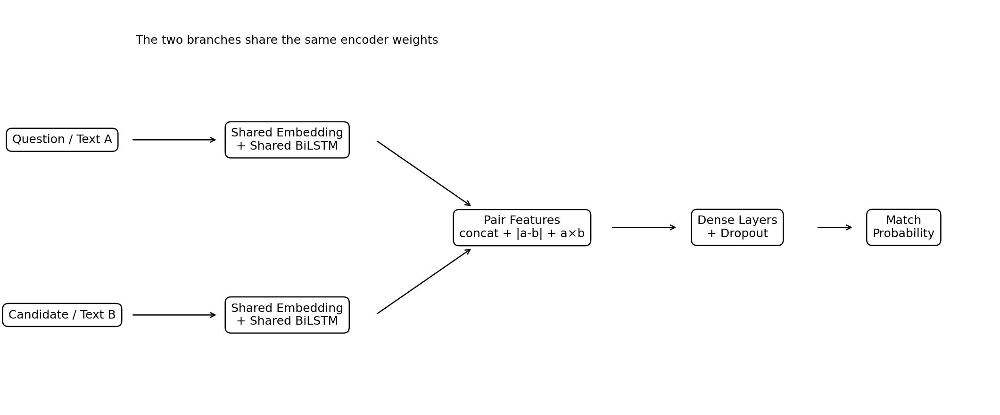

# Question Matching with a Siamese Bidirectional LSTM

[](#local-setup)
[](#model-architecture)
[](#streamlit-demo)
[](../../actions)

An end-to-end semantic text-pair matching project built with a **shared-encoder Siamese Bidirectional LSTM**. The project packages preprocessing, model architecture, training, evaluation, error analysis, inference, top-k candidate ranking, tests, Docker support, GitHub Actions, and a deployable Streamlit interface.

> **Responsible use and privacy:** This project is for education and portfolio demonstration only. It estimates semantic similarity but does not verify factual correctness, completeness, safety, or currency. Do not use it as the sole basis for legal, medical, financial, safety-critical, customer-support, or compliance decisions. Do not upload private, confidential, sensitive, or personally identifiable information.

## Honest Audit of the Attached Project

The supplied files do **not** contain a genuine question-answer relevance dataset. They implement **duplicate-question detection** using the columns `question1`, `question2`, and `is_duplicate`. This is a valid semantic matching task and a natural Siamese-network use case, but calling it factual answer matching would overstate the evidence.

The attached CSV contains only **15 synthetic pairs**: 10 matches and 5 non-matches. The saved test analysis contains 3 rows, and model probabilities are clustered near **0.51**. The apparent test accuracy of 66.7% and F1 of 0.80 are therefore not credible generalization evidence. The committed model is retained as a working deployment artifact; the modular training pipeline is the portfolio-grade improvement and should be retrained on a much larger dataset.

## Practical Objective

Given two texts, estimate whether they express the same intent or are semantically aligned.

```text
Question / Text A
        ↓
Shared Embedding + Shared Bidirectional LSTM
        ↓
Semantic Vector A

Candidate / Text B
        ↓
The same shared encoder
        ↓
Semantic Vector B

[A, B, |A-B|, A×B] → Dense layers → Match probability
```

This architecture is useful for duplicate-question detection, FAQ retrieval, support-ticket matching, issue-resolution recommendation, semantic search, and—after retraining on appropriate labels—question-answer relevance ranking.

## Dataset

The included `data/quora_question_pairs_sample.csv` is the exact small demonstration file supplied with the project. It has:

| Column | Meaning |
|---|---|
| `question1` | First question/text |
| `question2` | Second question/text |
| `is_duplicate` | `1 = Match`, `0 = No Match` |

It is a synthetic Quora-style sample, not the full official Quora Question Pairs dataset. Do not report the saved metrics as benchmark results.

## Preprocessing

The production code:

- resolves common pair-column aliases;
- removes rows missing either text;
- standardizes binary labels;
- normalizes Unicode and HTML;
- preserves question words, negations, numbers, and entities;
- handles URLs with a token;
- uses one shared tokenizer and OOV token;
- pads and truncates both sequences consistently;
- fits the tokenizer only on training data in the improved training pipeline;
- deduplicates unordered pairs to reduce leakage.

## Model Architecture

The supplied model contains:

- shared embedding: 128 dimensions;
- shared BiLSTM: 64 units per direction;
- global max pooling;
- 128-dimensional semantic projection;
- concatenated question vector, candidate vector, absolute difference, and element-wise product;
- dense layers with dropout;
- sigmoid match probability.



A Siamese network shares the same encoder weights across both branches. This places both texts in the same learned semantic space and reduces the number of parameters compared with two independent encoders.

## Evaluation

The improved pipeline supports accuracy, precision, recall, F1, macro F1, weighted F1, ROC-AUC, PR-AUC, confusion matrix, classification report, and validation-based threshold tuning.

Saved metrics under `outputs/model_metrics.json` reproduce the supplied three-row test analysis only. The confusion matrix shows that the model predicted every test row as a match, including the one negative pair. This is consistent with its near-constant probabilities and is a clear sign that the attached model is undertrained.

## Streamlit Demo

The app includes:

- manual pair prediction;
- match probability and confidence;
- sample pairs;
- lexical-overlap interpretation;
- CSV batch scoring and download;
- one-question/multiple-candidate ranking;
- architecture and limitation sections;
- responsible-use and privacy warnings.

The committed Keras archive was load-tested with TensorFlow 2.20.0.

Run it with:

```bash
streamlit run app/streamlit_app.py
```

## Local Setup

```bash
git clone https://github.com/<YOUR_GITHUB_USERNAME>/bi-directional-lstm-projects.git
cd bi-directional-lstm-projects/04-question-answer-matching-siamese-bilstm
python -m venv .venv
```

Windows:

```powershell
.venv\Scriptsctivate
pip install -r requirements.txt
streamlit run app/streamlit_app.py
```

macOS/Linux:

```bash
source .venv/bin/activate
pip install -r requirements.txt
streamlit run app/streamlit_app.py
```

## Retraining on a Real Dataset

Use a dataset with at least several thousand labelled pairs. The script refuses to train on fewer than 100 rows so that the tiny sample cannot accidentally be presented as a credible model.

```bash
python scripts/train_model.py --data path/to/labelled_pairs.csv --epochs 20 --batch-size 64
```

Supported column patterns include `question1/question2/is_duplicate`, `question/answer/is_match`, `text_a/text_b/label`, and `sentence1/sentence2/target`.

For true QA relevance, train on data where each row contains a question, a candidate answer, and a relevance label. Duplicate-question labels are not a substitute for factual answer relevance.

## Docker

```bash
docker build -t siamese-bilstm-matcher .
docker run --rm -p 8501:8501 siamese-bilstm-matcher
```

## Project Structure

```text
04-question-answer-matching-siamese-bilstm/
├── .streamlit/
├── app/
├── archive/
├── data/
├── images/
├── models/
├── notebooks/
├── outputs/
├── scripts/
├── src/
├── tests/
├── Dockerfile
├── README.md
├── README_HOSTING.md
├── requirements.txt
└── run_local.*
```

## Limitations

- The committed model is trained on 15 synthetic question pairs.
- Duplicate-question similarity is not factual answer validation.
- Scores are poorly calibrated and tightly clustered near the decision boundary.
- Vocabulary coverage is tiny and domain transfer is unreliable.
- Keyword overlap can create false positives; paraphrases with few common words can create false negatives.
- Long answers, negation, ambiguity, and domain terminology need larger, representative training data.

## Future Improvements

Train on the full public Quora Question Pairs dataset for duplicate detection or a dedicated QA relevance dataset; use grouped splits to prevent duplicate leakage; compare TF-IDF and sentence-transformer baselines; add hard-negative mining; calibrate probabilities; evaluate MRR and Recall@K; add embedding caching; and export an optimized inference model.

## Portfolio Positioning

**One-line description:** Built a deployable Siamese BiLSTM semantic matching system with shared encoders, pairwise interaction features, threshold-aware inference, batch scoring, top-k ranking, tests, Docker, and Streamlit.

This project connects naturally to quality analytics through customer-issue matching, GCS case-to-resolution retrieval, troubleshooting recommendation, complaint-text similarity, FAQ automation, and reusable semantic-search workflows.
