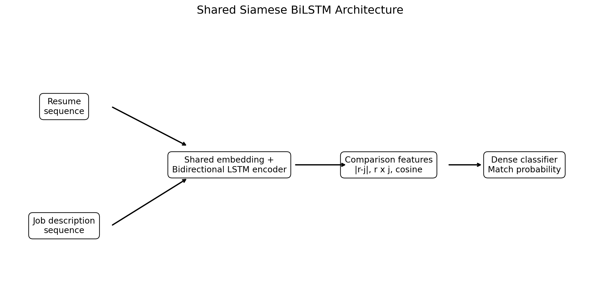

# Resume–Job Description Matching with a Shared Siamese BiLSTM

An end-to-end NLP and HR-analytics portfolio project that compares a resume with a job description, estimates semantic alignment, explains transparent skill overlap, supports batch scoring, and ranks multiple anonymized resumes for one role.

> **Responsible-use notice:** This project is an educational demonstration only. It must not be used as the sole basis for hiring, rejection, promotion, compensation, immigration, legal, or employment decisions. Do not upload real private resumes to a public demo.

## Project Objective

Given a resume and a job description, estimate how closely the two texts align based on skills, domain language, tools, responsibilities, and role requirements.

The system returns:

- Match / No Match prediction
- Neural match probability
- Blended fit score
- Weak, Moderate, or Strong Match band
- Overlapping skills
- Potential requirement gaps
- Batch predictions
- Top-k resume ranking
- Responsible-use reminder

## Why a Siamese BiLSTM?

A Siamese network processes two inputs through the same encoder. In this project:

1. The resume and job description use one shared tokenizer.
2. Both sequences pass through the same embedding layer.
3. Both sequences pass through the same Bidirectional LSTM encoder.
4. The resulting vectors occupy the same semantic space.
5. The classifier compares the vectors using:
   - the two original embeddings;
   - absolute difference;
   - element-wise product;
   - cosine similarity.
6. Dense layers return a match probability.

Because the encoder weights are shared, the architecture is genuinely Siamese rather than two unrelated BiLSTM branches.



## Important Audit of the Attached Starting Files

The supplied notebook and artifacts were reviewed before this project was rebuilt.

The original proof of concept contained:

- 8 resume rows;
- 24 generated pairs: 8 positive and 16 negative;
- separate resume and job embedding/BiLSTM layers despite a function being named `build_shared_encoder`;
- a four-row test set;
- 75% test accuracy but 0.00 positive-class precision, recall, and F1;
- all test probabilities clustered near 0.49 and all predictions classified as No Match;
- a placeholder Streamlit cell without model loading or inference;
- a double-encoded tokenizer JSON file.

The original notebook, model, tokenizer, and outputs are preserved under `archive/` for traceability. See [IMPROVEMENTS.md](IMPROVEMENTS.md) and [PROJECT_AUDIT.md](PROJECT_AUDIT.md) for the detailed review.

## Dataset

The supplied `resume_dataset.csv` has these columns:

| Column | Meaning |
|---|---|
| `Category` | Resume category or role family |
| `Resume_str` | Short resume text |

The file contains eight short examples across seven categories:

- Data Science
- HR
- Java Developer
- Python Developer
- Sales
- DevOps Engineer
- Testing

Because this is far too small for a credible hiring model, the repository uses transparent synthetic job-description templates to create a runnable portfolio demonstration. The full approach is documented in [data/README_data.md](data/README_data.md).

### Split design

Synthetic job-description template index determines the split:

- Templates 1–6: training
- Template 7: validation
- Template 8: test

The same small set of resumes still appears across partitions, so the metrics below are demonstration metrics only and must not be interpreted as real-world generalization.

## Text Preprocessing

The preprocessing pipeline:

- normalizes Unicode and HTML;
- removes bullet formatting and excess whitespace;
- masks common email, URL, and phone patterns;
- preserves numbers and useful technical context;
- normalizes terms such as C++, C#, .NET, CI/CD, and Power BI;
- avoids stop-word removal and stemming;
- preserves job titles, years, requirements, negations, section language, and technical skills;
- applies the same preprocessing during training and inference.

Aggressive cleaning is intentionally avoided because resume and job-description meaning often depends on terms such as “must have,” “no sponsorship,” degree names, tools, certifications, and experience duration.

## Architecture

```text
Resume sequence ─┐
                 ├─> Shared Embedding ─> Shared Bidirectional LSTM ─> Resume vector
Job sequence ────┘                                              └─> Job vector

Resume vector + Job vector
        ├─ Original vectors
        ├─ Absolute difference
        ├─ Element-wise product
        └─ Cosine similarity
                 ↓
          Dense matching layers
                 ↓
          Match probability
```

### Configured demonstration model

| Parameter | Value |
|---|---:|
| Vocabulary cap | 12,000 |
| Effective vocabulary | 167 tokens |
| Shared sequence length | 48 tokens |
| Embedding dimension | 32 |
| BiLSTM units per direction | 12 |
| Semantic projection | 32 |
| Decision threshold | 0.465 |

The small architecture is deliberate because the demonstration dataset is tiny.

## Fit Score Design

The interface reports both the neural probability and a more transparent demonstration fit score.

```text
Fit score = 0.35 × Siamese BiLSTM probability
          + 0.35 × TF-IDF similarity
          + 0.30 × transparent skill coverage
```

This reduces the risk that the tiny neural artifact dominates every result and gives reviewers supporting signals they can inspect. The fit score is still not a hiring recommendation.

### Score bands

| Score | Interpretation |
|---:|---|
| 0%–39% | Weak Match |
| 40%–69% | Moderate Match |
| 70%–100% | Strong Match |

## Demonstration Results

### Binary pair classification

| Approach | Accuracy | Precision | Recall | F1 | ROC-AUC | PR-AUC |
|---|---:|---:|---:|---:|---:|---:|
| TF-IDF cosine baseline | 0.875 | 1.000 | 0.750 | 0.857 | 1.000 | 1.000 |
| Transparent skill overlap | 0.750 | 0.667 | 1.000 | 0.800 | 0.953 | 0.932 |
| Shared Siamese BiLSTM | 0.875 | 0.800 | 1.000 | 0.889 | 0.984 | 0.986 |

The Siamese BiLSTM test confusion matrix is:

```text
                 Predicted No Match   Predicted Match
Actual No Match           6                 2
Actual Match              0                 8
```

These values come from only 16 synthetic test pairs. They demonstrate pipeline behavior, not production performance.

### Ranking evaluation

| Metric | Value |
|---|---:|
| Recall@3 | 0.286 |
| Mean Reciprocal Rank | 0.345 |
| NDCG | 0.498 |

The ranking result is intentionally reported even though it is weak. The current dataset does not contain enough diverse resumes to establish a useful ranking model. Improving ranking is a documented next step rather than something hidden behind a strong classification score.

## Evaluation Outputs

Generated files are saved under `outputs/`:

```text
outputs/
├── figures/
│   ├── confusion_matrix.png
│   ├── job_description_length_distribution.png
│   ├── label_distribution.png
│   ├── precision_recall_curve.png
│   ├── resume_length_distribution.png
│   ├── roc_curve.png
│   ├── similarity_score_distribution.png
│   ├── training_accuracy.png
│   └── training_loss.png
├── metrics/
│   ├── baseline_comparison.csv
│   ├── model_metrics.json
│   ├── ranking_metrics.json
│   └── training_history.csv
└── predictions/
    ├── ranking_examples.csv
    └── sample_predictions.csv
```

## Streamlit Demo

The app provides four workflows:

### 1. Single Match

- Paste an anonymized resume.
- Paste a job description.
- View prediction, neural probability, fit score, and score band.
- Review overlapping and missing skills.
- Inspect TF-IDF and skill-coverage signals.

### 2. Batch CSV

- Upload a CSV with resume and job-description columns.
- Automatically detect common column names.
- Score every pair.
- View a distribution chart.
- Download the scored CSV.

### 3. Rank Resumes

- Enter one job description.
- Upload a CSV containing `resume_id` and `resume_text`.
- Rank resumes by fit score.
- Download the ranking.

### 4. Model and Limitations

- Review the architecture.
- Read fairness, privacy, and data limitations.
- Confirm whether the neural model loaded or the transparent fallback is active.

## Run Locally

### Windows

```powershell
cd bi-directional-lstm-projects\05-resume-job-description-matching-siamese-bilstm
python -m venv .venv
.venv\Scripts\activate
python -m pip install --upgrade pip
pip install -r requirements.txt
streamlit run app\streamlit_app.py
```

You can also double-click `run_local.bat`.

### macOS / Linux

```bash
cd bi-directional-lstm-projects/05-resume-job-description-matching-siamese-bilstm
python3 -m venv .venv
source .venv/bin/activate
python -m pip install --upgrade pip
pip install -r requirements.txt
streamlit run app/streamlit_app.py
```

## Retrain the Model

```bash
python scripts/train_model.py
```

The standard training script uses TensorFlow/Keras and saves:

```text
models/resume_job_siamese_bilstm_model.keras
models/tokenizer.json
models/model_metadata.json
```

The app loads these artifacts and does not retrain during startup.

## Run Tests

```bash
pip install -r requirements-dev.txt
pytest -q
python scripts/validate_artifacts.py --allow-missing-tensorflow
```

The GitHub Actions workflow performs lightweight compilation, pure-Python tests, imports, and artifact metadata validation. It does not retrain the neural model.

## Docker

```bash
docker build -t resume-jd-bilstm .
docker run --rm -p 8501:8501 resume-jd-bilstm
```

Open `http://localhost:8501`.

## Hosting

Streamlit Community Cloud is the recommended option because the project already uses a Streamlit entry point and pre-trained artifacts.

Set the main file path to:

```text
05-resume-job-description-matching-siamese-bilstm/app/streamlit_app.py
```

Detailed instructions are available in [README_HOSTING.md](README_HOSTING.md).

## Folder Structure

```text
05-resume-job-description-matching-siamese-bilstm/
├── .streamlit/
├── app/
├── archive/
├── data/
│   ├── raw/
│   ├── processed/
│   └── sample/
├── images/
├── models/
├── notebooks/
├── outputs/
│   ├── figures/
│   ├── metrics/
│   └── predictions/
├── scripts/
├── src/
├── tests/
├── .dockerignore
├── .gitignore
├── Dockerfile
├── FILE_MANIFEST.csv
├── IMPROVEMENTS.md
├── MODEL_CARD.md
├── MONOREPO_INTEGRATION.md
├── PROJECT_AUDIT.md
├── README.md
├── README_HOSTING.md
├── requirements-dev.txt
├── requirements.txt
├── run_local.bat
├── run_local.sh
└── train_model.py
```

## Fairness, Bias, and Privacy

The model should not use or infer protected characteristics such as name, age, gender, race, nationality, disability, religion, pregnancy status, or other protected information.

Removing those fields is not enough to guarantee fairness. Historical patterns, schools, employers, geography, writing style, career gaps, job titles, and vocabulary can act as proxies. A real system would require:

- representative labeled data;
- subgroup fairness evaluation;
- human review and appeal processes;
- explainability and audit logs;
- security and access controls;
- data minimization and retention limits;
- candidate notice and consent where required;
- legal and compliance review;
- ongoing drift and bias monitoring.

The system does not verify candidate truthfulness, seniority, soft skills, work authorization, interview readiness, accommodations, or future job performance.

## Limitations

- Only eight short resumes were supplied.
- Job descriptions and pair labels are synthetic.
- Resumes repeat across train, validation, and test partitions.
- The skill catalog is intentionally small and transparent.
- The model can overvalue vocabulary overlap.
- Seniority, negations, certifications, and transferable skills remain difficult.
- Ranking quality is currently weak.
- Results are not calibrated on external recruiting data.
- No protected-group fairness analysis is possible with the supplied data.

## Future Improvements

1. Train on a substantially larger, legally usable, anonymized pair dataset.
2. Use grouped splits that hold out candidate profiles and employers.
3. Add hard-negative mining for similar but incorrect roles.
4. Add experience-level, seniority, education, certification, and location features with governance review.
5. Compare against sentence-transformer and cross-encoder baselines.
6. Calibrate probabilities using Platt scaling or isotonic regression.
7. Add richer ranking metrics and learning-to-rank training.
8. Test subgroup fairness and counterfactual consistency.
9. Add model monitoring, versioning, and experiment tracking.
10. Add PDF/DOCX text extraction only in a controlled privacy-safe deployment.

## Portfolio Positioning

### One-line description

Shared-weight Siamese BiLSTM for privacy-aware resume–job semantic matching, explainable fit scoring, batch inference, and top-k ranking through Streamlit.

### Skills demonstrated

- NLP preprocessing
- Semantic text matching
- Siamese neural networks
- Bidirectional LSTM sequence modeling
- Shared-weight encoders
- Binary classification
- Threshold tuning
- Baseline comparison
- Ranking metrics
- Error analysis
- Explainability-oriented UX
- Responsible AI and privacy communication
- Streamlit deployment
- Docker and GitHub Actions
- Modular, testable Python project design

### Connection to Quality Data Science

The same technical patterns transfer naturally to quality analytics work:

- matching new GCS cases with historical cases;
- comparing issue descriptions with known failure modes;
- routing support records to the correct team;
- matching requirements with evidence;
- identifying similar corrective actions;
- ranking relevant documents for root-cause investigation;
- building human-in-the-loop decision-support tools.

## License

MIT License. See the repository-level `LICENSE` file.
