# Resume–Job Description Matching using a Shared Siamese Bidirectional LSTM

[](https://www.python.org/)
[](https://www.tensorflow.org/)
[](https://keras.io/)
[](https://bi-directional-lstm-projects-8xeeq2xagjbubsodntpurq.streamlit.app/)
[](LICENSE)
[](https://github.com/unit-mole/bi-directional-lstm-projects/actions/workflows/05-resume-job-description-matching-siamese-bilstm.yml)

An end-to-end NLP and responsible-AI portfolio project that compares a resume
with a job description using a **shared-weight Siamese Bidirectional Long
Short-Term Memory network**. The repository combines neural semantic
similarity, TF-IDF similarity, transparent skill coverage, threshold-aware
classification, batch scoring, resume ranking, saved Keras artifacts, automated
tests, GitHub Actions, Docker support, and a deployed Streamlit application.

The supplied source data contains only eight short example resumes. The
repository therefore uses synthetic job-description templates and balanced
positive/negative pairs to demonstrate the complete machine-learning workflow.
The model and application are **not validated for real hiring decisions**.

**Status:** Portfolio-ready educational engineering demonstration  
**Live demo:** [Open the Streamlit application](https://bi-directional-lstm-projects-8xeeq2xagjbubsodntpurq.streamlit.app/)  
[](https://bi-directional-lstm-projects-8xeeq2xagjbubsodntpurq.streamlit.app/)  
**Primary stack:** Python · TensorFlow · Keras · pandas · scikit-learn · Plotly · Streamlit

---

## Responsible Use, Fairness, and Privacy

> **Educational use only:** This project is not a hiring, rejection, promotion,
> compensation, immigration, legal, or employment-decision system.
>
> Do not upload real private resumes, names, email addresses, phone numbers,
> home addresses, immigration information, protected attributes, confidential
> job descriptions, or other personally identifiable information to the public
> application.
>
> Model scores must not be used as the sole basis for candidate screening,
> ranking, rejection, advancement, or any consequential employment decision.
> Real use would require representative data, fairness evaluation, legal review,
> human oversight, candidate notice, auditability, security controls, and an
> appeal process.

## Business Problem

Recruiters, hiring teams, staffing platforms, and internal-mobility programs may
receive many resumes for a role. Manual comparison can be time-consuming and
inconsistent, particularly when job requirements contain long lists of tools,
skills, responsibilities, and domain terms.

This project asks:

> Given an anonymized resume and a job description, how closely do the two texts
> align based on semantic similarity and transparent skill evidence?

The deployed pipeline returns:

- **Match / No Match prediction**
- **Neural match probability**
- **Blended fit score**
- **Weak / Moderate / Strong score band**
- **Overlapping skills**
- **Potential requirement gaps**
- **TF-IDF similarity**
- **Skill-coverage score**
- **Confidence around the decision threshold**
- **Batch-scoring results**
- **Top-k resume ranking**

These outputs are decision-support demonstrations, not hiring recommendations.

## Project Objective

Build a complete and auditable Siamese BiLSTM workflow that can:

1. Load and validate resume and job-description text.
2. Normalize both text types consistently.
3. Mask common private-contact patterns.
4. Preserve technical terms, negations, numbers, and experience context.
5. Generate balanced positive and negative training pairs.
6. Split data using job-template groups.
7. Fit one shared tokenizer for both model branches.
8. Encode resumes and job descriptions using identical shared weights.
9. Learn bidirectional contextual representations.
10. Compare embeddings using multiple interaction features.
11. Produce a neural match probability.
12. Combine neural and transparent similarity signals.
13. Display overlapping and potentially missing skills.
14. Support single-pair scoring.
15. Support batch CSV scoring and downloadable results.
16. Rank multiple anonymized resumes against one role.
17. Save and reload all model artifacts required for inference.
18. Generate classification, ranking, and error-analysis outputs.
19. Validate the codebase using tests and GitHub Actions.
20. Deploy the trained artifact through Streamlit Community Cloud.

## Portfolio Scope

This repository demonstrates the complete engineering pattern around a
resume–job semantic-matching model:

```text
source-data audit
    → privacy-aware text preprocessing
    → synthetic job-description generation
    → balanced pair generation
    → template-based data splitting
    → shared tokenization
    → Siamese BiLSTM training
    → threshold selection
    → baseline comparison
    → blended fit scoring
    → skill-gap interpretation
    → batch scoring and ranking
    → saved artifacts
    → Streamlit deployment
    → testing and CI
```

The strongest portfolio value is the transparent and deployable ML workflow,
not the small-sample demonstration metrics.

## Honest Audit of the Starting Project

The original proof of concept was reviewed before the project was rebuilt.

### Original project characteristics

- Eight short resume records
- Seven role categories
- Twenty-four generated pairs
- Eight positive pairs
- Sixteen negative pairs
- Separate resume and job embedding/BiLSTM layers
- A function named `build_shared_encoder` that did not actually share weights
- A four-row test set
- Test accuracy of 75%
- Positive-class precision, recall, and F1 of 0
- All test probabilities close to 0.49
- All four test records classified as No Match
- Placeholder Streamlit code without production inference
- A double-encoded tokenizer JSON artifact

The original notebook, model, tokenizer, and outputs are retained under
`archive/` for traceability.

### Improvements made

The current project introduces:

- a genuinely shared Siamese encoder,
- one shared tokenizer,
- balanced positive and negative pair generation,
- deterministic split handling,
- explicit pair-interaction features,
- TF-IDF and skill-overlap baselines,
- blended and explainable fit scoring,
- threshold-aware inference,
- batch prediction,
- resume ranking,
- saved Keras artifacts,
- evaluation outputs,
- privacy and fairness guidance,
- tests, CI, Docker, and
- a deployed Streamlit application.

See [`PROJECT_AUDIT.md`](PROJECT_AUDIT.md) and
[`IMPROVEMENTS.md`](IMPROVEMENTS.md) for the detailed review.

## Dataset

### Supplied resume data

The original source file is stored at:

```text
data/raw/resume_dataset.csv
```

It contains:

| Column | Meaning |
|---|---|
| `Category` | Resume role family |
| `Resume_str` | Short resume text |

### Resume records

| Attribute | Value |
|---|---:|
| Resume rows | 8 |
| Role categories | 7 |
| Data Science resumes | 2 |
| Other-category resumes | 1 per category |

The role categories are:

- Data Science
- HR
- Java Developer
- Python Developer
- Sales
- DevOps Engineer
- Testing

### Synthetic job descriptions

The project creates eight job-description templates for every role category:

| Template index | Split |
|---:|---|
| 1–6 | Training |
| 7 | Validation |
| 8 | Test |

With seven role categories, the demonstration contains:

```text
7 categories × 8 templates = 56 synthetic job descriptions
```

### Balanced pair generation

For every resume and every same-category job description, the pipeline creates:

1. one positive resume–job pair, and
2. one deterministic negative pair from another category in the same split.

The processed demonstration dataset contains:

| Label | Rows | Share |
|---|---:|---:|
| No Match | 64 | 50% |
| Match | 64 | 50% |
| **Total** | **128** | **100%** |

### Split distribution

| Split | No Match | Match | Total |
|---|---:|---:|---:|
| Training | 48 | 48 | 96 |
| Validation | 8 | 8 | 16 |
| Test | 8 | 8 | 16 |
| **Total** | **64** | **64** | **128** |

The job-description templates are separated by split, but the same eight
resumes still appear across training, validation, and test partitions.
Therefore, the reported results are pipeline demonstrations rather than
credible estimates of unseen-candidate generalization.

### Included data files

```text
data/
├── raw/
│   └── resume_dataset.csv
├── processed/
│   └── resume_job_pairs.csv
├── sample/
│   ├── sample_job_descriptions.csv
│   ├── sample_resume_job_pairs.csv
│   └── sample_resumes.csv
└── README_data.md
```

## Data Governance

The repository contains synthetic and example data only.

Do not commit:

- real candidate names,
- email addresses,
- phone numbers,
- home addresses,
- LinkedIn or GitHub profile URLs,
- photographs,
- birth dates,
- age indicators,
- race or ethnicity,
- gender or gender identity,
- religion,
- disability information,
- pregnancy information,
- nationality,
- immigration or work-authorization information,
- salary history,
- confidential employer data, or
- other protected or sensitive information.

Authorized private data should remain outside Git and be protected using
access controls, encryption, retention limits, audit logs, and applicable legal
review.

## Tools and Technologies

| Area | Technology |
|---|---|
| Language | Python 3.11 |
| Deep-learning framework | TensorFlow / Keras |
| Data processing | pandas, NumPy |
| Traditional similarity | TF-IDF and cosine similarity |
| Evaluation | scikit-learn |
| Static visualization | Matplotlib |
| Interactive visualization | Plotly |
| Application | Streamlit |
| Model persistence | Keras `.keras`, JSON |
| Testing and validation | pytest, compile checks, artifact validation |
| Continuous integration | GitHub Actions |
| Containerization | Docker |
| Hosting | Streamlit Community Cloud |

## Project Workflow

```text
Eight supplied resume examples
        │
        ▼
Privacy-aware resume preprocessing
        │
        ▼
Synthetic job-description templates
        │
        ▼
Positive and negative pair generation
        │
        ▼
Template-based train / validation / test split
        │
        ▼
Shared vocabulary and tokenizer
        │
        ▼
Sequence encoding and post-padding
        │
        ├──────────────────────────────────┐
        ▼                                  ▼
Resume sequence                      Job-description sequence
        │                                  │
        └──────────────┬───────────────────┘
                       ▼
          Shared Embedding + Shared BiLSTM
                       │
        ┌──────────────┴───────────────────┐
        ▼                                  ▼
Resume semantic vector             Job semantic vector
        │                                  │
        └──────────────┬───────────────────┘
                       ▼
Original vectors + |difference| + product + cosine
                       │
                       ▼
Dense matching classifier
                       │
                       ▼
Neural match probability
                       │
        ┌──────────────┼──────────────────────┐
        ▼              ▼                      ▼
TF-IDF similarity   Skill coverage     Threshold decision
        │              │                      │
        └──────────────┴──────────┬───────────┘
                                  ▼
                         Blended fit score
                                  │
                  ┌───────────────┼───────────────┐
                  ▼               ▼               ▼
             Single match     Batch scoring    Resume ranking
```

## Resume and Job-Description Preprocessing

The project avoids aggressive cleaning because employment text can depend on
technical terms, requirement language, negation, seniority, and experience
duration.

### Processing behaviour

- applies Unicode normalization,
- decodes HTML,
- removes bullet-formatting artifacts,
- collapses repeated whitespace,
- masks common email patterns,
- masks common URL patterns,
- masks common phone-number patterns,
- preserves numbers,
- preserves technical language,
- preserves job titles,
- preserves degree and certification references,
- preserves years-of-experience context,
- preserves requirement language,
- preserves negations,
- avoids stemming,
- avoids broad stop-word removal, and
- applies the same logic during training and inference.

### Technical-term normalization

The preprocessing includes support for terms such as:

```text
C++
C#
.NET
CI/CD
Power BI
```

This prevents punctuation-heavy technical skills from being lost during
normalization.

## Pair Generation

The pair-generation function expects:

### Resume data

```text
resume_id
category
resume_text
```

### Job-description data

```text
job_id
category
job_description
split
template_index
```

For each positive pair, the generator selects a negative job description from a
different category while preserving the positive pair's split when possible.

The generated pairs contain:

```text
resume_id
job_id
resume_category
job_category
resume_text
job_description
label
split
template_index
```

## Shared Tokenizer and Sequence Generation

The resume and job description use the same tokenizer and sequence rules.

| Property | Value |
|---|---:|
| Configured vocabulary cap | 12,000 |
| Observed vocabulary | 167 tokens |
| Effective vocabulary | 167 tokens |
| Documents used for tokenizer artifact | 192 |
| Out-of-vocabulary token | `<OOV>` |
| Maximum sequence length | 48 tokens |
| Padding | Post-padding |
| Truncation | Post-truncation |
| Shared tokenizer | Yes |

The vocabulary is intentionally small because the demonstration corpus is
synthetic and limited.

## Why a Siamese BiLSTM?

A Siamese model processes two inputs using the same encoder weights.

In this project:

1. The resume and job description use one shared tokenizer.
2. Both inputs use the same embedding layer.
3. Both inputs use the same Bidirectional LSTM.
4. Both branches use the same max-pooling and average-pooling layers.
5. Both outputs use the same semantic projection.
6. The two normalized vectors are compared using multiple interaction features.

Weight sharing:

- reduces duplicated parameters,
- forces both texts into a common semantic space,
- makes pair comparison more meaningful, and
- correctly implements the Siamese-network design.

## Siamese BiLSTM Architecture

```text
Resume token IDs                          Job-description token IDs
        │                                           │
        ▼                                           ▼
Shared Embedding                           Shared Embedding
167 × 32 dimensions                       same weights
        │                                           │
        ▼                                           ▼
Shared Bidirectional LSTM                 Shared Bidirectional LSTM
12 units per direction                    same weights
        │                                           │
        ▼                                           ▼
Global Max Pooling + Average Pooling      same shared encoder
        │                                           │
        ▼                                           ▼
Encoder Dropout 0.25                      Encoder Dropout 0.25
        │                                           │
        ▼                                           ▼
Dense 32 semantic projection              Dense 32 semantic projection
        │                                           │
        ▼                                           ▼
Unit-normalized resume vector              Unit-normalized job vector
        │                                           │
        └───────────────────┬───────────────────────┘
                            ▼
                    Comparison features
                    ├── Resume vector
                    ├── Job vector
                    ├── Absolute difference
                    ├── Element-wise product
                    └── Cosine similarity
                            │
                            ▼
                    129-dimensional vector
                            │
                            ▼
                    Dense 96 + ReLU
                            │
                            ▼
                    Dropout 0.25
                            │
                            ▼
                    Dense 48 + ReLU
                            │
                            ▼
                    Dropout 0.125
                            │
                            ▼
                    Dense 1 + Sigmoid
                            │
                            ▼
                    Neural match probability
```

### Architecture summary

| Property | Value |
|---|---:|
| Effective vocabulary | 167 |
| Embedding dimension | 32 |
| BiLSTM units | 12 per direction |
| Pooled encoder width | 48 |
| Semantic projection | 32 |
| Comparison-vector width | 129 |
| First matching layer | 96 |
| Second matching layer | 48 |
| Trainable parameters | 28,417 |
| Output | One sigmoid probability |


## Pair-Interaction Features

The classifier compares the two 32-dimensional semantic vectors using:

| Feature | Purpose |
|---|---|
| Resume vector | Preserves the resume representation |
| Job vector | Preserves the job-description representation |
| Absolute difference | Captures distance between corresponding dimensions |
| Element-wise product | Captures dimension-wise agreement |
| Cosine similarity | Captures normalized angular similarity |

The comparison layer creates:

```text
32 + 32 + 32 + 32 + 1 = 129 features
```

## Training Configuration

| Parameter | Bundled artifact value |
|---|---:|
| Random seed | 42 |
| Training rows | 96 |
| Validation rows | 16 |
| Test rows | 16 |
| Completed epochs | 49 |
| Batch style | Full-batch demonstration training |
| Learning rate | 0.001 |
| Loss | Binary cross-entropy |
| Default configuration batch size | 32 |
| Default configuration epochs | 18 |
| Selected threshold | 0.465 |

### Artifact-provenance note

The included backend-neutral Keras artifact was initialized with arrays trained
using a mathematically equivalent PyTorch implementation because TensorFlow was
not available in the artifact-generation environment at that time.

The standard project training path remains:

```text
scripts/train_model.py
```

which uses TensorFlow and Keras.

The transferred Keras artifact was checked against the source predictions, with
a recorded maximum probability difference below `1e-7`.

## Probability and Decision Logic

The model produces a probability between 0 and 1.

The selected demonstration classification threshold is:

```text
0.465
```

| Neural probability | Classification |
|---|---|
| `< 0.465` | No Match |
| `>= 0.465` | Match |

The threshold was selected on the small validation set and must not be treated
as a production hiring threshold.

## Blended Fit Score

The application does not allow the tiny neural artifact to dominate the final
demonstration score.

The fit score is:

```text
Fit score =
    0.35 × Siamese BiLSTM probability
  + 0.35 × TF-IDF similarity
  + 0.30 × transparent skill coverage
```

### Why use a blended score?

- Neural probability provides learned semantic interaction.
- TF-IDF provides a transparent lexical similarity baseline.
- Skill coverage provides an interpretable requirement-overlap signal.
- The interface exposes all three components for reviewer inspection.

The blended score remains an educational score and is not a hiring
recommendation.

## Score Bands

| Fit score | Displayed interpretation |
|---:|---|
| `0%–39%` | Weak Match |
| `40%–69%` | Moderate Match |
| `70%–100%` | Strong Match |

These bands are demonstration interface categories, not employment-decision
policies.

## Skill-Overlap Interpretation

The application uses a deliberately small and transparent skill catalog.

For one resume–job pair, it shows:

- skills found in both texts,
- job-description skills not found in the resume text, and
- skill coverage as a supporting score.

### Important limitations

Skill matching:

- can miss synonyms,
- can miss equivalent tools,
- can miss transferable skills,
- cannot verify proficiency,
- cannot verify years of experience,
- cannot assess how recently a skill was used,
- cannot confirm whether the resume is accurate, and
- should not be treated as a candidate qualification decision.

## Demonstration Classification Results

The supplied test set contains only 16 synthetic pairs.

| Model | Threshold | Accuracy | Precision | Recall | F1 | ROC-AUC | PR-AUC |
|---|---:|---:|---:|---:|---:|---:|---:|
| TF-IDF cosine similarity | 0.200 | 0.875 | 1.000 | 0.750 | 0.857 | 1.000 | 1.000 |
| Transparent skill overlap | 0.205 | 0.750 | 0.667 | 1.000 | 0.800 | 0.953 | 0.932 |
| Shared Siamese BiLSTM | 0.465 | 0.875 | 0.800 | 1.000 | 0.889 | 0.984 | 0.986 |

### Siamese BiLSTM confusion matrix

```text
                       Predicted No Match   Predicted Match
Actual No Match                 6                  2
Actual Match                    0                  8
```

| Outcome | Count |
|---|---:|
| True negatives | 6 |
| False positives | 2 |
| False negatives | 0 |
| True positives | 8 |

> These results come from only 16 synthetic test pairs. They demonstrate that
> the packaged pipeline can train, save, load, score, and evaluate. They do not
> establish performance on real resumes, real job descriptions, new candidates,
> new companies, or new role families.

## Ranking Evaluation

The project also evaluates ranking one role against multiple resumes.

| Metric | Demonstration value |
|---|---:|
| Recall@3 | 0.286 |
| Mean Reciprocal Rank | 0.345 |
| NDCG | 0.498 |

The ranking results are intentionally reported even though they are weak.

The small dataset does not provide enough candidate diversity to establish a
reliable ranking system. The ranking workflow demonstrates engineering
functionality—not hiring validity.

## Training Behaviour

The saved history contains 49 epochs.

Observed behaviour includes:

- training accuracy reaching 1.00,
- validation accuracy peaking below perfect performance,
- training loss approaching zero,
- validation loss increasing after early epochs, and
- clear overfitting to the tiny synthetic dataset.

This is another reason the project does not present the supplied metrics as
production evidence.

## Visual Model Results

| Label distribution | Similarity-score distribution |
|---|---|
| 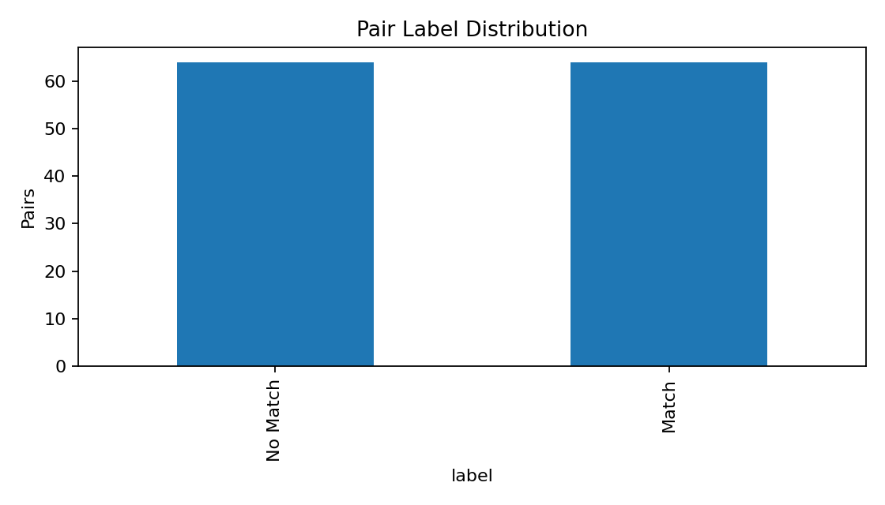 | 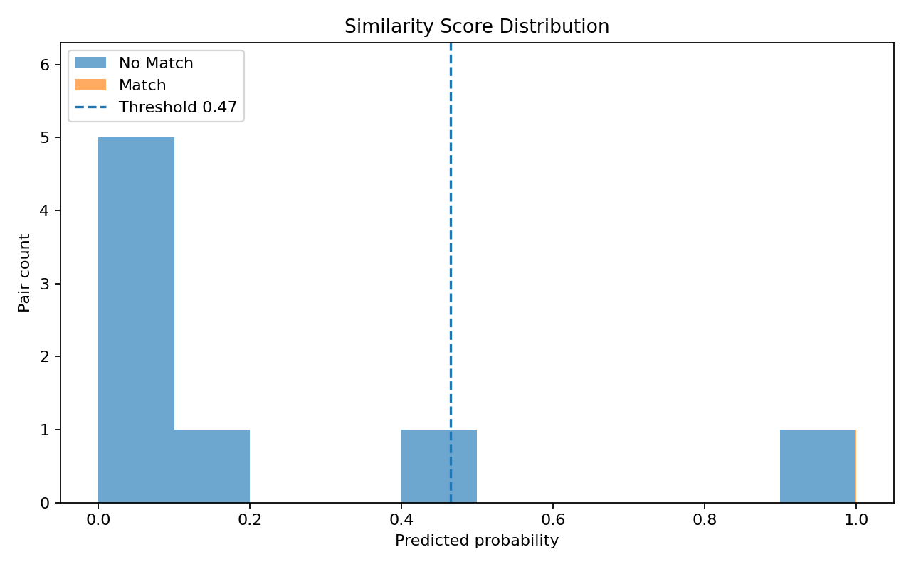 |

| Resume-length distribution | Job-description-length distribution |
|---|---|
| 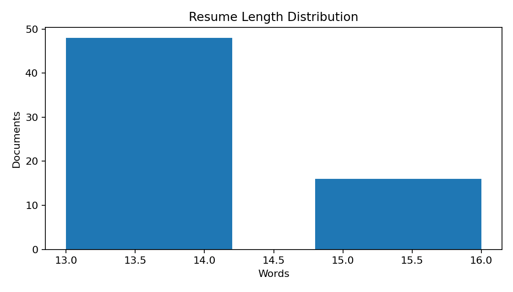 | 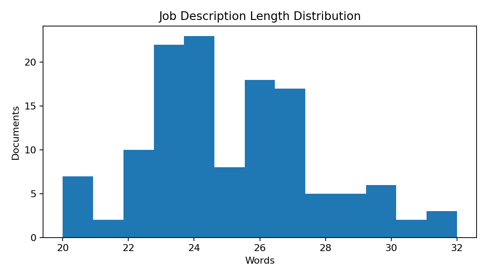 |

| Training accuracy | Training loss |
|---|---|
| 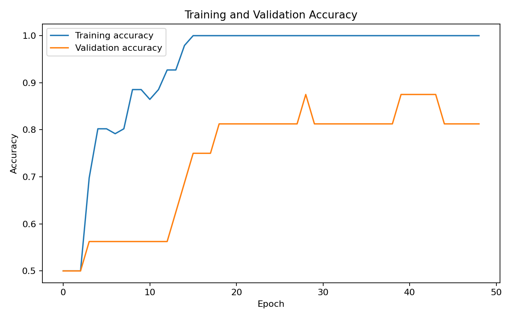 | 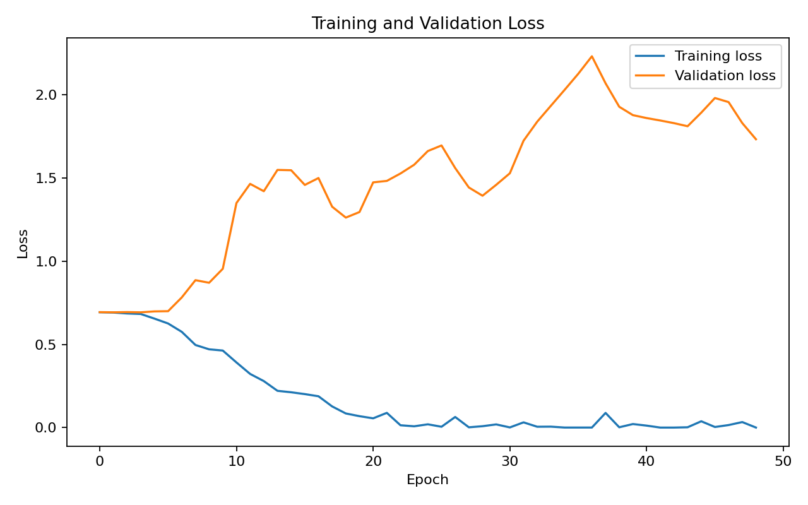 |

| ROC curve | Precision-recall curve |
|---|---|
| 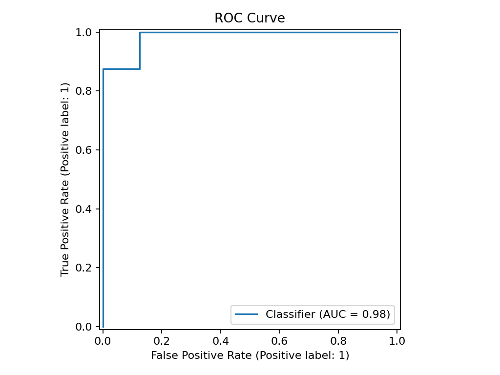 | 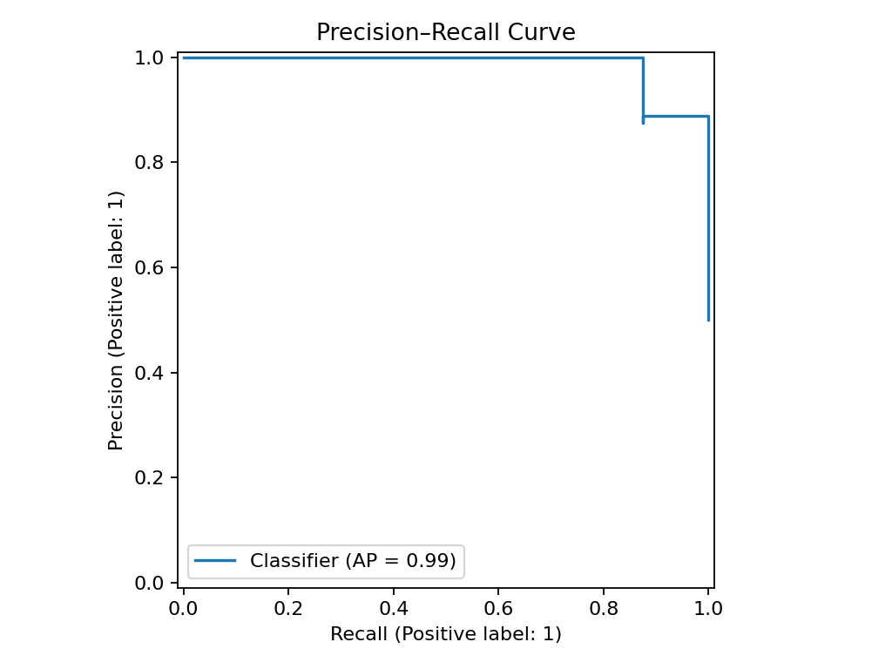 |

### Confusion Matrix

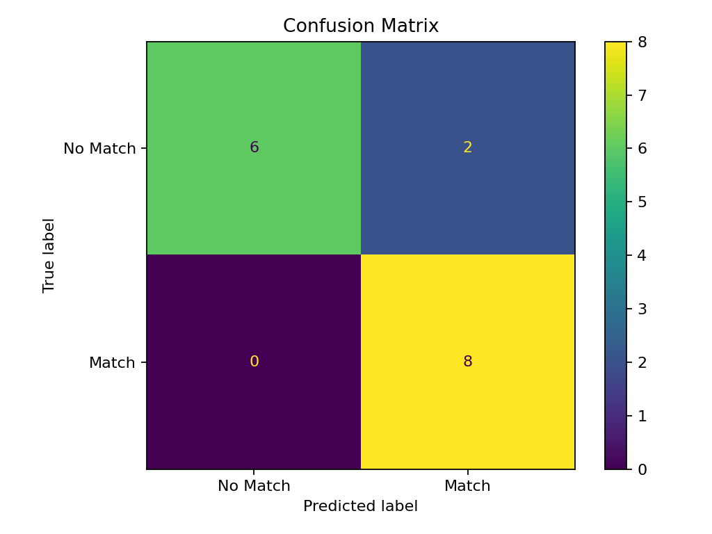

These figures are demonstration diagnostics based on synthetic data.

## Streamlit Application

The deployed application contains four workflows:

1. **Single Match**
2. **Batch CSV**
3. **Rank Resumes**
4. **Model & Limitations**

### Application features

- safe preloaded resume–job examples,
- manual anonymized resume entry,
- manual job-description entry,
- Match / No Match prediction,
- blended fit score,
- neural probability,
- score band,
- overlapping skills,
- potential requirement gaps,
- TF-IDF similarity,
- skill-coverage score,
- threshold confidence,
- batch CSV upload,
- downloadable scored CSV,
- fit-score distribution,
- multi-resume ranking,
- downloadable ranking,
- model architecture,
- artifact-status display,
- privacy warning, and
- fairness and limitation guidance.

### Application Overview

The main application view presents the matching objective, privacy warning,
model status, safe sample selector, resume input, job-description input, batch
workflow, ranking workflow, and model documentation.

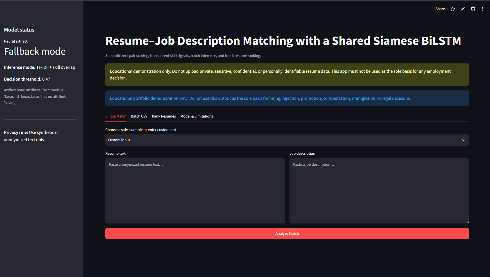

### Single Resume–Job Match

The single-match workflow displays the Match / No Match result, fit score,
neural probability, score band, interpretation, overlapping skills, potential
requirement gaps, and supporting similarity signals.

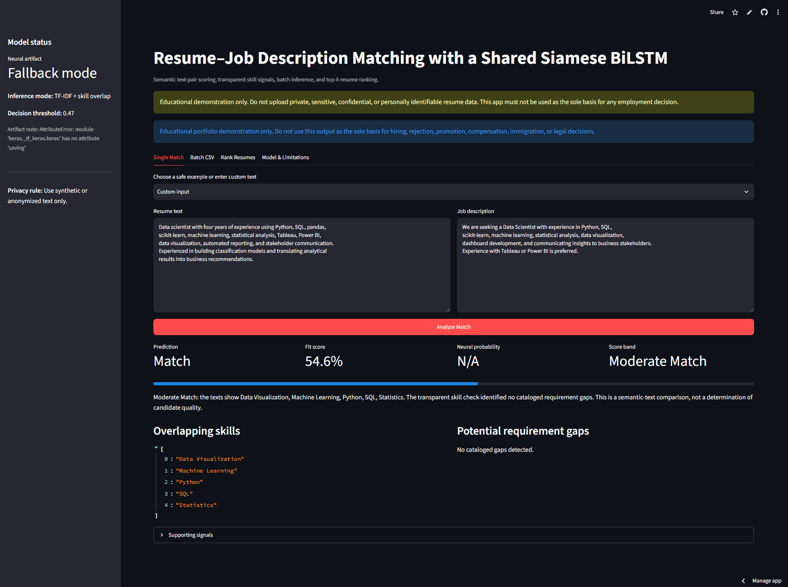

Only these two application screenshots are required for this README. The batch
and ranking workflows remain fully documented and available in the application.

## Safe Single-Match Example

Use only synthetic or anonymized text.

### Synthetic resume

```text
Data scientist with experience in Python, SQL, pandas, scikit-learn,
machine learning, statistical analysis, Tableau, Power BI, data visualization,
automated reporting, and stakeholder communication.
```

### Synthetic job description

```text
We are seeking a Data Scientist with experience in Python, SQL,
scikit-learn, machine learning, statistical analysis, data visualization,
dashboard development, and communicating insights to business stakeholders.
```

The output should be reviewed as a demonstration of the scoring workflow, not
as a candidate-selection recommendation.

## Batch CSV Workflow

A compatible file can use:

```csv
resume_text,job_description
"Anonymized synthetic resume text","Synthetic job description text"
"Another synthetic resume","Another synthetic job description"
```

The batch workflow:

1. detects common resume and job-description columns,
2. standardizes the pair schema,
3. scores each row,
4. displays the results,
5. creates a fit-score distribution chart, and
6. provides a downloadable CSV.

The scored output includes:

- prediction,
- fit score,
- fit-score percentage,
- score band,
- overlapping skills, and
- missing skills.

## Resume-Ranking Workflow

The ranking workflow requires:

```csv
resume_id,resume_text
Candidate_001,"Synthetic anonymized resume text"
Candidate_002,"Another synthetic anonymized resume text"
```

The user provides one job description, and the system:

1. scores every resume against the role,
2. sorts candidates by fit score,
3. displays the ranking, and
4. provides a downloadable ranking file.

Ranking must not be used as an autonomous hiring decision.

## Model Artifacts

| Artifact | Purpose |
|---|---|
| `models/resume_job_siamese_bilstm_model.keras` | Shared Siamese BiLSTM model |
| `models/tokenizer.json` | Shared resume and job-description tokenizer |
| `models/model_metadata.json` | Architecture, threshold, metrics, score bands, blend weights, and responsible-use metadata |

All three artifacts must remain synchronized.

Replacing only the model or tokenizer can invalidate inference.

### Artifact validation

Run:

```bash
python scripts/validate_artifacts.py
```

When TensorFlow is intentionally unavailable:

```bash
python scripts/validate_artifacts.py --allow-missing-tensorflow
```

## Legacy Artifacts

The original proof-of-concept materials are preserved under:

```text
archive/
├── ORIGINAL_PROJECT_REVIEW.md
├── legacy_outputs/
├── legacy_resume_jd_bilstm_model.keras
├── legacy_tokenizer_config.json
└── original_notebook.ipynb
```

These files support traceability and document why the deployable model was
rebuilt.

## Evaluation Outputs

### Figures

```text
outputs/figures/
├── confusion_matrix.png
├── job_description_length_distribution.png
├── label_distribution.png
├── precision_recall_curve.png
├── resume_length_distribution.png
├── roc_curve.png
├── similarity_score_distribution.png
├── training_accuracy.png
└── training_loss.png
```

### Metrics

```text
outputs/metrics/
├── baseline_comparison.csv
├── model_metrics.json
├── ranking_metrics.json
└── training_history.csv
```

### Predictions

```text
outputs/predictions/
├── ranking_examples.csv
└── sample_predictions.csv
```

### Governance note

```text
outputs/fairness_and_limitations_note.md
```

## Run Locally

### 1. Open the project directory

```bash
cd bi-directional-lstm-projects/05-resume-job-description-matching-siamese-bilstm
```

### 2. Create and activate a virtual environment

Windows Command Prompt:

```bat
py -3.11 -m venv .venv
.venv\Scripts\activate
```

Windows PowerShell:

```powershell
py -3.11 -m venv .venv
.venv\Scripts\Activate.ps1
```

macOS or Linux:

```bash
python3.11 -m venv .venv
source .venv/bin/activate
```

### 3. Install dependencies

```bash
python -m pip install --upgrade pip
python -m pip install -r requirements.txt
```

Install development tools when needed:

```bash
python -m pip install -r requirements-dev.txt
```

### 4. Validate project artifacts

```bash
python scripts/validate_artifacts.py
```

### 5. Run tests and compilation checks

```bash
python -m pytest -q
python -m compileall -q app src scripts tests
```

### 6. Launch the Streamlit application

```bash
python -m streamlit run app/streamlit_app.py
```

Open the local address shown in the terminal, normally:

```text
http://localhost:8501
```

Windows users can also run:

```bat
run_local.bat
```

macOS and Linux users can run:

```bash
chmod +x run_local.sh
./run_local.sh
```

## Retrain the Model

Run:

```bash
python scripts/train_model.py
```

The training script:

1. loads sample resumes,
2. loads synthetic job descriptions,
3. generates balanced positive and negative pairs,
4. stores the processed dataset,
5. trains the shared Siamese BiLSTM,
6. selects a validation threshold,
7. evaluates the model,
8. saves model artifacts,
9. generates the architecture diagram, and
10. creates a resume-ranking example.

### Generated artifacts

```text
models/resume_job_siamese_bilstm_model.keras
models/tokenizer.json
models/model_metadata.json
```

### Generated data and outputs

```text
data/processed/resume_job_pairs.csv
outputs/figures/
outputs/metrics/
outputs/predictions/
```

## Train on a Stronger Dataset

A credible future dataset should contain independently labelled resume–job
pairs and legally permitted, properly anonymized text.

Example schema:

```csv
resume_id,resume_text,job_id,job_description,label
R001,"Anonymized resume text",J001,"Job description text",1
R002,"Another anonymized resume",J001,"Job description text",0
```

A stronger training protocol should:

- include thousands of diverse pairs,
- hold out complete candidate profiles,
- hold out employers or job families where possible,
- avoid repeated resumes across partitions,
- include hard negatives,
- document label guidelines,
- measure inter-rater agreement,
- preserve an untouched external test set,
- evaluate subgroup fairness,
- calibrate probabilities, and
- include human-review and appeal requirements.

## Deployment

The application is deployed through Streamlit Community Cloud from the public
BiLSTM portfolio repository.

- **Repository:** `unit-mole/bi-directional-lstm-projects`
- **Branch:** `main`
- **Entrypoint:** `05-resume-job-description-matching-siamese-bilstm/app/streamlit_app.py`
- **Python:** `3.11`
- **Secrets:** None
- **Live application:**  
  https://bi-directional-lstm-projects-8xeeq2xagjbubsodntpurq.streamlit.app/

The deployment-specific requirements file should remain beside the nested
Streamlit entrypoint:

```text
05-resume-job-description-matching-siamese-bilstm/app/requirements.txt
```

See [`README_HOSTING.md`](README_HOSTING.md) for deployment and maintenance
instructions.

## Project Structure

```text
bi-directional-lstm-projects/
├── .github/
│   └── workflows/
│       └── 05-resume-job-description-matching-siamese-bilstm.yml
├── 01-emotion-detection-bilstm-attention/
├── 02-medical-text-classification-bilstm-attention/
├── 03-named-entity-recognition-bilstm-crf/
├── 04-question-answer-matching-siamese-bilstm/
├── 05-resume-job-description-matching-siamese-bilstm/
│   ├── .streamlit/
│   │   └── config.toml
│   ├── app/
│   │   ├── __init__.py
│   │   ├── requirements.txt
│   │   └── streamlit_app.py
│   ├── archive/
│   │   ├── legacy_outputs/
│   │   ├── ORIGINAL_PROJECT_REVIEW.md
│   │   ├── legacy_resume_jd_bilstm_model.keras
│   │   ├── legacy_tokenizer_config.json
│   │   └── original_notebook.ipynb
│   ├── data/
│   │   ├── raw/
│   │   │   └── resume_dataset.csv
│   │   ├── processed/
│   │   │   └── resume_job_pairs.csv
│   │   ├── sample/
│   │   │   ├── sample_job_descriptions.csv
│   │   │   ├── sample_resume_job_pairs.csv
│   │   │   └── sample_resumes.csv
│   │   └── README_data.md
│   ├── images/
│   │   ├── architecture.png
│   │   ├── single_resume_job_match_demo.png
│   │   └── streamlit_app_overview.png
│   ├── models/
│   │   ├── model_metadata.json
│   │   ├── resume_job_siamese_bilstm_model.keras
│   │   └── tokenizer.json
│   ├── notebooks/
│   │   ├── original_resume_job_description_matching.ipynb
│   │   └── resume_job_description_matching_siamese_bilstm.ipynb
│   ├── outputs/
│   │   ├── figures/
│   │   │   ├── confusion_matrix.png
│   │   │   ├── job_description_length_distribution.png
│   │   │   ├── label_distribution.png
│   │   │   ├── precision_recall_curve.png
│   │   │   ├── resume_length_distribution.png
│   │   │   ├── roc_curve.png
│   │   │   ├── similarity_score_distribution.png
│   │   │   ├── training_accuracy.png
│   │   │   └── training_loss.png
│   │   ├── metrics/
│   │   │   ├── baseline_comparison.csv
│   │   │   ├── model_metrics.json
│   │   │   ├── ranking_metrics.json
│   │   │   └── training_history.csv
│   │   ├── predictions/
│   │   │   ├── ranking_examples.csv
│   │   │   └── sample_predictions.csv
│   │   └── fairness_and_limitations_note.md
│   ├── scripts/
│   │   ├── bootstrap_demo_artifact.py
│   │   ├── evaluate_model.py
│   │   ├── generate_figures.py
│   │   ├── run_streamlit.py
│   │   ├── train_model.py
│   │   └── validate_artifacts.py
│   ├── src/
│   │   ├── __init__.py
│   │   ├── config.py
│   │   ├── data_preprocessing.py
│   │   ├── inference_pipeline.py
│   │   ├── job_description_preprocessing.py
│   │   ├── matching_pipeline.py
│   │   ├── model_evaluation.py
│   │   ├── model_training.py
│   │   ├── pair_generation.py
│   │   ├── ranking_pipeline.py
│   │   ├── resume_preprocessing.py
│   │   ├── sequence_generation.py
│   │   ├── siamese_model.py
│   │   ├── skills.py
│   │   ├── text_preprocessing.py
│   │   ├── tokenizer_utils.py
│   │   └── visualization.py
│   ├── tests/
│   │   ├── __init__.py
│   │   ├── test_inference_pipeline.py
│   │   ├── test_pair_generation.py
│   │   ├── test_sequence_generation.py
│   │   └── test_text_preprocessing.py
│   ├── .dockerignore
│   ├── .gitignore
│   ├── Dockerfile
│   ├── FILE_MANIFEST.csv
│   ├── IMPROVEMENTS.md
│   ├── LICENSE
│   ├── MODEL_CARD.md
│   ├── MONOREPO_INTEGRATION.md
│   ├── PROJECT_AUDIT.md
│   ├── README.md
│   ├── README_HOSTING.md
│   ├── requirements-dev.txt
│   ├── requirements.txt
│   ├── run_local.bat
│   ├── run_local.sh
│   └── train_model.py
├── 06-code-comment-generation-bilstm-attention/
├── .gitignore
├── LICENSE
└── README.md
```

## Testing and Continuous Integration

Run the test suite:

```bash
python -m pytest -q
```

Compile source files:

```bash
python -m compileall -q app src scripts tests
```

Validate artifacts:

```bash
python scripts/validate_artifacts.py --allow-missing-tensorflow
```

The project-specific workflow is:

```text
.github/workflows/05-resume-job-description-matching-siamese-bilstm.yml
```

The workflow performs:

- repository checkout,
- Python 3.11 setup,
- dependency installation,
- Python compilation,
- pure-Python unit tests,
- artifact metadata validation,
- inference-pipeline validation, and
- Streamlit application validation.

The CI workflow does not retrain the neural network.

## Docker

Build the image from the Project 05 directory:

```bash
docker build -t resume-job-siamese-bilstm .
```

Run the container:

```bash
docker run --rm -p 8501:8501 resume-job-siamese-bilstm
```

Then open:

```text
http://localhost:8501
```

## Fairness Risks

Removing explicit protected fields does not guarantee fairness.

Potential proxy signals can include:

- names,
- schools,
- employers,
- addresses,
- geography,
- job titles,
- career gaps,
- writing style,
- industry vocabulary,
- graduation dates,
- employment dates, and
- professional affiliations.

A real system would require:

- representative evaluation,
- subgroup metrics,
- counterfactual testing,
- bias and adverse-impact review,
- transparent model documentation,
- human review,
- appeal and correction mechanisms,
- candidate notice,
- data minimization,
- access controls,
- retention controls,
- audit logs,
- drift monitoring, and
- applicable employment-law review.

## Limitations

- Only eight short resumes were supplied.
- The job descriptions are synthetic.
- Pair labels are generated from role categories.
- The same resumes appear across splits.
- The model has not been evaluated on real candidates.
- The model has not been evaluated across employers.
- The model has not been calibrated on external recruiting data.
- The skill catalog is small.
- Synonyms and equivalent tools can be missed.
- Transferable skills can be undervalued.
- Keyword overlap can be overvalued.
- Seniority and depth of experience are difficult to infer.
- Certifications and education context are simplified.
- Negation and requirement exceptions remain difficult.
- The model cannot verify candidate truthfulness.
- The model cannot assess soft skills.
- The model cannot assess interview performance.
- The model cannot determine legal eligibility or work authorization.
- The model cannot predict future job performance.
- Ranking performance is weak.
- No protected-group fairness analysis is possible with the supplied data.
- Public deployment does not make the model production-ready.

## Future Improvements

1. Replace the demonstration data with a legally usable, anonymized,
   independently labelled dataset.
2. Hold out complete candidates and employers during evaluation.
3. Add hard-negative mining for similar but incorrect roles.
4. Add experience-duration and seniority extraction with careful governance.
5. Expand the transparent skill taxonomy.
6. Add synonym and ontology mapping.
7. Compare with TF-IDF, BM25, sentence-transformer, and cross-encoder baselines.
8. Add learning-to-rank training.
9. Improve Recall@K, MRR, MAP, and NDCG evaluation.
10. Calibrate probabilities using Platt scaling or isotonic regression.
11. Add confidence-based abstention.
12. Add subgroup and counterfactual fairness testing.
13. Add model cards and data cards for every release.
14. Add experiment tracking and model versioning.
15. Add drift and vocabulary-coverage monitoring.
16. Add secure document parsing in a controlled private environment.
17. Add human-review notes and reviewer feedback capture.
18. Add automated Streamlit deployment smoke tests.
19. Add API serving with authentication and rate limiting.
20. Add audit logs without storing raw sensitive text.

## Connection to Quality Data Science

The same architecture and engineering patterns transfer to quality and
operational analytics:

- matching new GCS cases to historical cases,
- retrieving similar customer complaints,
- matching issue descriptions to known failure modes,
- comparing service notes with troubleshooting guidance,
- suggesting prior corrective actions,
- matching requirements with evidence,
- ranking related documents for root-cause investigation,
- routing records to specialist teams, and
- building human-in-the-loop decision-support tools.

Production quality use would still require governed data, privacy controls,
domain-specific labels, independent validation, and human review.

## Skills Demonstrated

- Natural-language processing
- Resume-text preprocessing
- Job-description preprocessing
- Semantic text-pair classification
- Siamese neural networks
- Shared-weight model architecture
- Bidirectional LSTM sequence modeling
- TensorFlow and Keras
- Tokenization and sequence generation
- Pair generation
- Balanced binary classification
- Pair-interaction feature engineering
- Cosine similarity
- TF-IDF similarity
- Transparent skill-overlap scoring
- Probability threshold selection
- Blended scoring logic
- Confusion-matrix analysis
- ROC and precision-recall analysis
- Ranking metrics
- Batch inference
- Resume ranking
- Saved-model artifact management
- Streamlit application development
- Privacy-aware interface design
- Fairness and responsible-AI documentation
- Unit testing
- GitHub Actions
- Docker packaging
- Deployment-ready ML engineering

## Portfolio Positioning

**One-line description:** Privacy-aware resume–job semantic matching system
using a shared Siamese BiLSTM, TF-IDF similarity, transparent skill coverage,
explainable fit scoring, batch inference, and Streamlit deployment.

**Pinned repository description:** End-to-end NLP portfolio project with
shared-weight Siamese BiLSTM encoders, resume–job pair generation, semantic and
skill-based scoring, threshold-aware classification, ranking metrics, saved
Keras artifacts, tests, Docker, CI, and a live Streamlit application.

This project demonstrates the ability to audit a weak proof of concept, correct
its architecture, build a reproducible paired-text pipeline, preserve
traceability, communicate fairness limitations, and deploy a complete
machine-learning application.

## Responsible Use

This repository is an educational portfolio demonstration.

It must not be used as the sole basis for:

- hiring,
- rejection,
- promotion,
- compensation,
- candidate ranking,
- immigration decisions,
- legal decisions, or
- any consequential employment action.

Use synthetic or properly anonymized text only.

## License

Project code is distributed under the MIT License. Any replacement dataset,
skills ontology, pretrained model, or third-party resource remains governed by
its own license, privacy obligations, terms, and citation requirements.

## Author

**Anmol Tripathi**  
Quality Data Scientist transitioning toward Data Science, Machine Learning,
Applied AI, Analytics Engineering, and Quality Analytics roles.
