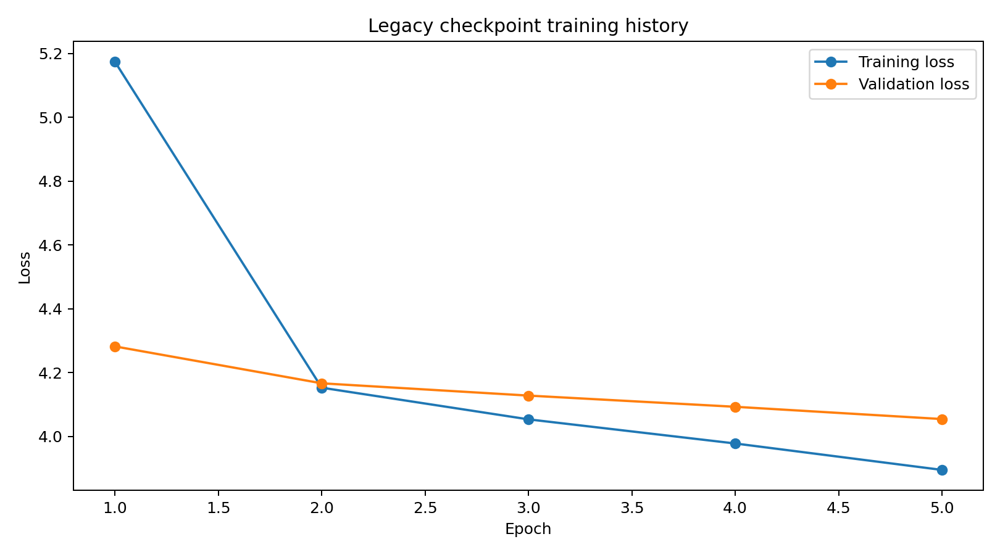

# Code Comment Generation using BiLSTM with Attention

> **Responsible-use and code-privacy notice**  
> This project is for educational and portfolio demonstration purposes only. Generated comments may be incomplete, inaccurate, misleading, or inconsistent with actual code behavior. The model does not verify code correctness, security, performance, licensing, or production readiness. Do not use generated comments in production without human review, and do not upload proprietary, confidential, private, or copyrighted source code into the public demo.

## Overview

This project frames code documentation as a code-to-text sequence generation problem:

> Given a Python function, can a model generate a short natural-language comment that describes what the function does?

The corrected implementation uses a **Bidirectional LSTM encoder**, **Bahdanau attention**, and an **LSTM decoder** with teacher forcing. It includes preprocessing, artifact management, greedy/beam inference, BLEU/ROUGE evaluation, a Streamlit demo, tests, Docker, CI, and deployment documentation.

## Critical checkpoint disclosure

The attached trained checkpoint was audited and found to be a **BiLSTM encoder-decoder without attention**, although the original notebook title claimed attention. It also achieved BLEU `0.0` on 100 examples and generated repetitive text. The checkpoint is retained as a transparent legacy baseline; the repository code adds the missing true attention architecture and a corrected retraining pipeline.

See [PROJECT_AUDIT.md](PROJECT_AUDIT.md) and [MODEL_CARD.md](MODEL_CARD.md).

## Dataset

The original notebook used the Python subset of **CodeSearchNet**:

- Source: `func_code_string`
- Target: `func_documentation_string`
- Metadata: language, repository, function name, path, split, and URL
- Original working sample: first 4,000 training rows

The public repository includes only synthetic examples. Full CodeSearchNet data is downloaded during training and is not committed. The corrected pipeline removes docstrings from source code because the original source field contains the target text and creates leakage risk.

## Workflow

```text
CodeSearchNet Python functions
        ↓
Schema detection and quality filters
        ↓
Docstring/comment removal from source
        ↓
Python lexical tokenization
(keywords, identifiers, operators, <NL>, <INDENT>, strings, numbers)
        ↓
Separate code and comment tokenizers
        ↓
Encoder input + shifted decoder input/target
        ↓
BiLSTM encoder with full time-step outputs
        ↓
Bahdanau attention + LSTM decoder
        ↓
Greedy or beam-search generation
        ↓
BLEU, ROUGE, token F1, examples, and error analysis
```

## Architecture

```text
Source code tokens
      ↓
Embedding (mask_zero=True)
      ↓
Bidirectional LSTM encoder (returns all states)
      ↓
Forward/backward state concatenation
      ↓
LSTM decoder with teacher forcing
      ↓
Bahdanau additive attention over encoder time steps
      ↓
Context + decoder state concatenation
      ↓
Dense softmax over comment vocabulary
```

The custom loss and accuracy ignore zero-padding positions.

## Preprocessing decisions

### Code

- Removes the target docstring from the source to reduce leakage
- Removes comments without deleting `#` characters inside strings
- Preserves Python keywords and operators
- Replaces strings and numbers with `<STR>` and `<NUM>`
- Preserves structural tokens such as `<NL>`, `<INDENT>`, and `<DEDENT>`
- Retains full identifiers and adds snake_case/camelCase subtokens
- Truncates only after lexical tokenization

### Comments

- Normalizes Unicode and whitespace
- Lowercases target text
- Removes low-quality or meaningless comments
- Adds `<start>` and `<end>` tokens
- Uses a separate tokenizer and vocabulary
- Creates shifted decoder input and target arrays

## Supplied checkpoint results

| Metric | Value | Interpretation |
|---|---:|---|
| Parameters | 6,049,727 | Moderate recurrent model |
| Training rows | 2,800 | From 4,000 sampled rows |
| Validation rows | 600 | Random split of sampled training data |
| Final validation loss | 4.0543 | High |
| Validation token accuracy | 0.4225 | Unmasked and padding-inflated |
| BLEU | 0.0000 | No meaningful n-gram generation quality |
| Exact match | 0.0000 | No exact matches |
| Mean token overlap | 0.0878 | Weak reference coverage |



## Streamlit application

The app provides:

- Safe built-in Python examples
- Code editor and syntax check
- Greedy and beam-search controls
- Generated comment and latency
- Transparent identifier-based baseline comparison
- Optional reference-comment evaluation
- Attention heatmap after corrected retraining
- Batch CSV mode limited to 20 examples
- Training results, architecture explanation, limitations, and privacy warnings

```bash
streamlit run app/streamlit_app.py
```

**Live demo:** `Add your Streamlit URL here`

## Run locally

```bash
git clone <your-repository-url>
cd bi-directional-lstm-projects/06-code-comment-generation-bilstm-attention
python -m venv .venv
```

Windows:

```powershell
.venv\Scriptsctivate
python -m pip install --upgrade pip
pip install -r requirements.txt
streamlit run app/streamlit_app.py
```

macOS/Linux:

```bash
source .venv/bin/activate
python -m pip install --upgrade pip
pip install -r requirements.txt
streamlit run app/streamlit_app.py
```

## Retrain the corrected attention model

```bash
pip install -r requirements-dev.txt
python scripts/train_model.py --train-samples 20000 --validation-samples 2000 --test-samples 2000 --epochs 20
python scripts/evaluate_model.py --method beam
```

Retraining saves:

```text
models/code_comment_bilstm_attention_model.keras
models/encoder_model.keras
models/decoder_model.keras
models/code_tokenizer_config.json
models/comment_tokenizer_config.json
models/model_metadata.json
```

## Tests and CI

```bash
pytest -q
python scripts/validate_project.py
```

The GitHub Actions workflow compiles files, runs lightweight tests, validates imports, and checks the artifact manifest without downloading the 70 MB checkpoint or retraining the model.

## Docker

```bash
docker build -t code-comment-bilstm .
docker run --rm -p 8501:8501 code-comment-bilstm
```

Open `http://localhost:8501`.

## Folder structure

```text
06-code-comment-generation-bilstm-attention/
├── .streamlit/
├── app/
├── archive/
├── data/
├── images/
├── models/
├── notebooks/
├── outputs/
├── scripts/
├── src/
├── tests/
├── Dockerfile
├── MODEL_CARD.md
├── PROJECT_AUDIT.md
├── README.md
├── README_HOSTING.md
├── requirements.txt
└── train_model.py
```

## Error analysis and limitations

- The supplied checkpoint often repeats high-frequency words such as “the,” “return,” and “given.”
- Five training epochs and 4,000 examples are insufficient for open-vocabulary code generation.
- Repository-specific identifiers create substantial sparsity.
- BLEU alone does not measure semantic correctness.
- Generated comments can describe intent incorrectly even when they sound fluent.
- Python-only training does not support other programming languages.
- The model is not a replacement for static analysis, testing, or developer review.

## Future improvements

- Train on a larger license-reviewed corpus with repository-level deduplication
- Use SentencePiece/subword tokenization
- Add coverage penalty, repetition blocking, and calibrated beam search
- Compare with CodeT5 or another Transformer baseline
- Add semantic evaluation and human developer ratings
- Quantize the checkpoint for lower-memory hosting

## Skills demonstrated

Code intelligence, code-to-text generation, sequence-to-sequence modeling, Bidirectional LSTM design, attention mechanisms, teacher forcing, masked sequence loss, BLEU/ROUGE evaluation, error analysis, Streamlit deployment, Docker, testing, CI, artifact governance, and responsible AI communication.

## Portfolio descriptions

**One line:** Built an end-to-end Python code comment generator using a Bidirectional LSTM encoder, Bahdanau attention, autoregressive decoding, BLEU/ROUGE evaluation, and a deployable Streamlit interface.

**Pinned repository text:** A six-project BiLSTM portfolio covering NLP classification, NER-CRF, Siamese semantic matching, and code-to-text generation with production-style packaging, tests, Docker, CI, and live demos.

## Relevance to Quality Data Science

The project supports maintainable analytics and automation by exploring automatic documentation for scripts, reusable data pipelines, internal analytical tools, and code handoffs. It demonstrates the engineering discipline required to turn an experimental notebook into an auditable, modular, tested, and deployable ML product.
