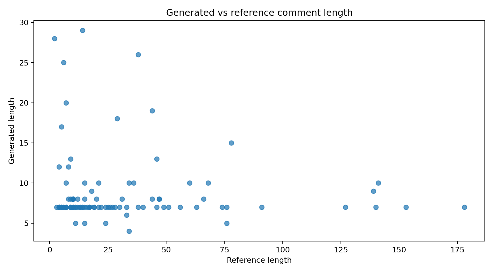
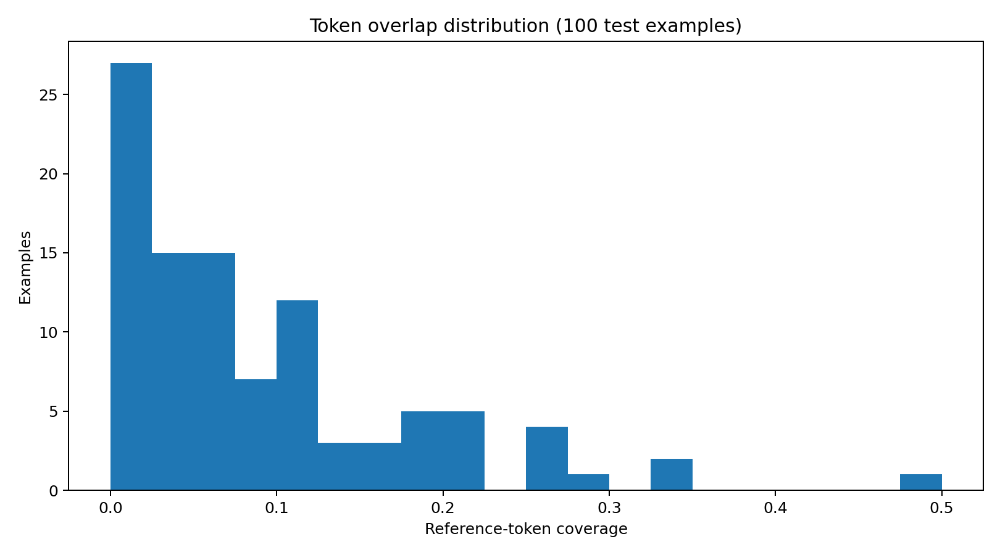
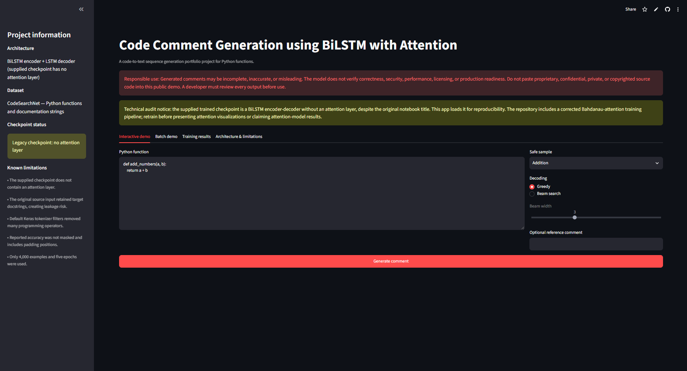
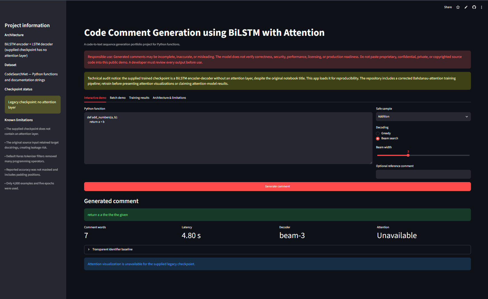

# Code Comment Generation using Bidirectional LSTM with Attention

[](https://www.python.org/)
[](https://www.tensorflow.org/)
[](https://keras.io/)
[](https://bi-directional-lstm-projects-bd5p6qnsd6r5thune4tsk4.streamlit.app/)
[](LICENSE)
[](https://github.com/unit-mole/bi-directional-lstm-projects/actions/workflows/06-code-comment-generation-bilstm-attention.yml)

An end-to-end **code-to-text sequence-generation project** that explores
automatic Python function documentation using a Bidirectional LSTM encoder,
an LSTM decoder, and a corrected Bahdanau-attention training path. The repository
includes code-aware preprocessing, separate source and target tokenizers,
teacher forcing, greedy and beam-search decoding, BLEU and token-overlap
evaluation, a transparent identifier-based baseline, batch CSV inference,
automated tests, Docker support, GitHub Actions, model-governance documentation,
and a deployed Streamlit application.

The supplied trained checkpoint is preserved as a transparent
**legacy BiLSTM encoder-decoder baseline without an attention layer**. The
repository separately provides the corrected attention architecture and
retraining pipeline required to produce a true attention-enabled checkpoint.

**Status:** Portfolio-ready engineering demonstration; corrected attention model requires retraining  
**Live demo:** [Open the Streamlit application](https://bi-directional-lstm-projects-bd5p6qnsd6r5thune4tsk4.streamlit.app/)  
[](https://bi-directional-lstm-projects-bd5p6qnsd6r5thune4tsk4.streamlit.app/)  
**Primary stack:** Python · TensorFlow · Keras · pandas · NumPy · Streamlit · NLTK · ROUGE

---

## Responsible Use and Code-Privacy Notice

> **Educational use only:** Generated comments may be incomplete, inaccurate,
> repetitive, misleading, or inconsistent with the actual behaviour of the
> source code.
>
> The model does not verify correctness, security, performance, complexity,
> licensing, side effects, exception behaviour, production readiness, or test
> coverage.
>
> Do not paste proprietary, confidential, private, copyrighted, customer,
> employer, security-sensitive, or otherwise restricted source code into the
> public Streamlit application.
>
> Every generated comment must be reviewed by a developer before use. This
> project is not a substitute for static analysis, unit testing, security
> review, code review, documentation standards, or developer judgement.

## Problem Statement

Software repositories often contain functions that are undocumented,
inconsistently documented, or difficult for a new developer to understand.

Manual documentation can become expensive when:

- scripts change frequently,
- multiple contributors use different documentation styles,
- analytical workflows are handed between teams,
- internal tools grow without formal documentation,
- legacy functions contain unclear names,
- notebooks are converted into production scripts, and
- maintainers must repeatedly inspect implementation details.

This project asks:

> Given a Python function, can a sequence model generate a short
> natural-language comment that summarizes what the function appears to do?

The deployed workflow returns:

- **Generated neural comment**
- **Greedy or beam-search decoding**
- **Generation latency**
- **Generated-comment word count**
- **Attention availability status**
- **Transparent identifier-based baseline**
- **Optional reference-comment evaluation**
- **Batch CSV generation**
- **Downloadable batch results**
- **Visible checkpoint and model limitations**

## Project Objective

Build a portfolio-ready code-intelligence workflow that can:

1. Load Python code and documentation pairs.
2. Detect common source and target columns.
3. Remove source docstrings that duplicate target documentation.
4. Remove comments without corrupting `#` characters inside strings.
5. Preserve Python syntax, operators, indentation, and structural information.
6. Replace string and numeric literals with stable semantic placeholders.
7. Retain complete identifiers and identifier subtokens.
8. Normalize target comments consistently.
9. Maintain separate source-code and comment vocabularies.
10. Create encoder inputs and shifted decoder inputs and targets.
11. Encode source sequences using a Bidirectional LSTM.
12. Decode comments autoregressively using an LSTM decoder.
13. Apply Bahdanau attention in the corrected training pipeline.
14. Ignore padded target positions during loss and accuracy calculation.
15. Support greedy and beam-search generation.
16. Compare the neural output with a transparent identifier baseline.
17. Evaluate outputs using BLEU, ROUGE, exact match, and token overlap.
18. Support safe single-function and batch inference.
19. Save and reload all required inference artifacts.
20. Validate the project with tests, CI, Docker, and deployment checks.

## Portfolio Scope

This project demonstrates the full engineering pattern around a
sequence-to-sequence code summarization system:

```text
dataset audit
    → source/target schema detection
    → leakage-aware code preprocessing
    → code lexical tokenization
    → comment normalization
    → separate vocabulary construction
    → sequence generation
    → BiLSTM encoder
    → autoregressive LSTM decoder
    → attention-based context
    → greedy / beam inference
    → generation evaluation
    → artifact persistence
    → Streamlit deployment
    → testing and CI
```

The project deliberately separates:

1. **What the supplied checkpoint actually contains**
2. **What the corrected repository architecture implements**
3. **What must be retrained before attention-based results can be claimed**

That distinction is central to the technical integrity of the repository.

## Critical Checkpoint Disclosure

The original project title claimed a BiLSTM model with attention. Inspection of
the saved checkpoint showed that the supplied trained artifact is:

```text
BiLSTM encoder
    → final encoder states
    → LSTM decoder
    → token softmax
```

It does **not** contain:

- a Bahdanau attention layer,
- encoder time-step context during decoding,
- trainable attention scores, or
- attention heatmap outputs.

The deployed application therefore labels the artifact as:

```text
Legacy checkpoint: no attention layer
```

The model is retained for reproducibility and auditability. The repository adds
a corrected attention architecture and training pipeline, but a new checkpoint
must be trained before presenting attention visualizations or reporting
attention-model performance.

See:

```text
PROJECT_AUDIT.md
MODEL_CARD.md
IMPROVEMENTS.md
README_LOCAL_MODEL.md
```

## Dataset

The original notebook used the **Python subset of CodeSearchNet**.

### Original fields

| Role | CodeSearchNet field |
|---|---|
| Source code | `func_code_string` |
| Target documentation | `func_documentation_string` |
| Language | Python |
| Additional metadata | Repository, function name, path, split, and URL |

### Supplied working sample

| Dataset attribute | Value |
|---|---:|
| Sampled rows | 4,000 |
| Training rows | 2,800 |
| Validation rows | 600 |
| Test rows | 600 |
| Training epochs | 5 |
| Batch size | 32 |
| Tokenizer documents | 4,000 |

### Public repository data

The full CodeSearchNet dataset is not committed to this repository. The public
project includes only safe synthetic examples:

```text
data/sample_code_comment_pairs.csv
data/sample_code_snippets.json
```

The included sample file contains twelve small Python functions, including:

- addition,
- average calculation,
- even-number filtering,
- value clamping,
- palindrome checking,
- safe division,
- unique-item extraction,
- file-extension extraction,
- word counting,
- temperature conversion,
- one-level flattening, and
- file-existence checking.

### Leakage risk in the original source

The original `func_code_string` input could contain the same docstring used as
the target output. This allows the model to read the expected answer directly
from its source input.

The corrected pipeline removes source docstrings before tokenization.

This change is essential because high metrics produced from leaked targets
would not represent genuine code understanding or generation.

## Tools and Technologies

| Area | Technology |
|---|---|
| Language | Python 3.11 |
| Deep-learning framework | TensorFlow / `tf.keras` |
| Data processing | pandas, NumPy |
| Source-code parsing | Python `ast` and `tokenize` workflows |
| Text evaluation | NLTK BLEU, ROUGE score |
| Supporting evaluation | scikit-learn |
| Static visualization | Matplotlib |
| Interactive visualization | Plotly |
| Application | Streamlit |
| Model persistence | Keras `.keras`, JSON |
| Testing and validation | pytest, compile checks, artifact validation |
| Continuous integration | GitHub Actions |
| Large-model handling | Git LFS |
| Containerization | Docker |
| Hosting | Streamlit Community Cloud |

## Project Workflow

```text
CodeSearchNet Python functions
        │
        ▼
Schema detection and quality filtering
        │
        ▼
Target docstring removal from source code
        │
        ▼
Safe Python comment removal
        │
        ▼
Code-aware lexical tokenization
        │
        ├── keywords
        ├── identifiers
        ├── operators
        ├── <STR>
        ├── <NUM>
        ├── <NL>
        ├── <INDENT>
        └── <DEDENT>
        │
        ▼
Comment normalization
        │
        ├── Unicode normalization
        ├── lowercase target
        ├── <start>
        └── <end>
        │
        ▼
Separate code and comment tokenizers
        │
        ▼
Encoder input sequences
        │
        ▼
Shifted decoder inputs and decoder targets
        │
        ▼
Bidirectional LSTM encoder
        │
        ▼
Full encoder sequence + combined final states
        │
        ▼
LSTM decoder with teacher forcing
        │
        ▼
Bahdanau additive attention
        │
        ▼
Token probability distribution
        │
        ├── greedy decoding
        └── beam-search decoding
        │
        ▼
BLEU / ROUGE / overlap / examples
        │
        ▼
Streamlit single and batch generation
```

## Code Preprocessing

Code must not be treated as ordinary natural-language text. Symbols,
indentation, operators, string literals, and identifier structure carry
meaning.

### Corrected code preprocessing

The modular preprocessing pipeline:

- parses Python source safely,
- removes the target docstring,
- removes comments,
- preserves `#` characters that occur inside string literals,
- retains Python keywords,
- retains operators,
- retains punctuation used by Python syntax,
- replaces string literals with `<STR>`,
- replaces number literals with `<NUM>`,
- preserves new-line structure using `<NL>`,
- preserves indentation using `<INDENT>` and `<DEDENT>`,
- retains full identifiers,
- adds snake_case subtokens,
- adds camelCase subtokens,
- normalizes repeated whitespace only where appropriate, and
- truncates after lexical tokenization.

### Why operator preservation matters

A comment generator must distinguish functions such as:

```python
return a + b
```

```python
return a - b
```

```python
return a * b
```

```python
return a / b
```

The original use of default Keras text filters removed many programming
operators, reducing the model's ability to distinguish these behaviours.

## Comment Preprocessing

Target comments are processed separately from source code.

The corrected pipeline:

- applies Unicode normalization,
- normalizes whitespace,
- converts target comments to lowercase,
- filters low-quality documentation,
- removes empty targets,
- adds `<start>` and `<end>` markers,
- fits a separate comment tokenizer, and
- creates shifted decoder inputs and targets.

Example:

```text
Reference comment:
returns the average of a list of values
```

```text
Decoder input:
<start> returns the average of a list of values
```

```text
Decoder target:
returns the average of a list of values <end>
```

## Supplied Legacy Checkpoint Architecture

The deployed checkpoint has the following verified structure:

```text
Source-code token IDs
        ↓
Encoder embedding
19,608 vocabulary × 128 dimensions
        ↓
Bidirectional LSTM
128 units per direction
        ↓
Forward and backward final states
        ↓
Concatenated hidden state: 256
Concatenated cell state: 256
        ↓
Comment-token input
        ↓
Decoder embedding
7,487 vocabulary × 128 dimensions
        ↓
LSTM decoder
256 units
        ↓
Dense softmax
7,487 target tokens
```

### Verified legacy configuration

| Property | Value |
|---|---:|
| Maximum code length | 180 tokens |
| Maximum comment length | 30 tokens |
| Code vocabulary | 19,608 |
| Comment vocabulary | 7,487 |
| Embedding dimension | 128 |
| Encoder units | 128 per direction |
| Decoder units | 256 |
| Model parameters | 6,049,727 |
| Legacy model size | Approximately 69 MB |
| Attention layer | Not present |
| Legacy preprocessing mode | `legacy` |

The supplied model artifact is:

```text
models/code_comment_bilstm_seq2seq_model.keras
```

## Corrected Attention Architecture

The corrected repository model uses:

```text
Source-code token IDs
        ↓
Embedding with masking
        ↓
Bidirectional LSTM encoder
returns full encoder sequence
        ↓
Forward/backward state concatenation
        ↓
LSTM decoder with teacher forcing
        ↓
Bahdanau additive attention
decoder state attends to encoder time steps
        ↓
Context vector + decoder output
        ↓
Dropout
        ↓
Dense softmax over comment vocabulary
```

### Default corrected-training configuration

| Parameter | Default |
|---|---:|
| Random seed | 42 |
| Maximum code vocabulary | 40,000 |
| Maximum comment vocabulary | 20,000 |
| Maximum code length | 180 |
| Maximum comment length | 30 |
| Embedding dimension | 128 |
| Encoder units | 128 per direction |
| Decoder units | 256 |
| Dropout | 0.20 |
| Batch size | 32 |
| Epochs | 20 |
| Learning rate | 0.001 |
| Default beam width | 3 |
| Corrected preprocessing mode | `semantic` |

## Bahdanau Attention

For each generated target token, the attention layer:

1. compares the current decoder representation with all encoder time steps,
2. creates a relevance score for each source position,
3. normalizes the scores,
4. creates a weighted source-code context vector, and
5. combines that context with the decoder output.

This allows the model to focus on different code regions while generating
different comment words.

Attention values are not proof that the model understands or correctly explains
the code. They are internal weighting signals and require careful
interpretation.

The deployed legacy checkpoint cannot produce these values because it has no
attention layer.

## Teacher Forcing

During corrected training, the decoder receives the true previous comment token
while learning the next token.

```text
Input:  <start> returns the sum of two
Target: returns the sum of two values <end>
```

Teacher forcing stabilizes training but creates a train-inference difference:
during live generation, the decoder must use its own previous prediction.

This exposure gap is one reason generated sequences can repeat, drift, or
terminate incorrectly.

## Masked Loss and Accuracy

Comment sequences are padded to a fixed maximum length. Padding tokens should
not contribute to training loss or token accuracy.

The corrected project implements:

```text
masked_sparse_categorical_crossentropy
masked_token_accuracy
```

These functions ignore target positions containing the padding token.

The supplied notebook's reported accuracy was not properly masked, so it
includes many easy padding positions and overstates meaningful token-generation
performance.

## Greedy Decoding

Greedy decoding selects the highest-probability token at every step.

```text
current decoder state
    → token probabilities
    → choose highest-probability token
    → feed token back to decoder
```

Advantages:

- fast,
- deterministic,
- simple to inspect.

Limitations:

- one early mistake cannot be corrected,
- repetitive high-frequency tokens can dominate,
- locally optimal choices may create a poor complete sentence.

## Beam-Search Decoding

Beam search retains several partial comment candidates at every step.

With beam width `3`, the decoder keeps the three strongest candidate sequences
before expanding them again.

Advantages:

- explores more than one decoding path,
- can improve sequence-level output,
- supports candidate ranking.

Limitations:

- slower than greedy decoding,
- can still prefer repetitive high-frequency text,
- requires length and repetition controls,
- does not guarantee factual correctness.

The Streamlit application supports beam widths from `2` to `5`.

## Transparent Identifier Baseline

The application displays a rule-based identifier baseline beside the neural
output.

For example:

```python
def calculate_average(values):
    return sum(values) / len(values)
```

may produce a baseline such as:

```text
Returns the quotient computed by calculate average.
```

This baseline is:

- transparent,
- deterministic,
- not neural output,
- useful for comparison,
- limited by identifier quality, and
- incapable of deep code understanding.

Displaying it prevents the weak neural checkpoint from being presented without
a simple reference point.

## Supplied Checkpoint Results

The supplied checkpoint was evaluated on 100 examples.

| Metric | Value | Interpretation |
|---|---:|---|
| Model parameters | 6,049,727 | Moderate recurrent sequence model |
| Training rows | 2,800 | Derived from 4,000 sampled rows |
| Validation rows | 600 | Random split |
| Test rows | 600 | Original sampled holdout |
| Training epochs | 5 | Insufficient for this task |
| Final training loss | 3.8949 | High |
| Final validation loss | 4.0543 | High |
| Training token accuracy | 0.4174 | Unmasked and padding-inflated |
| Validation token accuracy | 0.4225 | Unmasked and padding-inflated |
| Evaluated predictions | 100 | Limited evaluation |
| BLEU | 0.0000 | No meaningful multi-token n-gram quality |
| Exact match | 0.0000 | No exact reference matches |
| Mean token overlap | 0.0878 | Weak reference coverage |
| Mean generated length | 8.86 tokens | Much shorter than references |
| Mean reference length | 31.15 tokens | Large length mismatch |

### BLEU diagnostic components

| Component | Value |
|---|---:|
| Unigram precision | 0.2122 |
| Bigram precision | 0.0165 |
| Trigram precision | 0.0000 |
| Four-gram precision | 0.0000 |
| Brevity penalty | 0.0808 |
| Generated/reference length ratio | 0.2844 |

ROUGE was not calculated in the supplied notebook. The corrected evaluation
script supports ROUGE after retraining.

> **Important:** The current checkpoint is a weak baseline. Its metrics should
> not be described as production performance or as results from an
> attention-enabled model.

## Recorded Training Behaviour

| Epoch | Training accuracy | Training loss | Validation accuracy | Validation loss |
|---:|---:|---:|---:|---:|
| 1 | 0.3672 | 5.1739 | 0.3932 | 4.2820 |
| 2 | 0.3983 | 4.1526 | 0.4047 | 4.1664 |
| 3 | 0.4045 | 4.0534 | 0.4093 | 4.1279 |
| 4 | 0.4119 | 3.9777 | 0.4172 | 4.0928 |
| 5 | 0.4174 | 3.8949 | 0.4225 | 4.0543 |

Loss improves slowly, but five epochs on 2,800 training rows are insufficient
for open-vocabulary code-to-text generation.

## Known Generation Behaviour

The supplied checkpoint frequently generates repetitive high-frequency words.

Example greedy output recorded in the project:

```text
return the the the the the the the the ...
```

Example beam output:

```text
return a a the the the the the the the the the the given
```

These examples demonstrate:

- repetition,
- weak identifier grounding,
- poor semantic coverage,
- premature generic wording,
- insufficient data,
- insufficient training, and
- the need for stronger decoding controls.

They are retained in:

```text
outputs/generated_comment_examples.csv
```

## Evaluation Strategy

No single automatic metric proves that a generated comment is correct.

A stronger evaluation combines:

- corpus BLEU,
- sentence BLEU,
- ROUGE-1,
- ROUGE-2,
- ROUGE-L,
- exact match,
- token precision,
- token recall,
- token F1,
- generated/reference length comparison,
- repetition rate,
- syntax-category analysis,
- semantic similarity,
- manual developer review, and
- error analysis by function type.

### Why BLEU alone is insufficient

Two comments can describe the same function using different wording.

Example:

```text
Returns the average of the values.
```

```text
Calculates the mean of the supplied sequence.
```

BLEU may penalize these despite similar meaning.

Conversely, a fluent comment can achieve token overlap while describing the
wrong behaviour. Human review remains necessary.

## Visual Model Diagnostics

### Training Curve


### Prediction-Length Comparison



### Token-Overlap Distribution



These figures document the supplied baseline and should not be interpreted as
attention-model validation.

## Streamlit Application

The deployed application contains four workflows:

1. **Interactive demo**
2. **Batch demo**
3. **Training results**
4. **Architecture & limitations**

### Application features

- safe built-in Python samples,
- editable Python code area,
- Python syntax validation,
- greedy decoding,
- beam-search decoding,
- configurable beam width,
- optional reference comment,
- generated comment,
- comment word count,
- generation latency,
- decoder-method display,
- attention-availability display,
- transparent identifier baseline,
- optional reference evaluation,
- batch CSV upload,
- processing limit of 20 public-demo rows,
- downloadable generated-comment CSV,
- training-history chart,
- saved model metrics,
- architecture explanation,
- privacy guidance, and
- checkpoint-audit disclosure.

### Application Overview

The main application screen presents the project purpose, responsible-use
warning, technical checkpoint disclosure, model status, safe sample selector,
Python editor, decoding controls, and available application workflows.



### Single Code-Comment Generation

The interactive workflow demonstrates code entry, decoding configuration,
generated output, latency, decoder information, attention status, baseline
comparison, and optional reference evaluation.



Only these two application screenshots are included in this README. The batch,
training-results, and architecture workflows remain available in the deployed
application.

## Safe Built-In Examples

The application includes four built-in Python samples.

### Addition

```python
def add_numbers(a, b):
    return a + b
```

### Average

```python
def calculate_average(values):
    if not values:
        return 0
    return sum(values) / len(values)
```

### Even-number filtering

```python
def keep_even_numbers(values):
    return [value for value in values if value % 2 == 0]
```

### File extension

```python
def get_extension(path):
    return path.rsplit(".", 1)[-1].lower()
```

## Syntax Validation

Before generation, the application checks whether the entered text is valid
Python syntax.

A syntax warning does not automatically prevent generation because the model
operates on tokenized text rather than executing the function.

The syntax checker:

- does not run the code,
- does not prove runtime correctness,
- does not inspect dependencies,
- does not detect security vulnerabilities, and
- does not replace testing.

## Optional Reference Evaluation

The user may enter a reference comment for comparison.

The app can then display pair-level evaluation values produced by:

```text
src/model_evaluation.py
```

Reference evaluation is useful for demonstrations but one reference comment
cannot represent every acceptable description of a function.

## Batch CSV Format

The batch tab accepts a CSV containing:

```csv
code
"def add_numbers(a, b): return a + b"
"def is_even(number): return number % 2 == 0"
"def count_words(text): return len(text.split())"
```

The public application:

- requires a `code` column,
- processes the first 20 rows,
- uses greedy decoding,
- adds a `generated_comment` column,
- displays the scored table, and
- provides a downloadable CSV.

## Model Artifacts

### Supplied deployment artifacts

| Artifact | Purpose |
|---|---|
| `models/code_comment_bilstm_seq2seq_model.keras` | Legacy BiLSTM encoder-decoder checkpoint |
| `models/code_tokenizer_config.json` | Source-code tokenizer |
| `models/comment_tokenizer_config.json` | Target-comment tokenizer |
| `models/model_metadata.json` | Architecture, preprocessing, metrics, limitations, and artifact status |

### Corrected artifacts produced after retraining

| Artifact | Purpose |
|---|---|
| `models/code_comment_bilstm_attention_model.keras` | Full attention-enabled training model |
| `models/encoder_model.keras` | Encoder inference model |
| `models/decoder_model.keras` | One-step decoder with attention scores |
| `models/code_tokenizer_config.json` | Corrected source tokenizer |
| `models/comment_tokenizer_config.json` | Corrected target tokenizer |
| `models/model_metadata.json` | Updated model and evaluation metadata |

The application automatically prefers the corrected encoder and decoder
artifacts when they are present. Otherwise, it falls back to the legacy model.

## TensorFlow/Keras Compatibility

The project consistently uses:

```python
from tensorflow import keras
```

Custom layers and metrics are registered through:

```python
keras.utils.register_keras_serializable
```

This keeps the custom attention layer and masked metrics compatible with
TensorFlow's Keras namespace during deployment.

The root and nested Streamlit dependency files should remain synchronized:

```text
requirements.txt
app/requirements.txt
```

## Output Files

| Output | Purpose |
|---|---|
| `outputs/model_metrics.json` | Legacy checkpoint diagnostic summary |
| `outputs/bleu_scores.json` | BLEU components |
| `outputs/rouge_scores.json` | ROUGE status or corrected-model results |
| `outputs/code_comment_training_history.csv` | Epoch-level supplied training history |
| `outputs/generated_comment_examples.csv` | Neural and rule-based example outputs |
| `outputs/model_summary.txt` | Verified supplied model architecture |
| `outputs/figures/training_curve.png` | Training and validation loss |
| `outputs/figures/prediction_length_comparison.png` | Generated/reference length comparison |
| `outputs/figures/token_overlap_distribution.png` | Token-overlap analysis |

## Run Locally

### 1. Open the project directory

```bash
cd bi-directional-lstm-projects/06-code-comment-generation-bilstm-attention
```

### 2. Create and activate a virtual environment

Windows Command Prompt:

```bat
py -3.11 -m venv .venv
.venv\Scripts\activate
```

Windows PowerShell:

```powershell
py -3.11 -m venv .venv
.venv\Scripts\Activate.ps1
```

macOS or Linux:

```bash
python3.11 -m venv .venv
source .venv/bin/activate
```

### 3. Install runtime dependencies

```bash
python -m pip install --upgrade pip
python -m pip install -r requirements.txt
```

Install development dependencies when needed:

```bash
python -m pip install -r requirements-dev.txt
```

### 4. Validate the project

```bash
python scripts/validate_project.py
python -m compileall app src scripts tests
```

For the lightweight CI-style check:

```bash
python scripts/validate_project.py --ci
```

### 5. Run tests

```bash
python -m pytest -q
```

### 6. Launch Streamlit

```bash
python -m streamlit run app/streamlit_app.py
```

Open the local address displayed in the terminal, normally:

```text
http://localhost:8501
```

Windows users can also run:

```bat
run_local.bat
```

macOS and Linux users can run:

```bash
chmod +x run_local.sh
./run_local.sh
```

## Retrain the Corrected Attention Model

Install development dependencies:

```bash
python -m pip install -r requirements-dev.txt
```

Run the recommended larger training job:

```bash
python scripts/train_model.py \
  --train-samples 20000 \
  --validation-samples 2000 \
  --test-samples 2000 \
  --epochs 20
```

Windows Command Prompt equivalent:

```bat
python scripts\train_model.py --train-samples 20000 --validation-samples 2000 --test-samples 2000 --epochs 20
```

Evaluate using beam search:

```bash
python scripts/evaluate_model.py --method beam
```

### Retraining outputs

```text
models/code_comment_bilstm_attention_model.keras
models/encoder_model.keras
models/decoder_model.keras
models/code_tokenizer_config.json
models/comment_tokenizer_config.json
models/model_metadata.json
```

Updated evaluation files are saved under:

```text
outputs/
```

## Recommended Training Protocol

A stronger experiment should:

1. use official dataset splits where possible,
2. group by repository to reduce cross-repository leakage,
3. remove exact and near-duplicate functions,
4. remove target docstrings from source code,
5. fit tokenizers only on the training split,
6. preserve syntax-aware tokens,
7. use subword tokenization for identifiers,
8. train for more epochs with early stopping,
9. monitor masked validation loss,
10. evaluate greedy and beam decoding,
11. track repetition and empty-output rates,
12. preserve an untouched test set,
13. compare against transparent baselines,
14. compare with transformer-based code models, and
15. include human developer ratings.

## Deployment

The application is deployed through Streamlit Community Cloud from the public
BiLSTM portfolio repository.

- **Repository:** `unit-mole/bi-directional-lstm-projects`
- **Branch:** `main`
- **Entrypoint:** `06-code-comment-generation-bilstm-attention/app/streamlit_app.py`
- **Python:** `3.11`
- **Secrets:** None
- **Live application:**  
  https://bi-directional-lstm-projects-bd5p6qnsd6r5thune4tsk4.streamlit.app/

The deployment dependency file should remain beside the nested Streamlit
entrypoint:

```text
06-code-comment-generation-bilstm-attention/app/requirements.txt
```

The `.keras` model artifacts are managed through Git LFS using the monorepo
`.gitattributes` configuration.

See:

```text
README_HOSTING.md
README_LOCAL_MODEL.md
```

for deployment and local-artifact instructions.

## Project Structure

```text
bi-directional-lstm-projects/
├── .github/
│   └── workflows/
│       └── 06-code-comment-generation-bilstm-attention.yml
├── 01-emotion-detection-bilstm-attention/
├── 02-medical-text-classification-bilstm-attention/
├── 03-named-entity-recognition-bilstm-crf/
├── 04-question-answer-matching-siamese-bilstm/
├── 05-resume-job-description-matching-siamese-bilstm/
├── 06-code-comment-generation-bilstm-attention/
│   ├── .streamlit/
│   │   └── config.toml
│   ├── app/
│   │   ├── __init__.py
│   │   ├── requirements.txt
│   │   └── streamlit_app.py
│   ├── archive/
│   │   ├── original_submission/
│   │   │   ├── README.md
│   │   │   ├── original_complete_notebook.ipynb
│   │   │   └── project_requirements_prompt.md
│   │   └── private_review_only/
│   │       └── README.md
│   ├── data/
│   │   ├── README_data.md
│   │   ├── sample_code_comment_pairs.csv
│   │   └── sample_code_snippets.json
│   ├── images/
│   │   ├── README.md
│   │   ├── single_code_comment_generation_demo.png
│   │   └── streamlit_app_overview.png
│   ├── models/
│   │   ├── README.md
│   │   ├── code_comment_bilstm_seq2seq_model.keras
│   │   ├── code_tokenizer_config.json
│   │   ├── comment_tokenizer_config.json
│   │   └── model_metadata.json
│   ├── notebooks/
│   │   └── code_comment_generation_bilstm_attention.ipynb
│   ├── outputs/
│   │   ├── figures/
│   │   │   ├── prediction_length_comparison.png
│   │   │   ├── token_overlap_distribution.png
│   │   │   └── training_curve.png
│   │   ├── bleu_scores.json
│   │   ├── code_comment_training_history.csv
│   │   ├── generated_comment_examples.csv
│   │   ├── model_metrics.json
│   │   ├── model_summary.txt
│   │   └── rouge_scores.json
│   ├── scripts/
│   │   ├── __init__.py
│   │   ├── evaluate_model.py
│   │   ├── run_streamlit.py
│   │   ├── train_model.py
│   │   └── validate_project.py
│   ├── src/
│   │   ├── __init__.py
│   │   ├── attention_layer.py
│   │   ├── baseline.py
│   │   ├── code_preprocessing.py
│   │   ├── comment_generation.py
│   │   ├── comment_preprocessing.py
│   │   ├── config.py
│   │   ├── data_preprocessing.py
│   │   ├── inference_pipeline.py
│   │   ├── model_evaluation.py
│   │   ├── model_training.py
│   │   ├── seq2seq_model.py
│   │   ├── sequence_generation.py
│   │   ├── tokenizer_utils.py
│   │   └── visualization.py
│   ├── tests/
│   │   ├── __init__.py
│   │   ├── conftest.py
│   │   ├── test_baseline.py
│   │   ├── test_code_preprocessing.py
│   │   ├── test_comment_preprocessing.py
│   │   ├── test_data_preprocessing.py
│   │   ├── test_inference_pipeline.py
│   │   └── test_model_evaluation.py
│   ├── .dockerignore
│   ├── .gitignore
│   ├── Dockerfile
│   ├── FILE_MANIFEST.csv
│   ├── IMPROVEMENTS.md
│   ├── LICENSE
│   ├── MODEL_CARD.md
│   ├── MONOREPO_INTEGRATION.md
│   ├── PROJECT_AUDIT.md
│   ├── README.md
│   ├── README_HOSTING.md
│   ├── README_LOCAL_MODEL.md
│   ├── REFERENCES.md
│   ├── requirements-ci.txt
│   ├── requirements-dev.txt
│   ├── requirements.txt
│   ├── run_local.bat
│   ├── run_local.sh
│   ├── runtime.txt
│   └── train_model.py
├── .gitattributes
├── .gitignore
├── LICENSE
└── README.md
```

## Testing and Continuous Integration

Run the complete local test suite:

```bash
python -m pytest -q
```

Compile Python source:

```bash
python -m compileall app src scripts tests
```

Validate project artifacts:

```bash
python scripts/validate_project.py
```

The project-specific workflow is:

```text
.github/workflows/06-code-comment-generation-bilstm-attention.yml
```

The workflow performs:

- repository checkout,
- Python 3.11 setup,
- lightweight dependency installation,
- Python compilation,
- unit tests,
- inference-pipeline import validation,
- Streamlit application import validation, and
- artifact-manifest validation.

The workflow deliberately does not:

- download the approximately 69 MB model through Git LFS,
- load the full TensorFlow checkpoint,
- retrain the neural model, or
- claim attention-model performance.

## Docker

Build the image from the Project 06 directory:

```bash
docker build -t code-comment-bilstm .
```

Run the container:

```bash
docker run --rm -p 8501:8501 code-comment-bilstm
```

Then open:

```text
http://localhost:8501
```

## Limitations

- The deployed checkpoint does not contain attention.
- The original source contained target docstrings and therefore had leakage
  risk.
- The original tokenizer removed important programming operators.
- The supplied accuracy includes padding positions.
- Only 4,000 examples were sampled.
- Only 2,800 examples were used for training.
- Only five training epochs were completed.
- BLEU on 100 examples is zero.
- Exact match is zero.
- Mean token overlap is low.
- Generated outputs are often repetitive.
- The output vocabulary is limited.
- Repository-specific identifiers create sparsity.
- Word-level tokenization struggles with unseen identifiers.
- The model supports Python only.
- Long functions are truncated.
- Beam search does not guarantee correctness.
- A fluent comment can still be wrong.
- A comment can omit side effects or exception behaviour.
- The model cannot verify security.
- The model cannot detect licensing restrictions.
- The public application is not suitable for proprietary code.
- Automatic metrics do not replace developer evaluation.

## Future Improvements

1. Retrain the true Bahdanau-attention model.
2. Increase the training corpus substantially.
3. Use official or repository-grouped data splits.
4. Deduplicate repositories and functions.
5. Use SentencePiece or another subword tokenizer.
6. Improve identifier segmentation.
7. Add copy or pointer mechanisms for important identifiers.
8. Add coverage penalty.
9. Add repetition blocking.
10. Add length-normalized beam search.
11. Add diverse beam search.
12. Add semantic similarity metrics.
13. Add code-aware pretrained embeddings.
14. Compare with CodeT5 or another transformer baseline.
15. Add human developer ratings.
16. Evaluate by function complexity and code category.
17. Add empty-output and repetition-rate monitoring.
18. Add model quantization for lower-memory hosting.
19. Add API serving with authentication.
20. Add secure private deployment for authorized code.
21. Add deployment smoke tests.
22. Add experiment tracking and model versioning.
23. Add a formal data card.
24. Add model-card updates for every trained checkpoint.

## Connection to Quality Data Science

The code-to-text workflow can support maintainable analytics and automation by
helping document:

- data-cleaning functions,
- recurring report-generation scripts,
- model-evaluation utilities,
- quality-data pipelines,
- Excel automation,
- Streamlit applications,
- internal analytical tools,
- instrument-data processing,
- reusable root-cause-analysis code,
- deployment scripts, and
- team handoffs.

A production internal documentation assistant would still require secure
private deployment, repository permissions, developer review, model monitoring,
and organizational coding standards.

## Skills Demonstrated

- Code intelligence
- Python source preprocessing
- Code-to-text generation
- Sequence-to-sequence modeling
- Bidirectional LSTM encoding
- LSTM decoding
- Bahdanau attention
- Teacher forcing
- Masked sequence loss
- Masked token accuracy
- Greedy decoding
- Beam-search decoding
- BLEU evaluation
- ROUGE evaluation
- Exact-match analysis
- Token-overlap analysis
- Generation-length analysis
- Error analysis
- Identifier-based baselines
- Separate source and target vocabularies
- Saved Keras artifacts
- Custom Keras layer serialization
- TensorFlow/Keras deployment compatibility
- Streamlit application development
- Single-record and batch inference
- Git LFS model management
- Unit testing
- GitHub Actions
- Docker packaging
- Responsible AI and code-privacy communication
- Deployment-ready ML engineering

## Portfolio Positioning

**One-line description:** End-to-end Python code-comment generator with a
Bidirectional LSTM encoder, corrected Bahdanau-attention training path,
autoregressive decoding, BLEU and overlap evaluation, transparent baseline
comparison, and a deployed Streamlit interface.

**Pinned repository description:** Code-to-text sequence-generation project
with code-aware preprocessing, BiLSTM encoding, LSTM decoding, corrected
Bahdanau attention, greedy and beam search, masked sequence metrics, model
auditing, tests, Docker, CI, Git LFS, and a live Streamlit demo.

The project's strongest portfolio contribution is not the weak supplied
checkpoint. It is the ability to inspect an existing notebook, identify
architecture and evaluation problems, preserve the original artifact honestly,
design a corrected training path, and package the complete workflow as an
auditable and deployable ML application.

## Responsible Use

This repository is an educational portfolio demonstration.

Generated comments must not be accepted without human review. The model is not
validated for:

- production documentation,
- security-critical code,
- safety-critical code,
- regulated software,
- licensing review,
- legal interpretation,
- code correctness verification, or
- autonomous code maintenance.

Do not submit private or proprietary code to the public application.

## License

Project code is distributed under the MIT License. CodeSearchNet, source
repositories, pretrained artifacts, and other third-party resources remain
subject to their own licenses, attribution requirements, privacy obligations,
and terms.

## Author

**Anmol Tripathi**  
Quality Data Scientist transitioning toward Data Science, Machine Learning,
Applied AI, Analytics Engineering, Code Intelligence, and Quality Analytics
roles.
